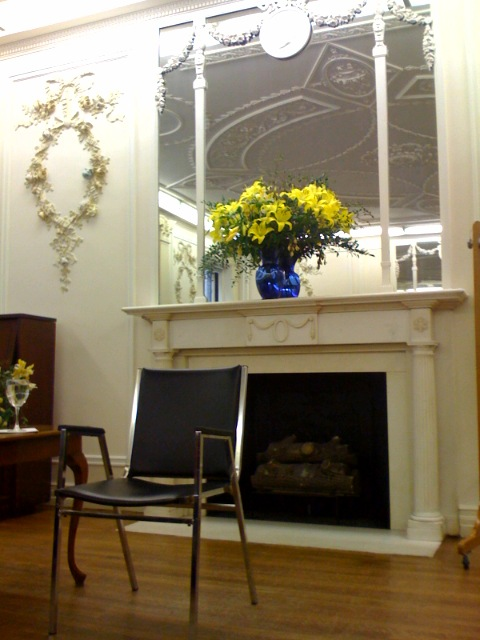

# Philosophy Works: Week Two

 

I got to my second Saturday class at the School of Practical Philosophy a little earlier, so I sat in the back room, which is decorated in what I'm inclined to call a Victorian style, all white and ornate.  On Saturdays the two rooms on the second floor are both full, and two tutors lead two sections simultaneously.  The tutor for today's section was a good deal more of a rambler.   I was less fond of him.   I was also more tired, grumpier and caffeinated, so it may not have been entirely to do with him.  I additionally entertained hostile thoughts for the gleefully talkative older members of this room's audience.   How dare they not share my cynicism?  The main content for the day was contained in two simple diagrams called "triads".  The first one is composed of external stimuli, desire, and action.  This is described as a mechanical cycle, or "the picture of a limited life".  The second triad has essential desires, habitual desired, and effort.  The word effort was broken down to mean "from strength".  These diagrams were supposed to explain something, I guess.  The tutor also led the group twice through "The Exercise" awareness meditation, and there were a few parables or fables involving animals.  Self knowledge and observation were themes, but the whole session seemed to lack coherence.  It couldn't have helped that I was in a kind of fog myself.  Fog or not, I feel I have growing criticisms of the philosophy as such that I will have to expand later.

  

  

After class I explored the neighborhood a little.  I had an expensive sandwich called "The Spa" with avocado and sun-dried tomatoes and drank fresh-pressed juice from carrots, bananas, and apples.  Walking toward the Met, I found that across the street from the School of Practical Philosophy is the first Waldorf school in the United States.  Some of its eighth-graders were advertising a fund-raising sale on the sidewalk out front.  They had knit hats, among other things.  I happen to know a little about Waldorf schools because they're in the same class of alternative educational schemes as Montessori schools, which I was and am interested in.  I wished them luck and walked into the Met, but decided I didn't really care to wander around inside for a suggested contribution of $20.  On my way to the subway on Lexington, I discovered that All Souls, the Unitarian church mentioned <a href="/2008/01/19/subway-philosophy/">earlier</a>, is within two blocks of the School of Practical Philosophy.  This whole region seems to somehow be a hotbed of upper class mysticism, a suit-wearing hippy land.   Subway Philosophy <a href="/2008/01/19/subway-philosophy/">Week One</a> Week Two <a href="/2008/02/02/practical-philosophy/">Week Three</a>

*This post was originally hosted [elsewhere](http://planspace.blogspot.com/2008/01/philosophy-works-week-two.html).*
