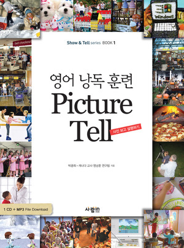
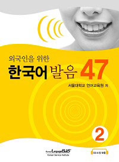

# Thoughts and recommendations on language books after a visit to the book store

Yesterday I went to Kyobo, the big Korean bookstore, to check out the books for learning English. I was starting to think I should offer some well-defined content, some "now we will learn this and nothing else" material, in the workshops I'm planning.

I guess there's a kind of spectrum in "speaking classes" like this, from "free talking" where everybody just talks, to lectures with material and prescribed no-variance activities. I was thinking maybe I'd go somewhere in the middle.

One thing about Korea: there are a LOT of books for learning English. One gets the feeling that maybe it would be more accurate to describe them as books for earning money when people who wish they knew English go looking for books.

So there are a lot of books, a huge ecosystem of books, with a million different hooks. The one that amused me the most was the one called "You can date an American, in just 30 minutes study a day for 30 days." And that is a little horrible, but if it catches somebody's attention I can imagine that person learning something from it. There's a good deal to be said for the importance of personal interest. A book, no matter how "educational" (judged how?) will just sit on a shelf if you're not motivated to use it.

Okay the other thing is that the way all these books seem to deal with the multitude of people with varying English proficiencies is just doing their thing, just throwing it out there, and hoping I guess that enough people will be at an appropriate level or at least buy the book. I don't think I saw one book that started from scratch though, with the possible exception of some miserable grammar books with obligatory chapters on pronunciation at the beginning.

Issue: Phrases vs. vocab+grammar

If you just learn phrases, you have very specific, very correct-in-that-instance language ability. But you have to learn so many phrases it's ridiculous. The phrases don't transfer to other situations, etc.

If you just learn vocab and grammar, you still have the so-much-it's-ridiculous problem. If you learn some subset though, you should be able to communicate in more situations, gaining some of the language productivity advantage. But you will probably say a lot of awkward, obviously non-native things.

A lot (maybe 70%?) of language is idiomatic. So learning phrases seems unavoidable. But it would be nice to take advantage as much as possible of the generative character of language.

<b>Main types of books</b>

Some books are <b>basically</b> <b>dictionaries</b>. I think dictionaries are useful, but these books seem intended to be read/studied straight through, or something. It's ridiculous. Who's going to sit and read/study five thousand vocabulary words in a row, or sentences, or phrases, or whatever? These books provide only content and no learning methods, so I can only imagine them being useful if they were used for reference (which seems difficult, and besides computers do it so much better for search etc.) or if the reader was simply godlike in memory and discipline and/or had some pre-existing study methodology they were using the book as input for. Summary: These books seem to be a crap waste of time.

I think I'll include most of the grammar books in this category too. They're organized a little different from alphabetization, but if you were to try to learn from one I think it would be like kicking yourself in the face. Maybe some of them could be used for reference.

Related note: some of these type of books are "pattern books" which take some sentence pattern and show how parts of it can be changed. These are a step in the direction of the next type, kind of, but I think they belong in this section. It's sort of a dictionary of specific cases of grammar rules, usually ones that happen to be commonly used.

Oh, and as mentioned above, some of these books are on the 30/30 concept, or related: spend 30 minutes a day for 30 days with this book, and you'll have learned something. I think it is not quite fair to say that prescribing time management counts as a learning method.

Some books are <b>selling conceptualization</b>. Their selling point is that they organize information in a useful way and present it so that you could conceivably learn from it as you read the book. So they have content and the learning method is just reading. Many of these will have some claim on the cover like "don't just memorize, learn!" I think this class of book has some value, although it probably wouldn't be the first thing I'd recommend to somebody who wants to actually learn a language. What I think is the best book like this that I found, while it still has some dictionary tendencies, is &#50689;&#50612;&#51032; &#50896;&#47532; (Principles of English) which organizes it's chapters based on generalizations about the way English is used, explains the differences in conceptualization that go into English versus Korean sentences, and gives examples that illustrate these generalizations. I would recommend a book like this as a supplement to a language learner who wants to keep learning even when they're too tired too keep focusing on more direct, more effective methods, to be read mostly for pleasure.

As a note, there are vocabulary books like this too. I saw one that provided groups of related words with some explanation, making connections between the words either just by conceptual relatedness or etymology or both.

I'll also include here the books that provide pictures to help guess meanings of words or phrases, or to aid in memory, although when there's just page after page of this kind of thing it's still pretty darn dictionary-ish.

Some books have a prime focus on a <b>learning method / activity</b> other than just reading. Some are just workbooks or various kinds, of which a lot just suck. I saw several books which basically just had pictures and then asked you to fill in words to describe the pictures, often fill-in-the-blank form, either whole words or with one or two letters of the word provided. I wonder how useful these are, even as review. I saw one other book which had a translucent red card so that you could read with the Korean and then go back and review while blanking it out with the card, or some variation thereof. I think highly of this category of book, because I think that activity is necessary for learning and that just reading is not going to be active enough for many, especially with regard to speaking.

By far the best book of this type that I encountered, really a line of seven or so books, is specifically for speaking, which is probably the area where activity is the most important - and a good help for listening too. The book's creators also seem to have thought a lot about the theory behind their system, which I am reading with interest now, slowly because it's in Korean. I find myself agreeing with a lot of their stuff, and this is the first book I would suggest to any Korean hoping to speak better English. It's focused, a little anti-climactically perhaps, on listening and repeating, as a foundational step in improving speaking. It does try to bootstrap that up to creative speaking, but that's a difficult step.

I want to mention: some books are total crap. It's because of their horrible design. A lot of textbooks are this way. They have flashy pictures all over the place, text with no discernable path through it all, bubbles popping out of everything... it's a mess. Say what you want about hyper-text or whatever, people read in a straight line. I don't want to have to put a check-mark by everything on a page to make sure I've looked at it all. A book like that is a book nobody is going to read, or at best, even the people who try to read it won't know if they've really read it.

The best-designed books have a clear line through them that the reader can follow. (Not to say they can't skip around if they want to, but it should be possible to go through the book.) They present things in a way that people can understand as they read, with illustrations in-line so they can be taken in as part of the narrative. They have logical breaks into chapters or sections that follow one after the other. They have the right number of examples, and they understand the difference between an example and an exercise. A book is not a magazine is not the web is not a Pollock.

As I'm thinking about it, I'll say something about explicit instruction and what might be the ideal book. Korean pronunciation is very close to perfectly phonetic from spelling, but there are some strange rules and some exceptions. The kind of rules that are not obvious, necessarily. The kind of rules that I didn't know and just kept making mistakes around. I did (notice not just "read") these books (it's two volumes) and I think it helped a lot.

First, the book organizes it's content brilliantly. It's called "Korean Pronunciation 47" because it's divided into 47 chapters, each one the next "concept" or rule in an orderly progression of rules that build on one another. When something uses a rule from another chapter, it's cross-referenced. I think it represents a kind of linguistic brilliance, and a lot of hard work.

Each chapter gives very explicit explanation of the rule, how it is applied, and it mentions any exceptions. Then, there are a lot of exercises: listening, read-and-identify, and listen-and-repeat exercises with just words, then sentences, and then mini-dialogues. There are little listening "tests" at the end of chapters.

So you go from thinking consciously about a pronunciation rule, to immediately applying it and practicing it. And the result is, I don't remember the conscious rules necessarily, but when I see a Korean word in writing I have a much better idea of how it should sound spoken. I think explicit instruction can be very good, but it does have to be matched with application and internalization, or the learner's personal "re-construction."

A note on comprehension: I think comprehension is important. I don't think anybody should be reciting things they don't know the meaning of. What help is that? So when I used those Korean pronunciation books, for example, I spent a lot of time with a dictionary, and occasionally asked for help with grammar and stuff like that. Maybe it was only possibly because I already knew a lot of grammar. Building grammar - that might be the main challenge.

Maybe to summarize a little bit, to wrap up:

Dictionaries just collect information.

Organizers put information into a meaningful framework.

Trainers give things to do, from which you can develop skills (and come up with information and frameworks, maybe).

Super-books present well-organized information and provide the activities that lead you to internalize this information and related skills.

Yeah, "super-books"... Yeah...

*This post was originally hosted [elsewhere](http://planspace.blogspot.com/2011/02/thoughts-and-recommendations-on.html).*
