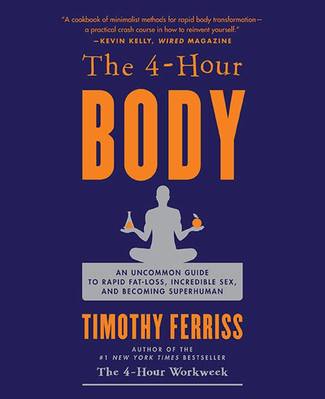

# Thoughts on listening to The Four-Hour Body (abridged)

The Four-Hour Body Timothy Ferriss  A friend lent me the abridged audio-book version of this. There were a lot of things I didn't know when I started listening. I didn't know it was abridged, although I kind of guessed. Having never seen the cover, I was quite surprised when he started talking about sex all of a sudden. I had been expecting just general fitness stuff.  I also didn't even guess from The title that it was by the same guy as The Four-Hour Workweek, which I had seen in bookstores. It turns out that the four hours in the title of this book doesn't mean four hours per week or anything much really, but seems to be in the title mainly to reinforce the connection to the successful workweek predecessor. (It could be interpreted as four hours of exercise per month, as recommended as thirty minutes twice per week.  I can't say that the whole method overall seems that time-efficient, really. Ferris is super OCD, and (was) an insomniac to boot - it seems like he spends a huge amount of time tweaking and messing with every little thing he can find. He recommends more crazy weird supplements than I could even keep track of. Not to mention ice baths and a low-carb diet he calls "slow carb". Oh, and a bunch of machines and lights for aiding sleep and so on.  He does keep it interesting throughout, and I do want to try to decrease my empty carb calorie intake, which is advice you can hear anywhere. I may also try his exercise program, which is just based on doing exercised to (exhaustion) failure, every time, minimizing the time to failure to a minute or so.  He also mentioned some supplement for memory that sounded interesting, but I'd have to check to find the name of it again. And he said there were nasty side-effects, so maybe I won't even check. I felt like I was missing things sometimes; transitions were choppy, or things didn't seem fully explained. I guess that'll be the abridgment.  In any event, you can't deny this Ferriss guy is an interesting character.  ---  Dang, you really CAN get a lot about a book just by looking at the cover, can't you?  

*This post was originally hosted [elsewhere](http://planspace.blogspot.com/2011/03/thoughts-on-listening-to-four-hour-body.html).*
