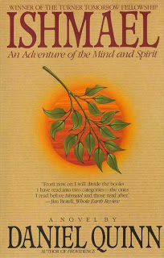

# Ishmael

Ishmael

Daniel Quinn

 

Really? This won awards and stuff? Maybe it was new to people when it came out. To me it seemed like a semi-interesting fleshing out of Jared M. Diamond's <a href="http://www.ditext.com/diamond/mistake.html">The Worst Mistake in the History of the Human Race</a>. Ishmael even came out five years after that paper. Huh.

 

First, it's a bit of a stretch to call Ishmael a novel, or even fiction. It's a dialogue giving some philosophical ideas. I think we can call them philosophical ideas. It presents a philosophy anyway, or an interpretation of the world.

 

Of course dialogues like this have a long tradition. Plato and all that, you know. It was interesting to me, while reading, to think about my ideas on writing and reading and fiction and so on. It seems to me that there may be two more-or-less linked parallel axes, something like this:

 

fun to read --------------------------------------------- not fun to read

not explicit in message ------------------------------ explicit in message

 

So, for example, a textbook is explicit in its content and not fun to read (speaking broadly, or in possibilities). A romance novel is not explicit in message, or may not even have a conscious message, but may be fun to read. Fiction generally has only a masked message, may even be explicitly meant to have no message (as in The Lord of the Rings) but I believe it is impossible to have no message. The reader's brain is not the same after reading. Kurt Vonnegut, I think, has typically wonderful messages in his writing, explicit or not, and yet his stuff is a lot of fun to read. Same with Douglas Adams. This I call being a skilled writer. Dialogues are not so boring to read as plain exposition, but neither are they terribly demanding of writing skills. So there are my ideas on that, quickly.

 

The content of the book: this gorilla is telling a guy about how, in a nutshell, the human race went wrong at agriculture, as in the Diamond piece (link above). Some pains are taken to point out that the problem is not exactly agriculture <i>per sé </i>- there were some farming Native Americans, etc. - but the world-view that we need to expand production and control the earth, rather than living in harmony with it, letting natural conditions govern things like human population.

 

This is all done with mythological/religious language, so that the "takers" (aka "civilization") are said to believe that the gods gave them the earth, but there were problems, so they took knowledge of good and evil (an interpretation of the Bible's Genesis is one of the most interesting parts of the book, and maybe the only addition to Diamond's much shorter essay - the interpretation seems at least reasonable, if not iron-clad) and took control of the earth to keep all their people alive and the population increasing. The "leavers" (aka "primitive people" and/or "hunter-gatherers") believe that they are of the earth, in the sense that all plants and animals are. They are said to be happier and continuously evolving, whereas takers subvert natural processes, have stopped evolving, and will necessarily destroy the earth completely if they don't go back to "leaver" ways immediately.

 

It is an interesting thing to think about, especially if you haven't yet. I don't see how I'm going to give up my iPhone though. Maybe I've missed the point.

 

 

*This post was originally hosted [elsewhere](http://planspace.blogspot.com/2011/08/ishmael.html).*
