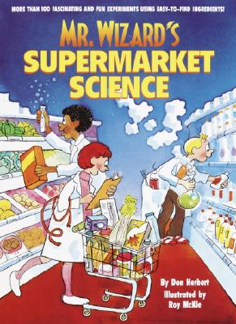

# Exploring Everyday Things with R and Ruby

<a href="http://www.amazon.com/Exploring-Everyday-Things-Ruby-Learning/dp/1449315151">Exploring Everyday Things</a> with R and Ruby Sau Sheong Chang  This book came out recently. Somebody had suggested it might be fun, so I read it. Sure enough, it is fun. It introduces a lot of really good stuff, perhaps briefly and imperfectly (and you will read "lot" instead of "plot" in at least one place) but it conveys a sense of wonder and possibility. It reminded me of the books of science experiments that I grew up with. This book is structured a bit like they were, with about eight investigations into various things. It guides you through building a digital stethoscope and processing the data it produces - and then it does the same for using a digital camera to take your pulse by reading differences in red intensity as a result of varying oxygen concentrations in your blood. It's really quite neat.  

 
The focus is not really on building physical objects though - it's on the computer side, for simulation and analysis. The techniques weren't really new to me - and in fact in one place the author spends nearly a full page explaining the Pythagorean Theorem - but the spirit of boldly applying techniques to interesting problems is a good one. I would feel pretty good about recommending this book to a middle or high school student with an interest in technology, and any others with curiosity. To be fair, there were good pointers to things I wasn't intimately familiar with, like the Shapiro-Wilk normality test, and while not novel or very deep, the introduction to and work with ggplot2 in R is definitely widely applicable. I'm still not sure I like Ruby more than Python, but you can quickly get a feel for doing things in Ruby as well. It's a fun little book for getting you thinking, and then hopefully looking for more information and working on your own experiments.

*This post was originally hosted [elsewhere](http://planspace.blogspot.com/2012/08/exploring-everyday-things-with-r-and.html).*
