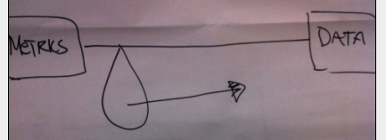
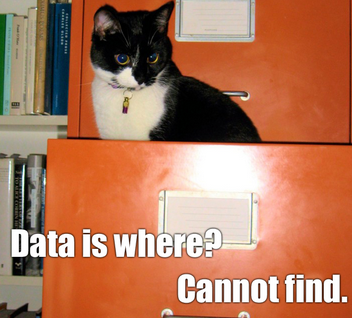

# metric-driven vs. data-driven

 
Bitsy Bentley, director of data visualization at GfK Custom Research, gave a good talk on Monday at Pivotal. It was mostly about visualization, but the part that resonated most with me was a related point she made about the difference between being&#160;<i>metric</i>-driven&#160;vs.<i>data</i>-driven. Here's how she illustrated where most groups currently are and the direction she thinks they need to move:

 

 

Some people in the audience on Monday were confused about the distinction between metrics and data. I think it's an absolutely vital distinction, and one that hits close to home when I think about work that I'm often asked to do. A&#160;metric&#160;is a particular reduction from some subset of your data. It can be reported, rewarded, punished, used for other decisions... Metrics can certainly have value, but being focused just on some metrics is not the same thing as being data-driven. The stories in data, the real information, they frequently resist reduction to metrics - certainly to the limited collection of metrics you happen to already have. And metrics frequently obscure rather than elucidate. At best they give you a rough&#160;<i>what&#160;</i>- rarely a useful&#160;<i>why&#160;</i>or&#160;<i>how</i>.

 

As a hypothetical example, you might feel good watching a&#160;metric&#160;march in the right direction for a number of years - but if it does move in the wrong direction, that&#160;metric&#160;doesn't tell you why or what to do about it. If it was evidence of success before, is it evidence of failure now? What if you aren't doing anything differently? To really make decisions based on data requires more than just monitoring metrics. And I don't just mean you need the right metrics rather than the wrong ones - metrics are necessarily reductive, and even if you have the best&#160;metric&#160;perspectives on your data, they are still perspectives, not the data itself.

 

One conclusion is that it's often better to&#160;<i>plot&#160;</i>all of your data, as much as possible, to have a chance at understanding it before you start reducing it to numeric summaries. A&#160;corollary&#160;might be that we should question metrics that don't show the whole picture. Another conclusion is that we need to spend more time dealing with the data itself in order to understand its nature, to identify which metrics might aid understanding and which effectively stymie it, to determine what is signal and what is noise, and vitally to&#160;<i>spend more time looking for new things</i>&#160;than we spend&#160;<i>recreating old things</i>&#160;and then quickly&#160;<i>close the loop</i>&#160;by acting on new insight (reporting, changing policy, etc.) - and then go back to looking for the next thing.

 

I think this could be something to think about: are we data-driven, or are we merely&#160;metric-driven?

 

Ponder the divine wisdom of data cat:

 

*This post was originally hosted [elsewhere](http://planspace.blogspot.com/2012/10/metric-driven-vs-data-driven.html).*
