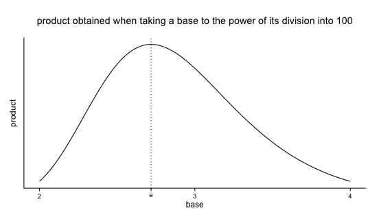

# e is the best base

Here's a fun little problem: What list of non-negative integers that sum to 25 will give you the biggest product when multiplied together? You can think of it as breaking 25 into pieces (additively) and then multiplying the pieces - and it's that product that you want to be large. So the list of twenty-five ones is pretty bad, because \\( 1^{25}=1 \\). The list of ten and fifteen is better, because \\( 10 \cdot 15 = 150 \\). The list of five fives is better yet, because \\( 5^5 = 3125 \\). Can you do better?

(Think about it for a minute if you want.)

Okay, the answer is this: \\( 2^2 \cdot 3^7 = 8748 \\). It's the list of two two's (or one four, it doesn't matter) and seven threes.

I noticed all these threes and remembered something I once heard in a computer science course, about how three is really the optimal base in terms of balancing number of unique digit symbols and number of digits needed to store a given number. (Binary, base two, has "too few" symbols - just 0 and 1 - which means lots of digits needed to store a big number, while decimal, base ten, has "too many" symbols - ten of them - but correspondingly uses fairly few digits to represent even largish numbers.) Of course it wasn't really three that was best, it was \\( e \\) (<a href="http://en.wikipedia.org/wiki/E_(mathematical_constant)">wiki</a>), which is around 2.71. And of course computers use binary anyway, so it was kind of beside the point. But I remembered this statement, which I never saw an explanation for or any other mention of.

Now I offer that the same sort of thing is going on here, and that you will be able to correctly answer any question like the above (not just for 25) by using as many threes as possible and then being smart with what's left over. And it's because 3 is close to \\( e \\)!

If we relax the rules about whole numbers and agree that we want to use all the same number (convince yourself) then the problem is now for whatever starting number \\( N \\) (the 25 from the original problem) we want to find the \\( x'$ that maximizes \\( \left(\frac{N}{x'}\right)^{x'} \\) or equivalently (with \\( x = \frac{N}{x'} \\)) find the \\( x \\) that maximizes \\( x^{\left(\frac{N}{x}\right)} \\). Using the [standard method](http://www.derivative-calculator.net/) for maximizing, the \\( N \\) quickly drops out and soon we have shown that \\( x = e \\). (Thanks Joe!)

The way I first investigated this was by choosing 100 and using R to try a bunch of numbers and plot the results. The products get large and I don't care much about their absolute values, and the curvature changes if you use numbers other than 100 to start from, but the graph always looks basically like this (<a href="http://rpubs.com/ajschumacher/edeal">code</a>):

So now we have both real math (calculus) and computational-experiment demonstrations of yet another way that \\( e \\) is cool! I don't know if it's worth adding to [this list](http://en.wikipedia.org/wiki/List_of_representations_of_e), but I like it.

*This post was originally hosted [elsewhere](https://planspacedotorg.wordpress.com/2013/07/21/e-is-the-best-base/).*
