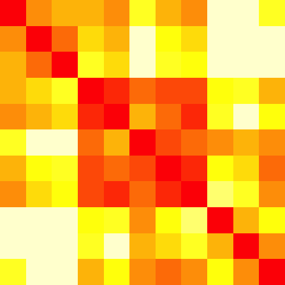

# Clustered R-squared Heat-Maps in R


Sometimes you want to quickly see how much variables are related to one another (linearly, here). You might be thinking about doing factor analysis or some such thing. You'd like to see if the variables can be neatly separated into various groups, perhaps. Here's a function that I wrote for this purpose:

```
clusterRsquared &lt;- function(dataframe) {
  dissimilarity &lt;- 1 - cor(dataframe)^2
  clustering &lt;- hclust(as.dist(dissimilarity))
  order &lt;- clustering$order
  oldpar &lt;- par(no.readonly=TRUE); par(mar=c(0,0,0,0))
  image(dissimilarity[order, rev(order)], axes=FALSE)
  par(oldpar)
  return(1 - dissimilarity[order, order])
}
```

Call it like this, for example:

```
round(clusterRsquared(mtcars),2)
```

You'll get output like this:

<pre>     drat   am gear  mpg   wt   hp  cyl disp carb qsec   vs
drat 1.00 0.51 0.49 0.46 0.51 0.20 0.49 0.50 0.01 0.01 0.19
am   0.51 1.00 0.63 0.36 0.48 0.06 0.27 0.35 0.00 0.05 0.03
gear 0.49 0.63 1.00 0.23 0.34 0.02 0.24 0.31 0.08 0.05 0.04
mpg  0.46 0.36 0.23 1.00 0.75 0.60 0.73 0.72 0.30 0.18 0.44
wt   0.51 0.48 0.34 0.75 1.00 0.43 0.61 0.79 0.18 0.03 0.31
hp   0.20 0.06 0.02 0.60 0.43 1.00 0.69 0.63 0.56 0.50 0.52
cyl  0.49 0.27 0.24 0.73 0.61 0.69 1.00 0.81 0.28 0.35 0.66
disp 0.50 0.35 0.31 0.72 0.79 0.63 0.81 1.00 0.16 0.19 0.50
carb 0.01 0.00 0.08 0.30 0.18 0.56 0.28 0.16 1.00 0.43 0.32
qsec 0.01 0.05 0.05 0.18 0.03 0.50 0.35 0.19 0.43 1.00 0.55
vs   0.19 0.03 0.04 0.44 0.31 0.52 0.66 0.50 0.32 0.55 1.00</pre>
And a plot like this, which is much easier to start investigating visually:

<a href="good.png"></a>

Is this necessarily the One True Clustering? No, but it isn't terribly bad either.


*This post was originally hosted elsewhere.*
