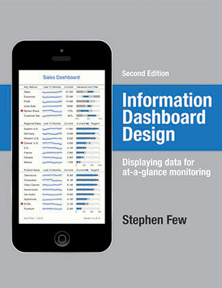
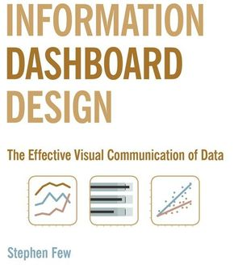

# Information Dashboard Design by Stephen Few (Second Edition)

The second edition of Stephen Few's book on making dashboards came out about two weeks ago. I read it, not having read the first edition. In some ways <a href="http://www.perceptualedge.com/">Few</a> is just <a href="http://www.edwardtufte.com/">Tufte</a> for MBAs, but he does have <a href="http://en.wikipedia.org/wiki/Bullet_graph">bullet graphs</a> in addition to <a href="http://en.wikipedia.org/wiki/Sparkline">sparklines</a>, and he focuses on and provides examples of dashboards.

The cover of the <a href="http://www.amazon.com/gp/product/1938377001/">second edition</a> (above) is way better than the cover of the <a href="http://www.amazon.com/Information-Dashboard-Design-Effective-Communication/dp/0596100167/">first edition</a> (below) because it features a complete example of the style of dashboard that Few advocates. If you understand everything on the cover above, you understand the entire book. It's a really neat sort of meta-visualization. This old cover is rather awful:

The other great thing, distinct to the new edition, is that it features multiple examples of dashboards for teachers, displaying student data. Neat! Mr. Few facilitated a dashboard design <a href="http://www.perceptualedge.com/blog/?p=1308">competition</a> in 2012, which I had been unaware of. The new edition features the <a href="http://www.perceptualedge.com/blog/?p=1374">two best submissions</a>, some more examples that weren't as good, and <a href="http://www.perceptualedge.com/blog/?p=1466">Few's own creation</a>, which I think would look a lot better with different color choice. (You can see a lot of this content on Few's blog, as linked.) The education use case is very interesting to me. I'd like to see the principles of this book applied to, say, NYC's ARIS data system. I wonder how other education data system vendors' products stack up!

I think Stephen Few is fundamentally right about dashboard design. The only thing I would add or discuss further is the primacy of analysis. Said another way, the dashboard should focus on communicating reality, not on communicating metrics. People who think they know what metrics they're interested in are very often wrong. There may be better metrics, or (more likely) it may be that finding a way to present more of the data without reducing it to metrics allows communication of a more complete picture. This could require the use of perhaps more expressive, possibly less conventional means even than sparklines and bullet graphs. But you should certainly know what's in this book.

*This post was originally hosted [elsewhere](https://planspacedotorg.wordpress.com/2013/09/01/information-dashboard-design-by-stephen-few-second-edition/).*
