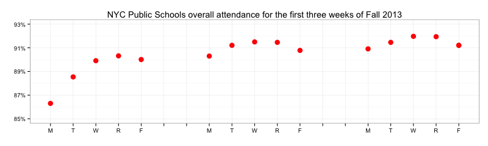
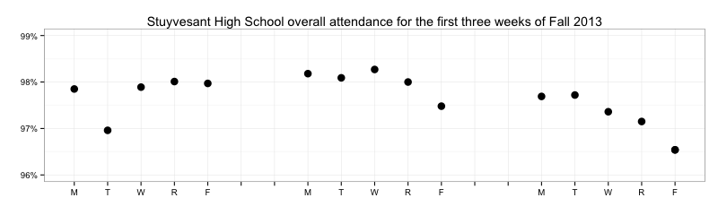

# NYC goes back to school: Attendance numbers show overall ramp-up

I've been <a href="https://github.com/ajschumacher/NYCattends">archiving</a>&#160;(and <a href="https://twitter.com/NYCattends">tweeting</a>) NYCDOE <a href="http://schools.nyc.gov/AboutUs/data/Attendance.htm">attendance</a> numbers since last spring, so this has been the first Fall that I've archived. I was interested to see what the start of the school year looks like. As I sort of guessed, there is a clear "ramp up" in the system overall, in addition to the usual weekly pattern:

But there's also huge variability; schools are all over the place when it comes to attendance:

And schools behave very differently - for example, <a href="http://www.stuy.edu/">Stuyvesant</a> doesn't seem to follow the overall trend at all:

I suspect that attendance <em>patterns</em> provide some information about school performance which is beyond just raw average attendance for a school. As a first guess, perhaps a more prominent "ramp-up" is associated with lower academic performance as measured by standardized tests. I think this could be interesting to investigate.

It would be great if more people took a look at these <a href="https://github.com/ajschumacher/NYCattends">attendance numbers</a>, and also if we could get more similar data from other school systems!

*This post was originally hosted [elsewhere](https://planspacedotorg.wordpress.com/2013/09/30/nyc-goes-back-to-school-attendance-numbers-show-overall-ramp-up/).*
