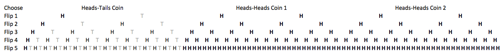

# What's the difference between Bayesian and non-Bayesian statistics?

 > A coin is flipped and comes up heads five times in a row. Is it a fair coin?

Whether you trust a coin to come up heads 50% of the time depends a good deal on who's flipping the coin. If you're flipping your own quarter at home, five heads in a row will almost certainly not lead you to suspect wrongdoing. At a magic show or gambling with a shady character on a street corner, you might quickly doubt the balance of the coin or the flipping mechanism.

What is often meant by non-Bayesian "classical statistics" or "frequentist statistics" is "hypothesis testing": you state a belief about the world, determine how likely you are to see what you saw if that belief is true, and if what you saw was a very rare thing to see then you say that you don't believe the original belief. That original belief about the world is often called the "null hypothesis".

Our null hypothesis for the coin is that it is fair - heads and tails both come up 50% of the time. If that's true, you get five heads in a row 1 in 32 times. That's 3.125% of the time, or just 0.03125, and this sort of probability is sometimes called a "p-value". If the value is very small, the data you observed was not a likely thing to see, and you'll "reject the null hypothesis". The cutoff for smallness is often 0.05. So the frequentist statistician says that it's very unlikely to see five heads in a row if the coin is fair, so we don't believe it's a fair coin - whether we're flipping nickels at the national reserve or betting a stranger at the bar.

Say a trustworthy friend chooses randomly from a bag containing one normal coin and two double-headed coins, and then proceeds to flip the chosen coin five times and tell you the results. When would you be confident that you know which coin your friend chose? If a tails is flipped, then you know for sure it isn't a coin with two heads, of course. But what if it comes up heads several times in a row? When would you say that you're confident it's a coin with two heads?

If you stick to hypothesis testing, this is the same question and the answer is the same: reject the null hypothesis after five heads.

Notice that when you're flipping a coin you think is probably fair, five flips seems too soon to question the coin. But when you know already that it's twice as likely that you're flipping a coin that comes up heads every time, five flips seems like a long time to wait before making a judgement. The non-Bayesian approach somehow ignores what we know about the situation and just gives you a yes or no answer about trusting the null hypothesis, based on a fairly arbitrary cutoff.

The Bayesian approach to such a question starts from what we think we know about the situation. This is called a "prior" or "prior distribution". In the case of the coins, we understand that there's a $latex \frac{1}{3}$ chance we have a normal coin, and a $latex \frac{2}{3}$ chance it's a two-headed coin.

The Bayesian next takes into account the data observed and updates the prior beliefs to form a "posterior" distribution that reports probabilities in light of the data. The updating is done via Bayes' rule, hence the name. In Gelman's notation, this is:

$latex \displaystyle p(\theta|y) = \frac{p(\theta)p(y|\theta )}{p(y)}$

For our example, this is: "the probability that the coin is fair, given we've seen some heads, is what we thought the probability of the coin being fair was (the prior) times the probability of seeing those heads if the coin actually is fair, divided by the probability of seeing the heads at all (whether the coin is fair or not)". <a href="http://en.wikipedia.org/wiki/Bayes'_theorem">This is true.</a>

So say our friend has announced just one flip, which came up heads. Back with the "classical" technique, the probability of that happening if the coin is fair is 50%, so we have no idea if this coin is the fair coin or not. With Bayes' rule, we get the probability that the coin is fair is $latex \frac{\frac{1}{3} \cdot \frac{1}{2}}{\frac{5}{6}}$. (Conveniently, that $latex p(y)$ in the denominator there, which is often difficult to calculate or otherwise know, can often be ignored since any probability that we calculate this way will have that same denominator.) In our case here, the answer reduces to just $latex \frac{1}{5}$ or 20%. There's an 80% chance after seeing just one heads that the coin is a two-headed coin. After four heads in a row, there's 3% chance that we're dealing with the normal coin. Notice that even with just four flips we already have better numbers than with the alternative approach and five heads in a row. And the Bayesian approach is much more sensible in its interpretation: it gives us a probability <em>that the coin is the fair coin</em>. With the earlier approach, the probability we got was a probability <em>of seeing such results if the coin is a fair coin</em> - quite different and harder to reason about.

It's tempting at this point to say that non-Bayesian statistics is statistics that doesn't understand the <a href="http://en.wikipedia.org/wiki/Monty_Hall_problem">Monty Hall problem</a>. But of course this example is contrived, and in general hypothesis testing generally does make it possible to compute a result quickly, with some mathematical sophistication producing elegant structures that can simplify problems - and one is generally only concerned with the null hypothesis anyway, so there's in some sense only one thing to check. The Bayesian formulation is more concerned with all possible permutations of things, and it can be more difficult to calculate results, as I understand it - especially difficult to come up with closed forms for things. There again, the generality of Bayes does make it easier to extend it to arbitrary problems without introducing a lot of new theory.

The example with the coins is discrete and simple enough that we can actually just list every possibility. In general this is not possible, of course, but here it could be helpful to see and understand that the results we get from Bayes' rule are correct, verified diagrammatically:

Here tails are in grey, heads are in black, and paths of all heads are in bold. You can see, for example, that of the five ways to get heads on the first flip, four of them are with double-heads coins.

I'm thinking about Bayesian statistics as I'm reading the newly released third edition of Gelman et al.'s <a href="http://www.amazon.com/Bayesian-Analysis-Edition-Chapman-Statistical/dp/1439840954">Bayesian Data Analysis</a>, which is perhaps the most beautiful and brilliant book I've seen in quite some time. The example here is logically similar to the first example in section 1.4, but that one becomes a real-world application in a way that is interesting and adds detail that could distract from what's going on - I'm sure it complements nicely the traditional abstract coin-flipping probability example here. I'll also note that I may have over-simplified the hypothesis testing side of things, especially since the coin-flipping example has no clear idea of what is more extreme (all tails is as unlikely as all heads, etc.), there was no experiment design or reasoning about that side of things, and so on. I think the characterization is largely correct in outline, and I welcome all comments!

*This post was originally hosted [elsewhere](https://planspacedotorg.wordpress.com/2013/11/11/whats-the-difference-between-bayesian-and-non-bayesian-statistics/).*
