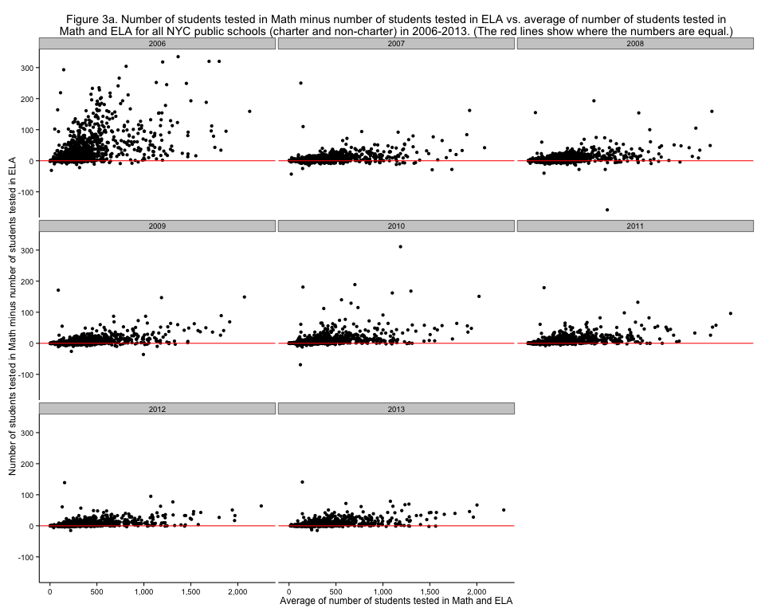
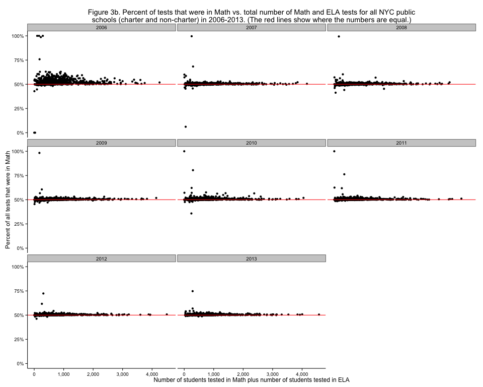

# NYC standardized test results: Checking out the number of students tested in Math and ELA again

Looking at <a href="http://planspace.org/2013/11/13/nyc-standardized-test-results-putting-the-data-together-and-looking-at-it/">NYC Math and ELA test</a>&#160;counts in the <a href="http://planspace.org/2013/11/14/nyc-standardized-test-results-checking-out-the-number-of-students-tested-in-math-and-ela/">last post</a> was interesting, but the graph put all the points very near the line $latex y=x$, so it was hard to see patterns in the differences. With just slightly different <a href="https://github.com/ajschumacher/NYCtests/blob/master/code/figure3.r">code</a>, we can make a <a href="http://en.wikipedia.org/wiki/Bland%E2%80%93Altman_plot">Tukey mean difference plot</a>:

[caption id="attachment_520" align="aligncenter" width="525"] Figure 3a. Number of students tested in Math minus number of students tested in ELA vs. average of number of students tested in Math and ELA for all NYC public schools (charter and non-charter) in 2006-2013. (The red lines show where the numbers are equal.)[/caption]

This makes it much clearer, for example, that 2010 was "worse" than 2009 in terms of students not taking the ELA exam. It also shows clearly that all the very large schools have more Math than ELA since 2010. It's hard to compare the relative number of students between small and large schools though, since raw numbers are shown. A somewhat customized display shows this very nicely:

[caption id="attachment_522" align="aligncenter" width="525"] Figure 3b. Percent of tests that were in Math vs. total number of Math and ELA tests for all NYC public schools (charter and non-charter) in 2006-2013. (The red lines show where the numbers are equal.)[/caption]

This shows much more clearly than <a href="http://planspace.org/2013/11/14/nyc-standardized-test-results-checking-out-the-number-of-students-tested-in-math-and-ela/">before</a> that the <a href="http://insideschools.org/middle/browse/school/1259">Academy for New Americans</a> was pretty much the only serious holdout to roughly equal Math and ELA testing in 2013, with a long history of very little ELA testing relative to Math testing.

[<a href="http://planspace.org/2014/01/10/nyc-test-data/">table of contents for this series</a>]

*This post was originally hosted [elsewhere](https://planspacedotorg.wordpress.com/2013/11/15/nyc-standardized-test-results-checking-out-the-number-of-students-tested-in-math-and-ela-again/).*
