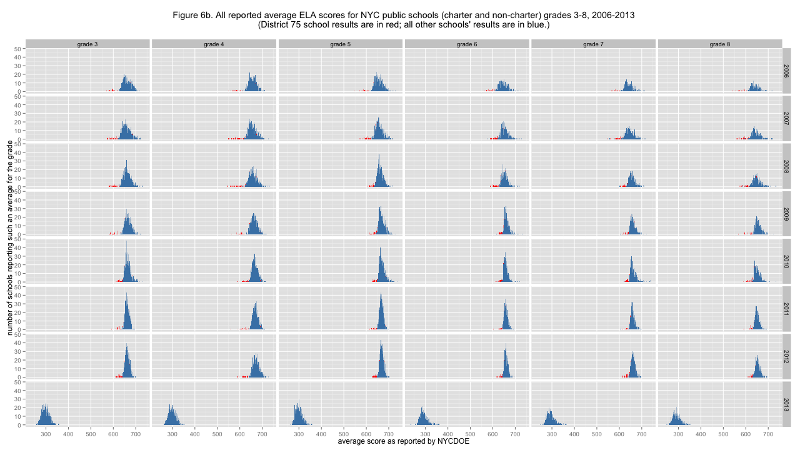

# NYC standardized test results: Considering District 75 schools

[caption id="attachment_537" align="aligncenter" width="525"] Figure 6a. All reported average Math scores for NYC public schools (charter and non-charter) grades 3-8, 2006-2013 (District 75 school results are in red; all other schools' results are in blue.)[/caption] 
 
When I first <a href="http://planspace.org/2013/11/13/nyc-standardized-test-results-putting-the-data-together-and-looking-at-it/">put all this data together</a>, the strange low-scoring outliers were noted. We also observed a dip in total tests and students tested between 2012 and 2013, and it was <a href="http://planspace.org/2013/11/15/nyc-standardized-test-results-the-total-number-of-students-and-tests/">hinted</a> that this might be a result of District 75. What is the New York City Department of Education's&#160;<a href="http://schools.nyc.gov/Offices/District75/">District 75</a>? 

<blockquote>District 75 provides citywide educational, vocational, and behavior support programs for students who are on the autism spectrum, have significant cognitive delays, are severely emotionally challenged, sensory impaired and/or multiply disabled.</blockquote>
 
There are two things to notice about D75 school results in this data, and both of them give us reason to exclude D75 results from all further analysis. First, District 75 scores are (almost always) very low and don't seem to follow the same distribution as other schools' scores. Second, there is for whatever reason <em>no data</em> for District 75 schools for 2013. It isn't clear whether D75 students suddenly stopped ever taking these standardized tests or whether the city just stopped including their results, but whatever the reason it seems that D75 shouldn't be included in further analysis. 
 
[caption id="attachment_538" align="aligncenter" width="525"] Figure 6b. All reported average ELA scores for NYC public schools (charter and non-charter) grades 3-8, 2006-2013 (District 75 school results are in red; all other schools' results are in blue.)[/caption] 
 
(The R code that generated these graphs is <a href="https://github.com/ajschumacher/NYCtests/blob/master/code/figure6.r">available</a>.) 

[<a href="http://planspace.org/2014/01/10/nyc-test-data/">table of contents for this series</a>]

 

*This post was originally hosted elsewhere.*
