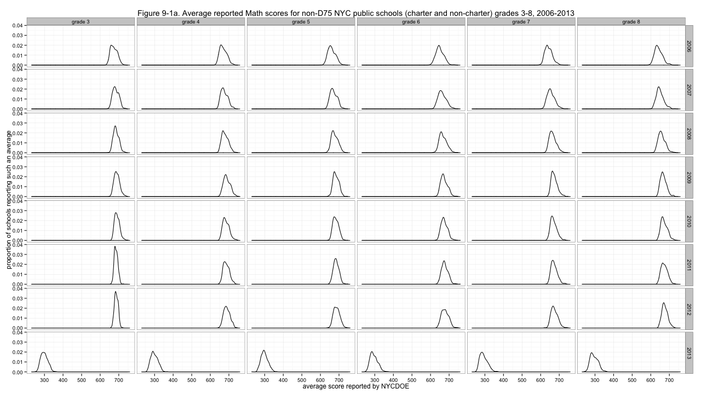
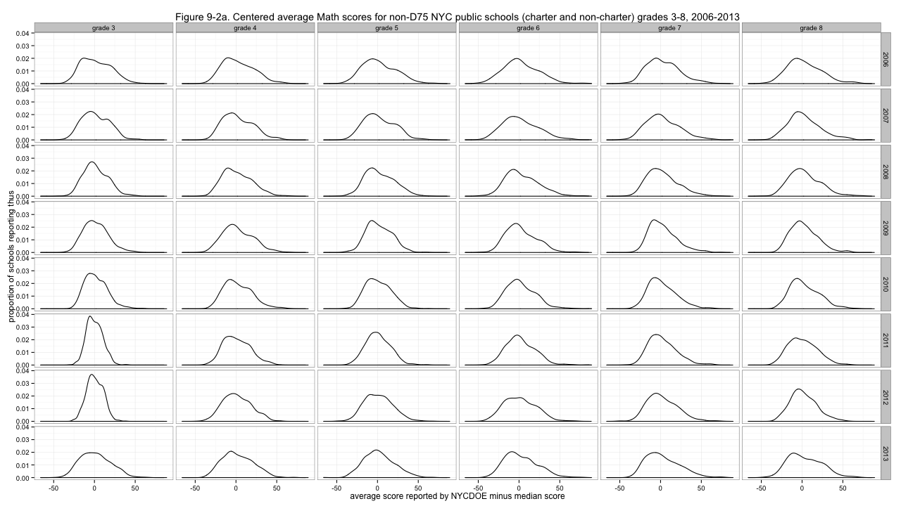
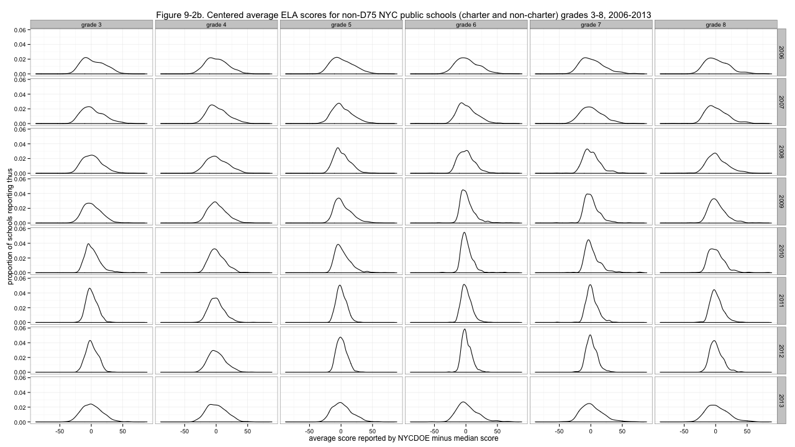
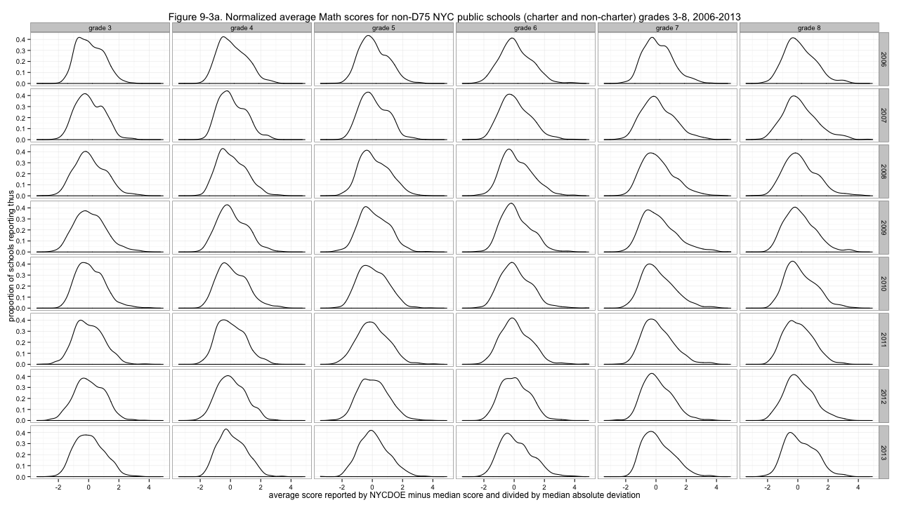
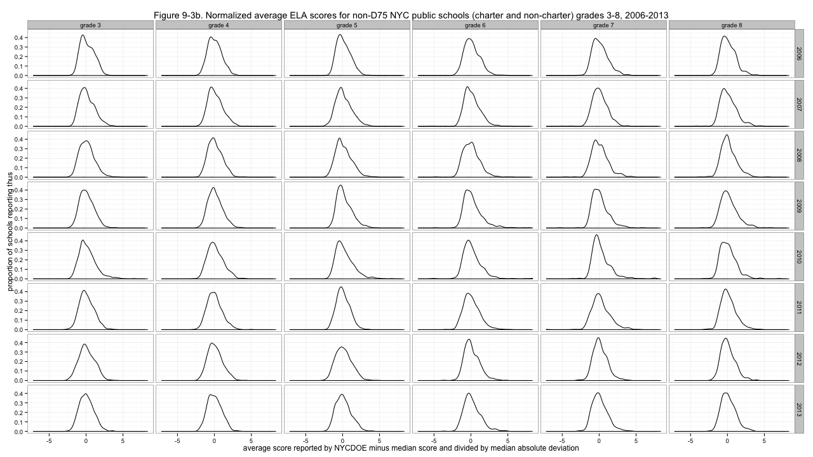
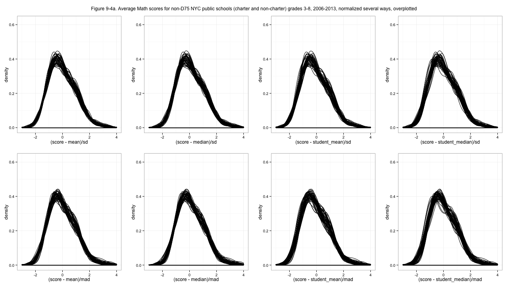

# NYC standardized test results: Normalizing the distributions of average scores

Ever since <a href="http://planspace.org/2013/11/13/nyc-standardized-test-results-putting-the-data-together-and-looking-at-it/">starting to look at this data</a>, we've dreamed a great dream: a dream of comparing data across years and grades. Deciding to <a href="http://planspace.org/2013/11/16/nyc-standardized-test-results-considering-district-75-schools/">remove District 75 school results</a> eliminated some nasty tails from the distributions, but there's more work to be done. As a clarification up front: It's called normalization, but this work will not make the distributions <a href="http://en.wikipedia.org/wiki/Normal_distribution">normal, in the Gaussian sense</a>. Don't get it twisted! 
 
First, we'll start looking at density plots rather than histograms. This normalizes over the number of observations, giving every such plot equal area under the curve, and makes it easier to get a quick sense of the shapes of the distributions. Here's how we're doing: 
 
[caption id="attachment_563" align="aligncenter" width="525"] Figure 9-1a. Average reported Math scores for non-D75 NYC public schools (charter and non-charter) grades 3-8, 2006-2013[/caption] 
 
[caption id="attachment_564" align="aligncenter" width="525"] Figure 9-1b. Average reported ELA scores for non-D75 NYC public schools (charter and non-charter) grades 3-8, 2006-2013[/caption] 
 
Clearly, problem one is that the distributions are not agreeing about where they are in the left-to-right sense. I'll center them by subtracting out the medians of each distribution. 
 
[caption id="attachment_567" align="aligncenter" width="525"] Figure 9-2a. Centered average Math scores for non-D75 NYC public schools (charter and non-charter) grades 3-8, 2006-2013[/caption] 
 
[caption id="attachment_568" align="aligncenter" width="525"] Figure 9-2b. Centered average ELA scores for non-D75 NYC public schools (charter and non-charter) grades 3-8, 2006-2013[/caption] 
 
That's much better - though especially for ELA, some distributions are much more peaked than others. With the less peaked ones, we can have fun deciding which looks the most like <a href="http://cs.swan.ac.uk/~cswill/The_little_prince.pdf">a boa constrictor digesting an elephant</a>. But to address the non-uniform variability of the distributions, I'll divide by the <a href="http://en.wikipedia.org/wiki/Median_absolute_deviation">median absolute deviation</a>s, giving these results: 
 
[caption id="attachment_569" align="aligncenter" width="525"] Figure 9-3a. Normalized average Math scores for non-D75 NYC public schools (charter and non-charter) grades 3-8, 2006-2013[/caption] 
 
[caption id="attachment_570" align="aligncenter" width="525"] Figure 9-3b. Normalized average ELA scores for non-D75 NYC public schools (charter and non-charter) grades 3-8, 2006-2013[/caption] 
 
Now&#160;<em>those</em> distributions look... at least a little similar. And those are the normalized scores I'll use going forward. Why did I choose median and median absolute deviation, rather than the more common mean and standard deviation, which gives what is commonly called "z-scores"? Because it doesn't work as well. In particular, it gives substantially worse results for some of those spiky ELA distributions. I tried several possibilities: 
 
[caption id="attachment_579" align="aligncenter" width="525"] Figure 9-4a. Average Math scores for non-D75 NYC public schools (charter and non-charter) grades 3-8, 2006-2013, normalized several ways, overplotted[/caption] 
 
[caption id="attachment_578" align="aligncenter" width="525"] Figure 9-4b. Average ELA scores for non-D75 NYC public schools (charter and non-charter) grades 3-8, 2006-2013, normalized several ways, overplotted[/caption] 
 
<a href="http://en.wikipedia.org/wiki/Standard_score">Z-scoring</a>&#160;(top left sub-plots) works pretty well for the math score distributions, but using standard deviation (top row sub-plots) is a disaster for the ELA distributions. I had initially favored using a student-level statistic for centering, since it makes the school averages somehow more sensible (above or below the student average, vs. above or below an average of school averages) but the un-weighted median gives better results, I think. Take a look at the full-resolution images and I think you'll agree with my choice. Probably. In fact now I'm having second thoughts. 
 
I'll note, while I think, that every time I've ever looked at anything for both Math and ELA results, ELA has&#160;<em>always</em> been weirder. Math results behave more like measurements. I wish I had a formal way to say that, or some theoretical explanation aside from some hand-waving mixture of "math skills are more testable" and "who knows what's going on with ELLs". 
 
The issue with normalization is a choice: what information do we get rid of, and what do we keep? I don't think too highly of these standardized test results, really. I think of them mostly as inducing an ordering of schools. But if I use a percentile or rank, then changes in the middle of the distribution are exaggerated, which I don't think makes sense. A two-point difference in the middle of the distribution could be huge, viewed that way. 
 
Can we get rid of differences in the variances? What if some years the test really was less sensitive, so all the scores really were bunched up together? Well, I don't want that make it look like there are changes from year to year. You shouldn't appear to improve just because the distribution shrinks. So I feel 100% okay with trying to eliminate differences in the spread of these distributions. 
 
What about the centering? The issue with using a school-level average is that it doesn't seem to mean much. Is it demonstrably bad? Let's see... Yes. It's bad. If you have a school of all exactly average students, your school score should be a zero. Using the mean of school averages, your school of average students would see its school score change depending on the how students happen to be arranged among other schools. Your school's score shouldn't depend on whether there are two other schools or three, so using the mean of school averages is bad. Put another way, though using the student (weighted) mean gives less perfect alignment of the distributions, I think that non-alignment is meaningful information. 
 
Okay! I'm not going to update everything up above. The graphs would look almost identical anyway. But I will use the normalization that centers on&#160;<em>student average</em> and divides by&#160;<em>median absolute deviation</em> to address variance. Decision made! Either way, the units of these scores are going to be screwy. But next time the <a href="https://github.com/ajschumacher/NYCtests/blob/master/code/figure9.r">code</a> will be shorter!<em> 
</em> 

[<a href="http://planspace.org/2014/01/10/nyc-test-data/">table of contents for this series</a>]

 

*This post was originally hosted elsewhere.*
