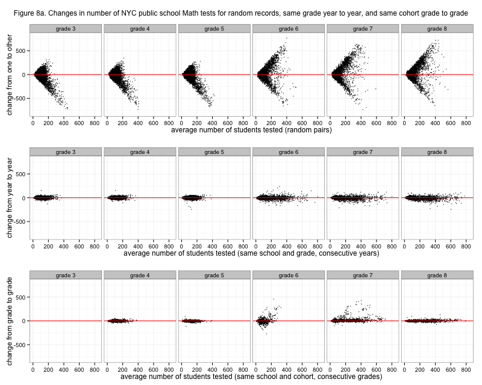
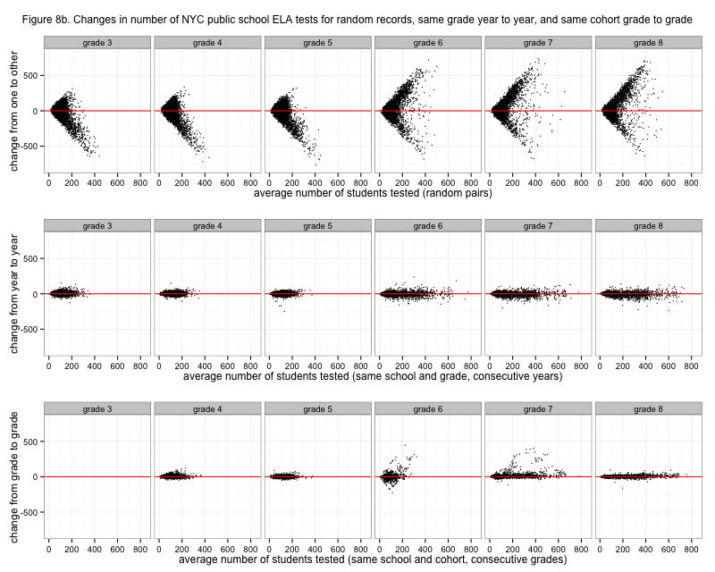

# NYC standardized test results: Number of students tested at the school grade subject level

After <a href="http://planspace.org/2013/11/15/nyc-standardized-test-results-the-total-number-of-students-and-tests/">all</a> <a href="http://planspace.org/2013/11/16/nyc-standardized-test-results-the-total-number-of-students-and-tests-by-grade/">the</a> <a href="http://planspace.org/2013/11/16/nyc-standardized-test-results-the-total-number-of-tests-by-grade-viewed-by-cohort/">preceding</a>, it might be interesting to look at some totals by subject, but I think the time has come to look at the school grade level numbers directly. This analysis with the number of tested students should have some similarity to eventual analysis of average scores themselves, if all goes well.

[caption id="attachment_549" align="aligncenter" width="525"] Figure 8a. Changes in number of NYC public school Math tests for random records, same grade year to year, and same cohort grade to grade[/caption]

This is <a href="http://planspace.org/2013/11/15/nyc-standardized-test-results-checking-out-the-number-of-students-tested-in-math-and-ela-again/">another</a> <a href="http://www.statistics.com/index.php?page=glossary&amp;term_id=364">Tukey mean-difference plot</a>, showing changes in number of tested students in Math. The top panel randomly pairs records to show a sort of baseline maximal variation. Grades three to five have less top end because elementary grades tend to be smaller than than middle school grades. The middle panel shows changes in numbers for the same grade at the same school, between years. So for example if a school had 40 grade 4 math tests in 2008 and 50 grade 4 math tests in 2009, that's a change of +10 for grade 4. The bottom panel shows changes in numbers for the same <a href="http://planspace.org/2013/11/16/nyc-standardized-test-results-the-total-number-of-tests-by-grade-viewed-by-cohort/">cohort</a> at the same school, between grades (which is also between years, of course). For example, if a school had 40 grade 4 math tests in 2008 and 42 grade 5 math tests in 2009, that's a change of +2, which will show up in the grade 5 sub-panel. Since testing starts in grade 3, there isn't any change to be observed for the cohort into that grade.

As expected, there is typically more variation in <em>grades</em> than in <em>cohorts</em>. This is true even for the cohort change into grade 6 versus the grade 6 year to year, though it's closer (<a href="http://en.wikipedia.org/wiki/Median_absolute_deviation">MAD</a> 10 vs. 9). We know that schools tend to change more from grade 5 to grade 6, generally - students could come from an elementary school and enter a K-8 school, for example, and that would show up here. There are conspicuous outliers for cohort changes especially going from fifth to sixth grade and from sixth to seventh. This is a little weird. They are almost all positive, meaning that a school seems to have started testing a lot of students in seventh grade, for example, who weren't tested in sixth grade. It could also be that a school has a big influx of sixth graders from other schools, as another possibility. These outliers suggest that some care should be taken in later analysis of test scores - perhaps a check that numbers tested are more or less similar.

Because of the outliers, changes for grades and changes for cohorts actually have similar overall <a href="http://en.wikipedia.org/wiki/Standard_deviation">standard deviation</a>s (about 20) but the <a href="http://en.wikipedia.org/wiki/Median_absolute_deviation">median absolute deviation</a> for grade changes (10) is twice what it is for cohort changes (5).

[caption id="attachment_550" align="aligncenter" width="525"] Figure 8b. Changes in number of NYC public school ELA tests for random records, same grade year to year, and same cohort grade to grade[/caption]

This figure showing the same things but for ELA testing looks very similar but is in fact different. (See <a href="https://github.com/ajschumacher/NYCtests/blob/master/code/figure8.r">code</a>.) The extreme similarity even for outliers may be reflecting that Math and ELA testing go hand in hand, so what happens for one also happens for the other. Hopefully this can be taken as evidence that apparent cohort swings are due to student movement and not changes in whether particular students were tested or not. It might be worth tracking down explanations for some of these strange patterns anyway, but I won't pursue this for the moment.

[<a href="http://planspace.org/2014/01/10/nyc-test-data/">table of contents for this series</a>]

*This post was originally hosted [elsewhere](https://planspacedotorg.wordpress.com/2013/11/17/nyc-standardized-test-results-number-of-students-tested-at-the-school-grade-subject-level/).*
