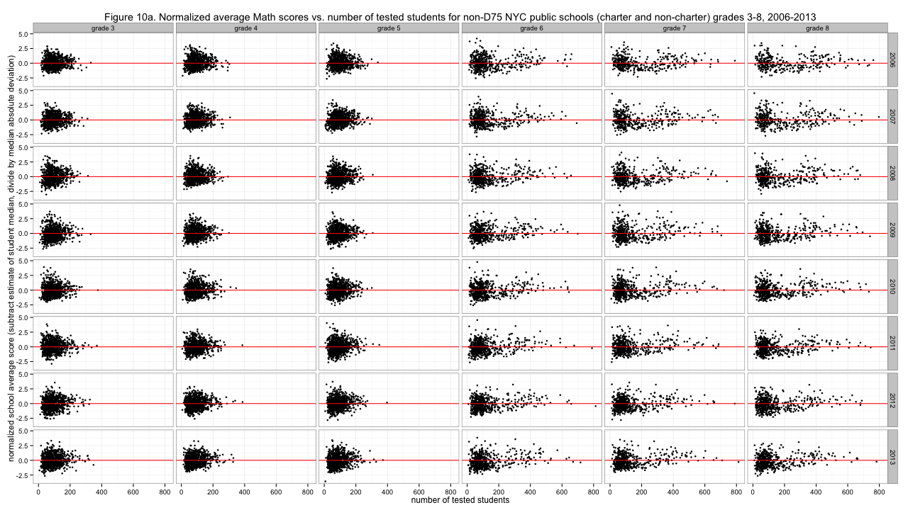
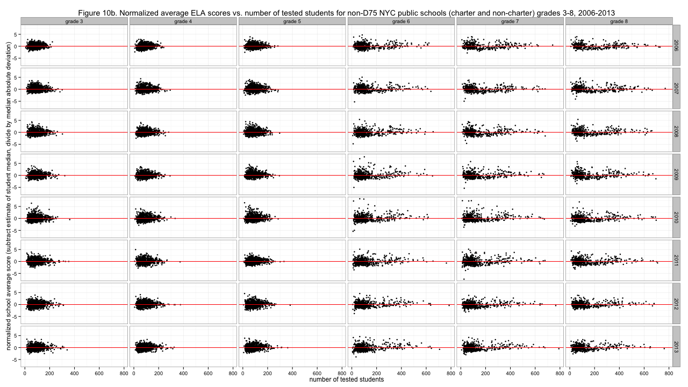

# NYC standardized test results: Schools fight the Law of Large Numbers

After all the hemming and hawing over choices that make no visible difference in the plots of this post, I've decided I like the bottom right option from the <a href="http://planspace.org/2013/11/17/nyc-standardized-test-results-normalizing-the-distributions-of-average-scores/">last post</a> the most - subtracting out the estimated student-level median and then dividing by median absolute deviation. So be it! 
 
The question of this post, however, is how the variability of school grade average scores changes with the number of tested students. Smaller samples generally produce more extreme results. There's less chance for regression to the mean, as it were. The <a href="http://en.wikipedia.org/wiki/Law_of_large_numbers">Law of Large Numbers</a> hasn't had a chance to take effect. If we're drawing randomly, then the variance of the sample mean gets small when the sample size is big. Does that happen for school grade averages? 
 
[caption id="attachment_603" align="aligncenter" width="525"] Figure 10a. Normalized average Math scores vs. number of tested students for non-D75 NYC public schools (charter and non-charter) grades 3-8, 2006-2013[/caption] 
 
It does, to some extent. The graphs are vaguely cone-shaped. (ELA is a little more cone-shaped; see below.) Of course, students are not randomly assigned to schools, which is what makes these graphs particularly interesting. The elementary grades (including 3 to 5) are generally smaller, yet it looks like the elementary grade averages approach the student average even while the middle school grades (6 to 8) vary widely. This seems consistent with the idea of smaller local elementary schools that educate mostly whoever is nearby, with more of a filtering effect starting with middle school - a parent might be more likely to support a longer commute to a better school, which also means the better school draws good students from a wider area. 
 
It is good news that the school scores do mostly seem to converge toward average when there are more students. If there were perfect segregation of better and worse-performing students we could see all these averages avoiding the center red lines entirely. 
 
If you squint a little, it looks like there somehow aren't any middle schools&#160;with around 200 students in a grade that perform much above average in ELA. You can almost see something like that for math too. Weird. (<a href="https://github.com/ajschumacher/NYCtests/blob/master/code/figure10.r">Code</a>.) 
 
[caption id="attachment_606" align="aligncenter" width="525"] Figure 10b. Normalized average ELA scores vs. number of tested students for non-D75 NYC public schools (charter and non-charter) grades 3-8, 2006-2013[/caption] 

[<a href="http://planspace.org/2014/01/10/nyc-test-data/">table of contents for this series</a>]

 

*This post was originally hosted elsewhere.*
