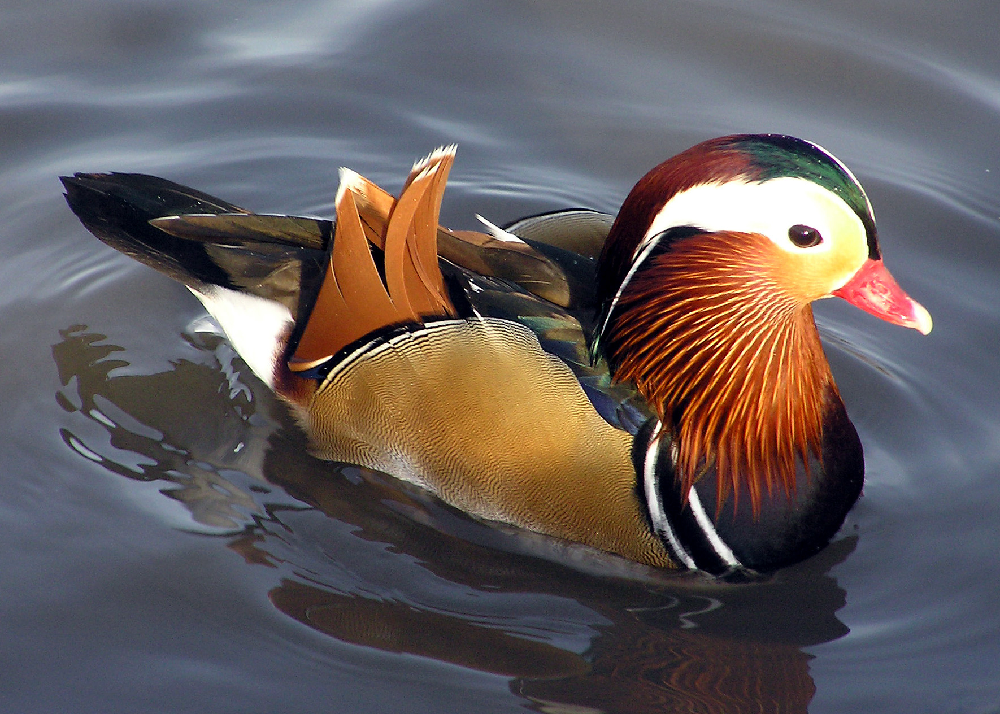
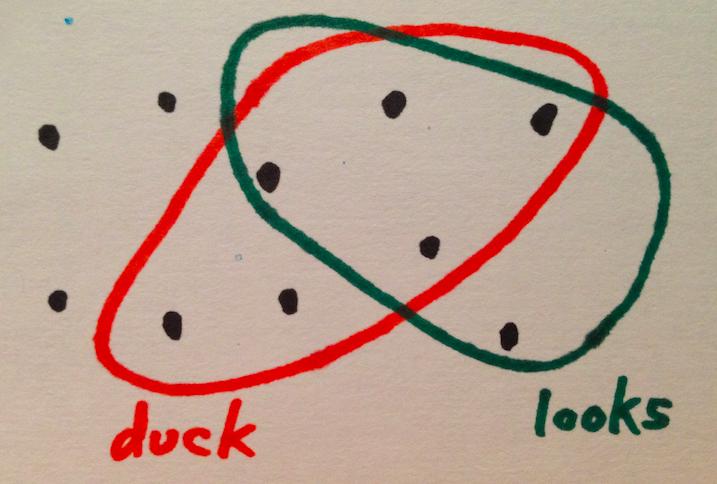

# Bayes' Rule for Ducks

You look at a thing. 
 
 
 
Is it a duck? 
 
Re-phrase: What is the probability that it's a duck, if it looks like that? 
 
Bayes' rule says that the probability of it being a duck, if it looks like that, is the same as the probability of any old thing being a duck, times the probability of a duck looking like that, divided by the probability of a thing looking like that. 

$latex \displaystyle Pr(duck | looks) = \frac{Pr(duck) \cdot Pr(looks | duck)}{Pr(looks)}$

 
This makes sense: 
<ul>
 
	<li>If ducks are mythical beasts, then $latex Pr(duck)$ (our "prior" on ducks) is very low, and the thing would have to be <em>very</em> duck-like before we'd believe it's a duck. On the other hand, if we're at some sort of duck farm, then $latex Pr(duck)$ is high and anything that looks even a little like a duck is probably a duck.</li>
 
	<li>If it's very likely that a duck would look like that ($latex Pr(looks|duck)$ is high) then we're more likely to think it's a duck. This is the "likelihood" of a duck looking like that thing. In practice it's based on how the ducks we've seen before have looked.</li>
 
	<li>The denominator $latex Pr(looks)$ normalizes things. After all, we're in some sense portioning out the probabilities of this thing being whatever it could be. If 1% of things look like this, and 1% of things look like this <em>and</em> are ducks, then 100% of things that look like this are ducks. So $latex Pr(looks)$ is what we're working with; it's the denominator.</li>
 
</ul>
 
Here's an example of a strange world to test this in: 

 
There are ten things. Six of them are ducks. Five of them look like ducks. Four of them both look like ducks and are ducks. One thing looks like a duck but is not a duck. Maybe it's a fake duck? Two ducks do not look like ducks. Ducks in camouflage. Test the equality of the two sides of Bayes' rule: 

$latex \displaystyle Pr(duck | looks) = \frac{Pr(duck) \cdot Pr(looks | duck)}{Pr(looks)}$

 

$latex \displaystyle \frac{4}{5} = \frac{\frac{6}{10} \cdot \frac{4}{6}}{\frac{5}{10}}$

 
It's true here, and it's not hard to show that it must be true, using two ways of expressing the probability of being a duck and looking like a duck. We have both of these: 

$latex \displaystyle Pr(duck \cap looks) = Pr(duck|looks) \cdot Pr(looks)$

 

$latex \displaystyle Pr(duck \cap looks) = Pr(looks|duck) \cdot Pr(duck)$

 
Check those with the example as well, if you like. Using the equality, we get: 

$latex \displaystyle Pr(duck|looks) \cdot Pr(looks) = Pr(looks|duck) \cdot Pr(duck)$

 
Then dividing by $latex Pr(looks)$ we have Bayes' rule, as above. 

$latex \displaystyle Pr(duck | looks) = \frac{Pr(duck) \cdot Pr(looks | duck)}{Pr(looks)}$

 
This is not a difficult proof at all, but for many people the result feels very unintuitive. I've tried to explain it <a href="http://planspace.org/2013/11/11/whats-the-difference-between-bayesian-and-non-bayesian-statistics/">once before</a> in the context of statistical claims. Of course there's a <a href="http://en.wikipedia.org/wiki/Bayes'_theorem">wikipedia page</a> and <a href="http://betterexplained.com/articles/an-intuitive-and-short-explanation-of-bayes-theorem/">many</a> <a href="http://yudkowsky.net/rational/bayes">other</a> <a href="http://www.quora.com/Probability/What-is-an-intuitive-explanation-of-Bayes-Rule">resources</a>. I wanted to try to do it with a unifying simple example that makes the equations easy to parse, and this is what I've come up with. 

*This post was originally hosted elsewhere.*
