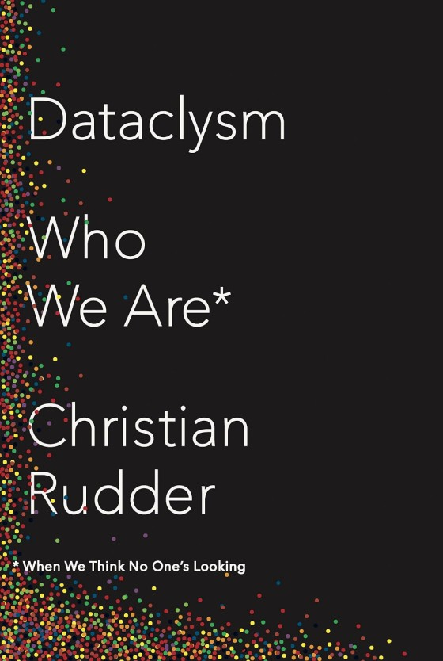

# Dataclysm: There's another book

Dataclysm is a nicely made book. In the Coda (p. 239) we learn something of why:

<blockquote>Designing the charts and tables in this book, I relied on the work of the statistician and artist Edward R. <a href="http://www.edwardtufte.com/tufte/">Tufte</a>. More than relied on, I tried to copy it.</blockquote>

The book is not unpleasant to read, and it goes quickly. It may be successful as a popularization. I rather wish it had more new interesting results. Perhaps the author agrees with me; often the cheerleading for the potential of data reads like disappointment with the actuality of the results so far.

The author's voice was occasionally quite insufferable. He describes himself "photobombing before photobombing was a thing" in a picture with Donald Trump and Mikhail Gorbachev, for example. This anecdote is around an eighth of the text in the second chapter; perhaps more. The chapter is about the value of being polarizing, so if he alienated me there it may count as a success.

In conclusion: the <a href="http://blog.okcupid.com/">OkTrends blog</a> is fun; there's also a book version now.

*This post was originally hosted elsewhere.*
