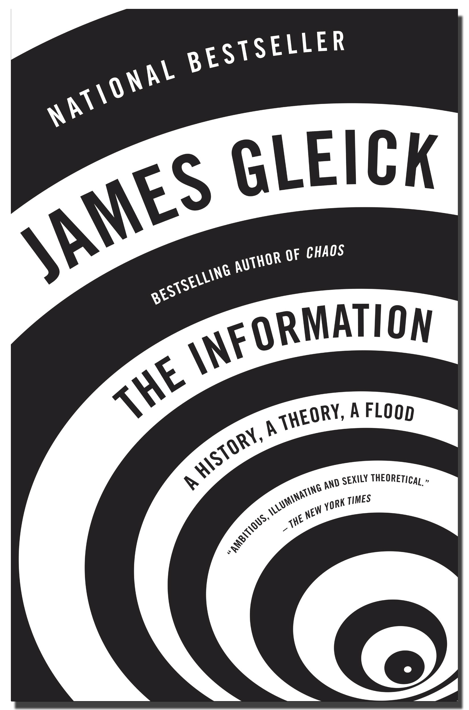

# The Information: a History, a Theory, a Flood

This is a really good book. 
 
 
 
James Gleick is excellent. The history is beautifully researched and explained; there is so much <em>content</em>, and it is all fitted together very nicely. 
 
The core topic is <a href="http://en.wikipedia.org/wiki/Information_theory">information theory</a>, with the formalism of entropy, but perhaps it's better summarized as the story of human awakening to the idea of what information is and what it means to communicate. It is a new kind of awareness. Maybe the universe is nothing but information! I'm reminded of <a href="http://planspace.blogspot.com/2012/05/quotes-from-frederick-w-kantor.html">the time I met Frederick Kantor</a>. 
 
I'm not sure if <em>The Information</em>&#160;pointed me to it, but I'll also mention&#160;<em>Information Theory, Inference, and Learning Algorithms</em> by&#160;David J.C. MacKay. This book can be <a href="http://www.inference.phy.cam.ac.uk/itprnn/book.pdf">read in PDF for free</a>. I haven't gone all through it, but it seems to be a good more advanced reference. 
 
<em>The Information</em>: Highly recommended for all! 

*This post was originally hosted elsewhere.*
