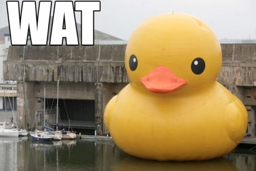

# Data and Truth

*A presentation at [csv,conf][].*

[csv,conf]: http://csvconf.com/

I would like to approach some ideas about data and truth through a
specific example. Some theoretical frameworks will be mixed in. By the
end I'll have made a few recommendations.

```html
How many NYC public school English
Language Learner (ELL) students
took the state math test in 2008?
```

The specific question to get us started is this: "How many New York
City public school English Language Learner (ELL) students, that is,
students identified as not speaking English fluently, took the New
York State math test in 2008?

You'll notice that this is a very specific question, and this is
because I'm cheating. I've aligned the question to the data I happen
to have.

Just for fun, take it as a Fermi problem - how many do you think there
were? Can you estimate the answer?

```html
Way of Knowing:
 Silence
```

But before we officially start trying to answer the question with
data, I want to start introducing some "ways of knowing" that I'm
borrowing from Balenky and friends. These are going to be systems of
epistemology - ways of understanding knowledge. "Silence" refers to
alienation from knowledge, which might sound strange. Especially with
regard to math, statistics, anything data related, you have likely met
people who feel these things are quite "other" to them You, on the
other hand, are on the very opposite of that spectrum. I'd like to
offer, and it may be the most important point in the talk, that it is a
fundamental problem that we as humanity are missing the involvement of
so many people.

```html
Way of Knowing:
 Subjective Knowledge
```

Next up is "subjective knowledge", which is important but relevant to
data work mostly in as much as they might seem to devalue one another.
Probably a good deal more could be said about this relationship.

```html
There is a file, `ell.csv`
```

We have a file, `ell.csv`! It was obtained first as an Excel file from
the New York City Department of Education's web site. I've saved the
relevant bit as CSV and you'll have to take my word that this process
resulted in the "right" data, whatever that means.

```python
d = read_csv('ell.csv')
```

I'll read in the data. What do you think? How much closer are you to
an answer to our starting question?

```html
You can't see data
```

The point here is that you haven't got a data sense. Data might as
well be ultraviolet light, because it is totally invisible to you.
Except it's worse, because UV light we can at least try to project
somehow sort of reasonably into something that you do have a sense for
handling, but for data we really haven't got anything like that, in
general.

For your consideration: Numbers are visualizations. Letters are
visualizations. Means are visualizations, p-values are visualizations,
root mean squared errors are visualizations. And, of course,
visualizations are visualizations. We have a lot of visualizations,
but we don't have nearly enough, and many of those we do have are
awful.

I think one thing we need is better tools, and I'll give some small
examples later on.

```python
In [1]: d.ix[0:4, 0:5]
Out[1]:
      DBN Grade  Year Category  Number Tested
0  01M015     3  2006      ELL              4
1  01M015     3  2006       EP             35
2  01M015     3  2007      ELL              8
3  01M015     3  2007       EP             23
4  01M015     3  2008      ELL              6
```

So let's visualize some of this data that I've promised. "DBN" is a
school identifier. "Grade" and "Year" you can make sense of, perhaps.
"ELL" we talked about earlier, and "EP" is "English Proficient".
"Number Tested" is what we're looking for! Great!

```python
In [2]: d['Number Tested'][(d['Category'] == 'ELL') &
                           (d['Year']     == 2008)].sum()
Out[2]: 110956
```

So we can write these two lines and get an answer. Here is is: about
110,000.

How many things could have gone wrong here? Have we answered the
question we started with? How close is this answer to the truth? Do
you know enough to answer these questions?

```html
Way of Knowing:
 Received Knowledge
```

Say I'm a data journalist and I got a number for my story, or I'm an
education policy student, or I'm anyone at all, and now this number is
published somehow and it is far easier to find than the data itself.
Many people will not even think to ask to see this number's
credentials. It isn't just dangerous that the credentials aren't out
there - it's dangerous that people aren't asking. These are problems
of "received knowledge".

```html
Way of Knowing:
 Procedural Knowledge
```

Or you might be concerned with aspects of the procedure that rather
miss the point. Do I have structured provenance data for the number?
Are those students schema.org "Thing > Person"s? These are the
failings of "procedural knowledge".

```html
Way of Knowing:
 Constructed Knowledge
```

Even with just this one data source and this one question, things are
more complicated than that. We'll call a complete and nuanced view of
knowledge and belief "constructed knowledge". What we really need is a
more complete understanding. Let's look in the data for some of the
easy bits.

```python
In [3]: sorted(d['Grade'].unique())
Out[3]: ['3', '4', '5', '6', '7', '8', 'All Grades']
```

Looking at what grades are in this file, we see that there are grades
3-8, which I can tell you is what it should be - those are the grades
with New York State math tests. But we also have "All Grades" rows,
which immediately suggests that our first answer was off by a factor
of two.

```html
 + Internal checks for consistency
 - Consistency is not truth
 - Redundancy
 o Views
```

Are the subtotal rows good or bad? On the one hand, it gives us
something to check - if the provided totals are wrong, then certainly
something is wrong, somewhere. But if they're right, it really only
gives us a good feeling and perhaps increases a general sort of
respect for someone somewhere. It's not really evidence that the data
is "true".

The redundant data certainly isn't needed and introduces more places
for mistakes to happen both in production and use. The fundamental
problem, as is often the case, is that the data we see is really a
view of other data, and we'd like to reduce the number of these
indirections. So these rows really shouldn't be in there. But this is a
point you may not succeed in making with whoever produces the file.

```python
In [4]: d['Number Tested'][(d['Category'] == 'ELL') &
                            (d['Year']     == 2008) &
                            (d['Grade']    != 'All Grades')].sum()
Out[4]: 55478
```

So let's re-calculate. 55 thousand or so. Is this the right answer
then?

```python
In [5]: sorted(d['Category'].unique())
Out[5]: ['ELL', 'ELLs', 'EP']
```

Let's look at the "Category" column just a little more carefully. We
thought there were just "ELL" and "EP", but also there's "ELLs". How
strange.

```python
In [6]: (d['Category'] == 'ELLs').sum()
Out[6]: 6
```

There are six of these "ELLs". Strange indeed. At this point you can
look into what's going on, and you will almost certainly conclude that
someone edited the source file by hand at some point. Of course we
have no record of this, of who it was or when it happened, and we are
really just guessing about the process that brought the data to us. I
want to suggest that this guessing is something important.

```html
Information Source
 + Transmitter
    + Signal
       + Receiver
          + Destination
```

Here is Shannon's general model of communication, going from
information source via transmitter to some signal, and then from
signal via receiver to destination. You can find this model many
places. Try doing it for spoken language. It also has a fractal
quality. Try doing it for brain to vocal cord. And so on.

```html
Phenomena of Interest
 + Data Creation
    + Data
       + Analysis
          + System of Beliefs
```

Here I've re-written Shannon's model to be the data process we often
need to think about. Whatever we're interested in is the phenomenon of
interest, which is leading via some data creation process to some
data, perhaps a CSV. Then some sort of analysis happens which leads to
an updated system of beliefs inside the head of some human, perhaps
you.

While Shannon was mostly concerned with noise affecting his signal,
we're mostly concerned with what's happening in the data creation and
analysis steps. Problems can enter in either phase, and probably both.
Note especially that correct analysis depends on correct understanding
of the data creation process.

```python
In [7]: d['Number Tested'][(d['Category'].isin(['ELL', 'ELLs'])) &
                           (d['Year']     == 2008) &
                           (d['Grade']    != 'All Grades')].sum()
Out[7]: 55487
```

With our hard-earned guess about the "ELLs" labels, we can now get yet
another answer to our initial question. 55,487. So precise.

Notice how ugly our code is already for this simple question. So
fragile. Really it would be better to fix the data at its source,
wouldn't it? We can probably agree about the "ELLs" thing at least,
can't we?

```python
In [8]: d.ix[[1235], 0:5]
Out[8]:
         DBN Grade  Year Category  Number Tested
1235  01M363     4  2006      ELL              1

[1 rows x 5 columns]
```

But the problems we have seen are still superficial. How do we know if
this data is true? Was there exactly one fourth-grade ELL student
tested at 01M363 in 2006? I don't know. You probably don't know. The
people running the data system probably don't know. A teacher might
know. That student might know.

```python
In [9]: read_csv('world_cup_2014_final.csv')
Out[9]:
        team  score
0    Germany      0
1  argentina      1

[2 rows x 2 columns]
```

But let's look at some data that people care about much more than the
education of New York City's youth. As you can plainly see, this data
has a serious problem. Argentina is not capitalized!

(Note that this talk was given two days after this match was played,
with actual scores the reverse of those given.)

The point here is that many of the things that we think of to fix in
data are not really the difficult things. There's no way to know that
the score is wrong unless you know that the score is wrong, in this
case. We need eyes on the data. We need distributed validation. We
need people.

```html
Data should be easy to change.
It isn't easy.
∴ We need to fix something.
```

Say we have the people. It's still far too hard for them to make
corrections. I'll mention two reasons.

One is related to authority-based epistemology, wherein the data is
correct because it comes from an "authoritative" source. This is
especially pernicious when the authority is an organization - a human
released that incorrect data, but now that it has the stamp of the
organization even the humans in the very same organization may not be
able to change it.

The second reason is that systems aren't set up to be changed
flexibly. Too often available data is a view of underlying systems and
we're playing wack-a-mole. We need to find better ways to design and
expose data systems.

```html
Data must never change.
```

So say the data is corrected. This is a disaster! Now some things have
been corrected, but our code was adapted to those things so the fixes
may have broken our code, and of course there are new problems that we
couldn't have anticipated.

Attempting to ensure that data meets whatever expectations we've
developed, we might write assertions about the data. This is another
kind of wack-a-mole, in that we can't really test everything that we
assume. To be clear, I think we should write more tests rather than
fewer, especially when code is used on data that necessarily changes.
But for analysis that we want to be reproducible, the data must not
change.

```python
In [10]: assert((d['Category'] == 'ELLs').sum() == 6)
```

Computer scientist types are sometimes excited about homoiconicity,
which we can think of as having your code also be data. I think that
we should flip this around and think of our data as also being code.
Then you don't need a million assertions to check that each piece of
the data is the data you expect. If the data is in another file, you
do one assertion that the file is the same file you thought it was,
and you can go on then to use assertions in useful expressive ways.

```python
In [11]: sha('ell.csv')
Out[11]: '846bb60a6e5df37281ffe79eec2087044d900860'

In [12]: assert(sha('ell.csv') == '846bb60a6e5df37281ffe79eec2087044d900860')
```

One way to knit your data into your code is to write an assert on a
hash of your data. The hash of a file is, for practical purposes,
unique to the file, but small enough to include in your source. So if
the data changes, the hash will change, and the assertion will fail.
It's effectively the same thing as copying all your data into your
source file as a literal, but it takes fewer lines of code. This is
reproducible.

I'll note that this kind of trick is also what git uses for ensuring
your version controlled files aren't fiddled with, and it's related to
how the blockchain of cryptocurrencies like BitCoin ensure that
history isn't fiddled with. I think it may turn out that the block
chain idea is useful for public records beyond currency.

```html
How do we assert?
```

I still think we should be assertive in working with data, and I want
to propose a way of doing it that sucks less, as a possible interface
idea. Read Evaluate Print Loops are very useful tools, and things like
IPython notebook are nice as well. But coding with a REPL you have a
lot of back and forth, and with IPython notebook especially it's easy
to get tangled up because you have exactly one current state of the
system and you can't really rewind it or otherwise access earlier
points.

```python
1 + 1
```

```python
assert(1 + 1 ==
       2)
```

What if we used assertions as the interface? Now, this may seem to
have all the sexiness of a paper tape adding machine. But note that
I'm not switching to a REPL, but I am getting my output, and as I go
I'm creating a confirmable record of what I've done.

```python
x = 16

assert(x / 2 ==
       8)
```

```python
x = 24

x / 2
```

It would also be nice if there was some intelligence to this system,
so that if I go back and change something I don't have untrue
assertions lying around.

```python
sha('ell.csv')
```

```python
assert(sha('ell.csv') ==
       '846bb60a6e5df37281ffe79eec2087044d900860')
```

And it's very easy to do my data assertions.

```python
assert(sorted(d['Category'].unique()) ==
       ['ELL', 'ELLs', 'EP'])

d['Category'][d['Category'] == 'ELLs'] = 'ELL'

assert(sorted(d['Category'].unique()) ==
       ['ELL', 'EP'])
```

This sort of thing would make it very natural to write code that reads
like a narrative, or better yet an argument, showing what was the
case, what was done, and what the result is, all confirmable.

```html
Data that changes and doesn't change
```

Now we still have this problem of data needing to change and also
absolutely not being allowed to change. How do we resolve this? Well,
physics also has this problem, and the solution is time. We need a
system that can always have the same answer for questions like "what
did we know on some date at some time?". What can do this?

```html
SQL?
```

SQL, and really most databases, is almost always a disaster when it
comes to this. If your work pulls data from SQL, your work is not
reproducible, and it may not even be consistent for a single run.

```html
csv
```

In this sense, it's a benefit of CSV that it's so often used as a
snapshot format - for the most part a CSV file will not change on its
own. You can do worse than to keep around copies of every CSV you ever
use and treat them as immutable. Storage space is cheap, they say.

```html
git checkout `git rev-list -n 1 --before="2014-05-01" master`
```

Of course some real versioning system would be better. Git is not the
worst thing. It can get you the system as of whatever date/time, but
it's a little clunky, and there are other issues that make it less
than ideal for some data sets. But still, for many data sets
git-controlled CSV is a great solution.

```html
dat?
```

The Dat Project promises to do versioning, and I really hope to see it
do it very well. It's still early. So far versioning behavior is a
little strange as far as I can tell. There's also the issue of unique
IDs, which is something you might not think about if you're storing
data in rows of CSV. This affects the next candidate as well.

```html
datomic
 * time baked in
    * (as-of db t)
 * triples
 * datalog
 * proprietary
```

Datomic is a database that has the time feature that I think should be
a requirement for every data system: you can always get the state of
the data "as of" any time. So if I run my analysis today and get a
result, I can be guaranteed that I can get the same result if I do it
again tomorrow. You have no such guarantee with a SQL database or with
CSV files in DropBox, for example.

Datomic makes some other interesting choices. First, it decides that
the structure of data is fundamentally triples, not rows or objects.
I'm not sure this is right for every problem, but Datomic is very
clear about its opinion. A related choice is that you query the
database using datalog. And most unfortunately, Datomic is proprietary
software.

I don't know yet whether Dat will be anything like the Free version of
Datomic, but I want this as-of time feature somewhere!

```html
The most exciting phrase to hear in science,
the one that heralds new discoveries, is not
"Eureka" but "That’s funny..."      (Asimov)
```

Wrapping up, I want to connect to what I think is the purpose of
working with data, which is to learn something about the world. Of
course, with data much of the time when we say "That's funny..." it's
because there's something wrong with the data. Here's an example.



So: Is the duck real? Call me naive, but when I first saw this picture
I thought this was Photoshop wizardry. This is a real duck. Some of
you already know, and some of you may not believe me. Talk to the
people around you. Google it. It's a team effort.

```html
The Data Explorers Club
```

So the final point is that while there is data out there that is
unbelievable, some of those are discoveries! I would like to see more
discoveries. I would like it very much if building knowledge from data
became a popular hobby. Call it The Data Explorers Club.

Thank you.

```html
This is how life will be. I must be wholehearted while tentative,
fight for my values yet respect others, believe my deepest values
right yet be ready to learn. I see that I shall be retracing this
whole journey over and over - but, I hope, more wisely.   (Perry)
```

*This post was originally hosted [elsewhere](https://github.com/ajschumacher/data_and_truth/blob/master/README.md).*
