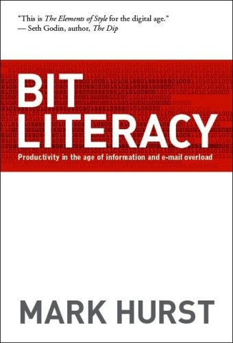
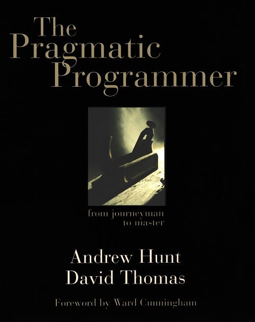
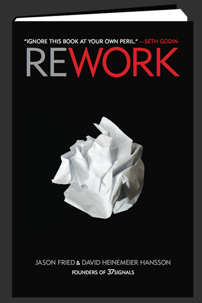
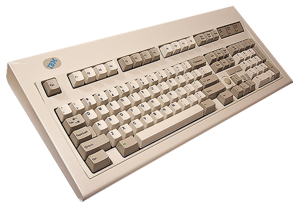

# Well-Used Simple Tools

*A [short talk](http://www.meetup.com/Design-Thinking-DC/events/216029412/) for [Design Thinking DC](http://www.meetup.com/Design-Thinking-DC/).*

I work with data, and the tools that are unique to what I do may or may not be interesting to you. There are some tools, however, that can be applied across many domains, and some ideas for maximizing their effectiveness.

-----

image of big post-it

-----

This is an image from the drafting process for this talk. Paper is my favorite invention. [1] You could read these books on paper if you would like.

[1] *The [Bard Institute for Writing and Thinking](http://www.bard.edu/iwt/) brought me back to the immediacy of physical artifacts and influenced how I think about the creative process.*

-----

-----

My thoughts on email and to-do management come directly from this [Bit Literacy](http://bitliteracy.com/), which you can get for free at [bitliteracy.com](http://bitliteracy.com/).

-----

-----

My thoughts about text and separation of concerns, among other things, were certainly influenced by [The Pragmatic Programmer](https://pragprog.com/the-pragmatic-programmer).

-----

-----

[ReWork](http://37signals.com/rework/), which is largely the same as the freely available [Getting Real](http://gettingreal.37signals.com/), brings ideas of working effectively to working at work.

-----

-----

