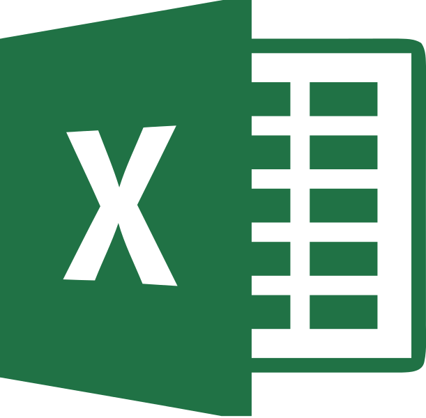
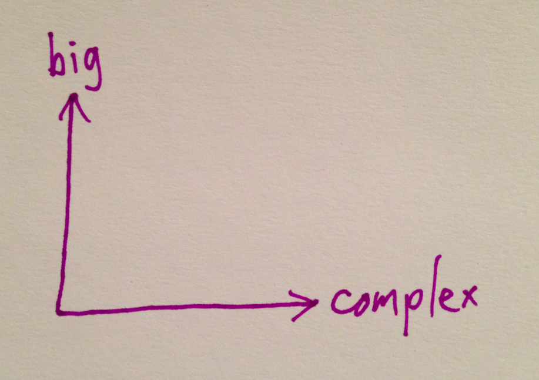
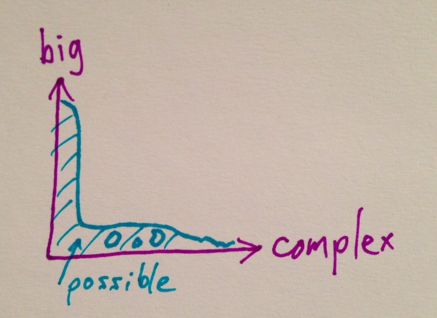

# Please stop saying “Big Data”

*A short talk for [AIR](http://www.air.org/).*

I thought about calling this “Size and Complexity in Real Data Systems,” but that would have been so boring.

-----

-----

This is [Alan Kay](http://en.wikipedia.org/wiki/Alan_Kay). He worked at Xerox PARC, he said “The best way to predict the future is to invent it,” and he said this, at a [talk](https://www.youtube.com/watch?v=gTAghAJcO1o) earlier this year:

> Big data is a way that a lot of people are trying to make money today. And it's a favorite of marketing people, because it's in the wind. Everybody has heard the phrase “big data.” Not everybody knows what it means. And so it's the perfect context for doing things that people can say, “Well this is an application of big data and this is an application of big data.” But in fact, the interesting future's not about data at all—it's about meaning.

The objection here which is an objection of many is an objection to torturing the phrase “Big Data” until it means everything and nothing.

You can also read an article that Deloitte published last Wednesday on the Wall Street Journal's web site called [Should We Stop Using the Term ‘Big Data’?](http://deloitte.wsj.com/cio/2014/12/10/should-we-stop-using-the-term-big-data/).

The answer is yes. Let's all stop saying “big data” when we just mean “data.”

-----

-----

Some people think big data is data they can't put in Excel. The problem with this is that you shouldn't be putting *any* data in Excel. There are many reasons Excel is bad. If you care about getting the right answer, you shouldn't use Excel [1]. But it is also true that more and more, we've moved from the era of “shouldn't use Excel” to the era of “can't possibly use Excel.”

The reasons you can't use Excel these days can include volume, velocity, variety, and veracity, those [V words](http://www.ibmbigdatahub.com/infographic/four-vs-big-data) that buzz along with “big data.” These Vs are trying to get people to realize that their ideas about how to work with data are inadequate. The ideas were inadequate before as well, but now they're really clearly inadequate. It is more comfortable to think that the problem is only with these new-seeming Vs.

[1]: *See, for example [Growth in a Time of Debt](http://www.businessweek.com/articles/2013-04-18/faq-reinhart-rogoff-and-the-excel-error-that-changed-history).*

-----

-----

Working with data is always about building systems. This includes systems where the output is an analysis result. You need to build systems that are testable, reusable, extensible, and composable. Ideally, systems that are elegant. You can't do that with Excel, or with most commercial statistical offerings. To steal some other peoples' language, [software is eating the world](http://www.wsj.com/articles/SB10001424053111903480904576512250915629460) and you need to [program or be programmed](http://www.rushkoff.com/program-or-be-programmed/).

What should you learn, if all you know is Excel or something similarly unfortunate like Stata or SAS? If you think you should learn [R](http://www.r-project.org/) or [Clojure](http://clojure.org/) or [Scala](http://www.scala-lang.org/), you might be right. Otherwise, learn [Python](https://www.python.org/).

-----

-----

This is a [slide](http://people.cs.umass.edu/~mcgregor/stocworkshop/langford.pdf) from [John Langford](http://en.wikipedia.org/wiki/John_Langford_%28computer_scientist%29), who has worked on large scale machine learning problems at Yahoo! and Microsoft. This is what technical people tend to mean by “big data.”

It's not quite the same thing as being “O(n2) algorithm feasible,” but to put it differently, let's say that some small data you could theoretically work with in Excel.

Medium data might fit on one computer, but to work with it you'll probably need someone who knows what “O(n2)” means. She started programming years before you, and you probably want her working on your small data too.

Very few people have big data by the definition here, and that's okay [2].

Second recommendation: if you do have really big data, learn [Spark](https://spark.apache.org/).

[2]: *Everybody can get access to somebody else's big data, often public, but very few are producing their own.*

-----

-----

Is more data better? This question is distinct from the question of whether our data is big. Do we want more data at all?

In 2009, some folks at Google come out with [The Unreasonable Effectiveness of Data](http://static.googleusercontent.com/media/research.google.com/en/us/pubs/archive/35179.pdf). They seem to be saying that there is at least one case in which the answer is yes, we want more data.

-----

-----

A good illustration of their point is a [2001 Microsoft paper](http://dl.acm.org/citation.cfm?id=1073017). The problem here is called “confusion set disambiguation,” which sounds fancy but just means that the model has to decide whether to fill in a blank in a sentence with T-O to, T-O-O too, or T-W-O two. So the data is text, and the point is that the amount of data seems to be more important than the choice of algorithm. There are three things to say here.

First, is this big data? Their complete data set was a billion words. Around five gigabytes. This is not an example of big data; that fits on a memory stick.

Second, how are we measuring effectiveness? This is an important thing to take from this example. The Y axis is prediction accuracy on a test set. The model sees some training data, and then we ask it to predict for separate test data, and we see how often it's right. This is a predictive framing of the problem, which is powerful. It's the scientific method: the model is correct to the extent it makes correct predictions. But it doesn't make much sense to try to interpret these models in any way that would please a traditional linguist.

Finally, should we be surprised that having more data helps for this problem?

The problem is a natural language problem. Language is complicated. The problem has been simplified quite a lot, to just confusion set disambiguation, but there are a lot of words, and all these models are high variance, meaning roughly that they have a ton of coefficients [3]. So even if you have a lot of data, you may still have relatively little (or even none) for some cases.

So it makes sense that these models should do better when they get to study more text. And text is easy to get from the internet, so there's no reason not to throw more data at the problem.

Not all problems are like this.

[3]: *[Xavier Amatriain](http://xavier.amatriain.net/) (formerly of Netflix) has a good [explanation](http://technocalifornia.blogspot.com/2012/07/more-data-or-better-models.html) of this which inspired this section.*

-----

-----

I've tried to separate bigness from other kinds of data complexity. Where in this space can we operate?

-----

-----

I don't know if this is a perfect sketch, but there's some truth to it. Simple problems are common and now relatively easy to scale with the big name technologies that people like to sell.

A criticism of this graph is that it's a little circular, in that I'm kind of implicitly saying that things that can be scaled are simple. Maybe so. But there are problems that don't scale even in theory, and there are also problems that have no current good solution at any scale, and the number one way to make a complex problem scale is to transform it into a simple problem.

The amazing thing that you encounter in practice though is how much work there is still to be done here in the lower left-hand corner of this graph, and the tendency of organizations to take their easy problems and make them more complicated.

-----

TSDL

-----

Here's an example that I didn't work on; I only witnessed it from a distance. TSDL stands for Teacher Student Data Linkage. So say you're a company like AIR and you have to decide, for a state, who's a good teacher based on how their students did. (That's hard, by the way.)

You need, of course, some Teacher Student Data Linkage data. Certainly the school districts in the state have this, right?

Well, no. In the case of at least one large urban school district, they did not have usable information of this type. What they did have was two systems that each had some overlapping information. This was arguably already too many systems.

So how do they satisfy the need that the state and the company have for the linkage data? They build a third system. This third system gets data from the two existing systems, and then presents an interface for everyone in the district to go in by hand and identify their students.

This is a lot of work to get something that they probably should have had to begin with. But at least now that they have it, all their systems can benefit, right?

The data that was collected, to the best of my knowledge, was never fed back into the rest of the systems.

This is an example of the importance of smart engineering. For whatever reason, be it funding, vision, technical knowledge... systems are not good. They are not delivering the data that should really be expected of them, so when there's finally a clear and present need for that data, a lot of work goes into getting it,too often yielding dividends for nobody else.

It's not easy to set up and instrument systems, and especially hard to anticipate future needs. And the fragmentation of the American education system does not help with data integration. But if we want to benefit from better uses of data, we need to invest in better systems, not band-aid systems.

-----

Arlington Big Data Roundtable

-----

Here's an example that I did work on. The Arlington Big Data Roundtable was put on by Arlington Public Schools, and the team I was on won, and it got some [press](http://www.washingtonpost.com/local/education/arlington-schools-announce-key-findings-from-big-data-competition/2014/09/10/fff0ee3a-3903-11e4-8601-97ba88884ffd_story.html), which was nice.

What did we do? They gave us a bunch of data, and we predicted which students would drop out in the following year. Based on the historical data we had, and the success metric that we chose, we were pretty good at it. You can predict dropouts. This should be surprising to no one. So what's to say about this?

Let's start with the size of the data. The data in the last example wasn't big, by the way, and that was a large urban school district. Arlington has something like 20,000 students. So the only “big” here has to be some other kind of complexity.

You may have heard that 80% of a data scientist's time is spent munging data, leaving only 20% for analysis. It's interesting that in a data-obsessed profession this entirely made-up statistic gets quoted so much. But it feels true!

How is this example like the last example? We were handed data and worked entirely separately from the real host data systems. So all the work we did to make the data usable, who benefits from that? Nobody. They can't just take that and plug it in to whatever system it came from.

A side issue is that many of the problems come from defining what you are talking about, and bureaucracies tend to ruin this process, often by failing to provide a complete definition, sometimes deliberately. “What does it mean to drop out?” turns out to be tricky.

So we can predict who's going to drop out. Is that going to help any students this year? If it does, it will be because of systems-building work in larger measure than modeling work.

-----

سقسقة

-----

Google Translate tells me that this is Arabic for “tweet.”

This is an example from a hackathon I participated in. It gives me the opportunity to gently critique two more things: hackathons themselves, and what I'll call “data science mad-libs.”

Hackathons first. They're great for getting people excited and talking about something. They're hard to get results out of. So if you're clear about your goal, hackathons may be for you.

The hackathons that are successful tend to have goals that are either totally wide open, or very very well focused. In the first case, any interesting thing could be success. In the second, a lot of work has already gone into scoping a problem and making it attainable in the time available.

The deadly middle ground, which may be familiar if you've worked with clients, is a dream-like aspiration, sometimes a “data science mad-lib.”

Take a big problem and some big source of data, and you get a data science mad-lib:

 * “We're going to stop human trafficking with Facebook!”
 * “We're going to end world hunger with Twitter!”
 * “We're going to monitor flu around the world with Google!”

That last one has been [done](http://www.google.org/flutrends/), though there are [questions](http://bits.blogs.nytimes.com/2014/03/28/google-flu-trends-the-limits-of-big-data/) about its effectiveness. Somebody may we working on these others. And wouldn't it be neat if these worked? And there may *be* a way to make them work—but these aspirations require methods. A starting point and an ending point do not imply a good path between them.

In the case of this particular hackathon we had quite a few Arabic tweets and the idea was to monitor socioeconomic conditions in towns in Egypt. So we put the tweets in Hadoop. Great! This gives us the illusion of making progress toward a goal. But what is our goal? How will we know if we've achieved it? We weren't sure, and while the exercise was interesting, we didn't have any usable results after our one day of work.

Now the [UN Global Pulse](http://www.unglobalpulse.org/) is working on doing things like this Twitter exercise, and they may have some success. I don't want to nay-say all crazy-sounding ideas. Crazy ideas are some of my favorites. But crazy ideas that work are like magic tricks: they're only mysterious if you don't know what's really going on.

-----

data

-----

I am hopeful about data. I think we need more people working on data with more effective tools and practices. Dream big but write code. You can start writing Python tonight. Another book I recommend is called [The Pragmatic Programmer](https://pragprog.com/the-pragmatic-programmer).

-----

Thank you!

-----

And of course, you're under no obligation to agree with me.
