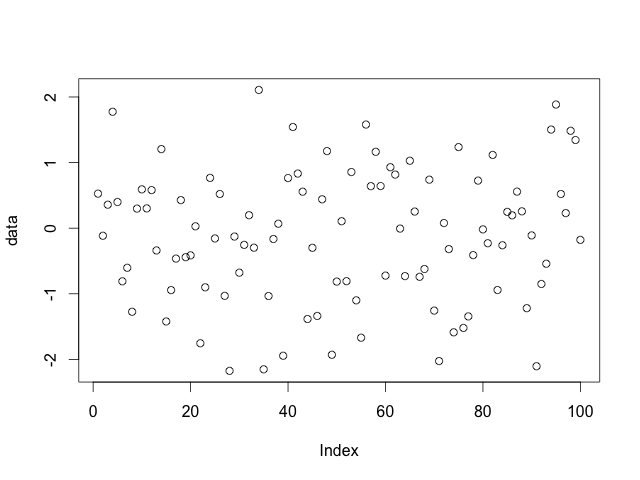
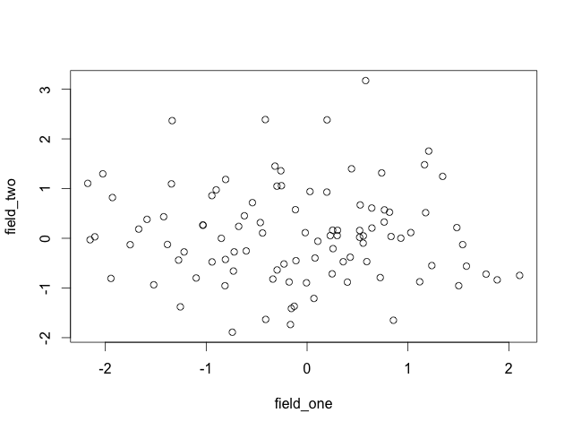

# gog data on your eyes

*A short presentation at the DC [Monthly Challenge](http://www.meetup.com/TrackMaven-Monthly-Challenge/) on [Monday January 19, 2015](http://www.meetup.com/TrackMaven-Monthly-Challenge/events/219314544/).*


-----


-----

`gog` is a name for a simple idea I've been exploring about making it easy to quickly see data from whatever computing environment you happen to be in.

First I'll talk about _quickly_, then I'll talk about _from whatever_, and then I'll show some `gog` prototype work.

Part of the idea is that it's easy to make existing systems work with `gog`—you could start using it by the end of this!

There are two kinds of _quickly_ that I care about. Getting images produced quickly, and then working with them quickly.


-----

```r
plot(data)
```

-----

`R` can produce plots quickly. The `plot` function is generic and will dispatch to a method that knows how to plot whatever you're plotting. This is very nice for the user.


-----



-----

If you plot a single vector, you get a plot like this with the index in the horizontal direction.


-----



-----

If you plot a data frame with two fields, you get a familiar scatterplot.


-----


-----

If you plot a data frame with more than two fields, you get a scatterplot matrix.


-----


-----

And if you plot a linear model object, you get four diagnostic plots.

All of these plots were created with `plot(data)`. There are a lot of defaults chosen, and you might also want to see another view, but the pure convenience of being able to `plot(data)` so easily is really wonderful.

The only way to reduce the friction of graphing even further would be to have plots automatically generated in the background based on whatever data you have on your system. I [think](https://twitter.com/planarrowspace/status/555893329460994048) that would be a fun project, in fact.
