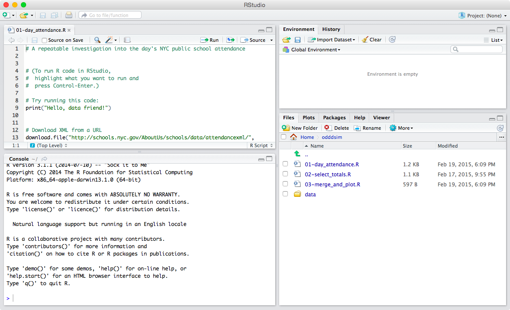
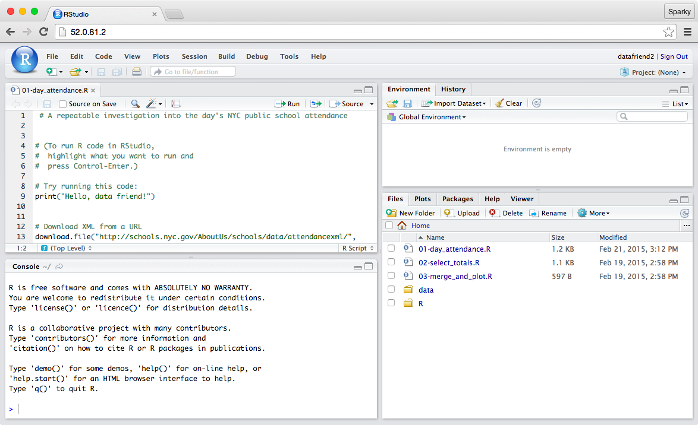
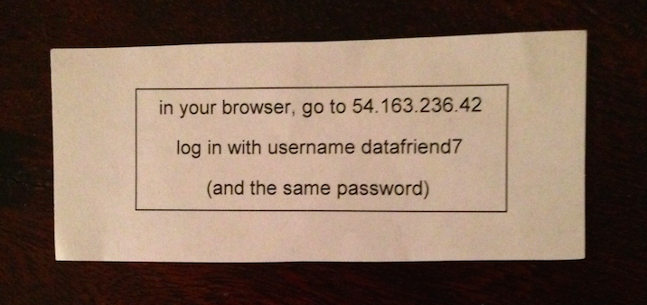

# RStudio in a Web Browser

The most annoying part of `R` workshops is installing software and downloading necessary files. With RStudio Server, workshop participants can skip all that entirely.

Here's what RStudio looks like running locally. To attain the setup shown, you need to install [R](http://www.r-project.org/), install [RStudio](http://www.rstudio.com/), install necessary R [packages](http://cran.r-project.org/), separately download necessary code and data, and navigate to the correct working directory.

Here's what RStudio looks like in a browser. To attain the setup shown, you go to a URL and log in.

In a workshop, it's very nice to be able to start doing things with `R` without messing with setup. Somebody does have to set up the environment in advance though.

Setting up RStudio Server is very easy, especially if you're already familiar with Amazon Web Services ([AWS](http://aws.amazon.com/)):

 * Spin up an AWS Elastic Compute Cloud ([EC2](http://aws.amazon.com/ec2/)) machine using [Louis Aslett's RStudio Amazon Machine Image (AMI)](http://www.louisaslett.com/RStudio_AMI/).
     * [Louis's page](http://www.louisaslett.com/RStudio_AMI/) has good concise directions on how to do this—follow his directions!
 * Secure Shell (SSH) into your EC2 machine and set up the environment as you want it to be.
     * Install globally required packages while running R as root (`sudo R`).
     * Put necessary files (code, data, etc.) as desired in `/home/rstudio` (the prototypical user).
     * Run [build_logins.sh](https://gist.github.com/ajschumacher/12f7484d06cacd4b4cd3), a script developed by [Josh Tauberer](https://twitter.com/joshdata), to create the desired number of user accounts. (See documentation in the script itself.)
* You can optionally give your EC2 machine an AWS [elastic IP address](http://docs.aws.amazon.com/AWSEC2/latest/UserGuide/elastic-ip-addresses-eip.html), which will let you start and stop the machine (avoiding the cost of keeping it running when you aren't using it) but still know in advance what address the machine will be accessible at.
     * Be sure your EC2 machine and elastic IP are both “EC2 classic” or both Virtual Private Cloud (VPC). (Some instance types are only available in VPC!)

For an in-person workshop, it can be effective to distribute login information on slips of paper like this:

I've led an [introductory workshop](/20150220-data_science_isnt_magic/) with ten active participants on one EC2 m3.2xlarge, which runs at 56 cents per hour. For a larger group, I ran two m3.2xlarge machines and three c4.8xlarge machines ($1.856/hour). That used all my five elastic IP addresses and provided 124 vCPUs and 240 gigs of RAM. We had 94 active users and could probably have supported quite a few more without problems.

RStudio in the cloud is a great fit for workshops because it eliminates install and setup pain for participants. It lets you decouple the install process from other workshop activities. The experience of using RStudio in a browser is nice enough that it makes me wonder whether anyone offers cloud RStudio as a service—is that a business that should exist? Workshops certainly aren't the only place where RStudio Server could make sense.

There are also other options for setting up your server. You don't need to use Louis's AMIs; you don't need to use AWS at all. The [Bioconductor Project](http://www.bioconductor.org/) maintains a [Cloud AMI](http://www.bioconductor.org/help/bioconductor-cloud-ami/) that comes with a lot of other pre-installed R packages, for example. (When I last checked it was based on an older version of Ubuntu.) For total control, you can install [RStudio Server](http://www.rstudio.com/products/rstudio/download-server/) from scratch on whatever type of system you like.
