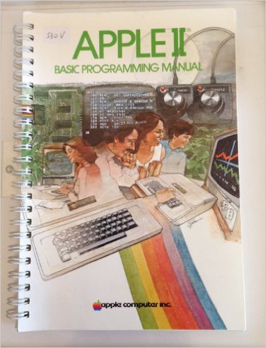
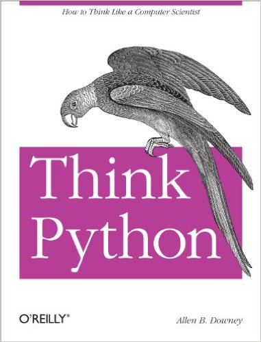

# How to Eat Computers

*A ten-minute talk for first, second, and third-graders at the [Léman Manhattan Preparatory School](http://www.lemanmanhattan.org/)'s elementary school, which they call their “[Lower School](http://www.lemanmanhattan.org/academics/lower)”, on Friday December 4, 2015. I was invited to speak at Léman because I volunteered to help out at schools for “[Hour of Code](https://hourofcode.com/)”. ([slides](big.html))*

-----

planspace.org

@planarrowspace

-----

Hi! I'm Aaron. This is my blog and [my twitter handle](https://twitter.com/planarrowspace). You can get from one to the other. [This presentation](big.html) and a corresponding write-up (you're reading it) are on my blog (which you're on).

-----

-----

note Ghostbusters lunchbox

-----

friends and family

-----

ways to learn

-----

-----

grandparents

-----

binary

-----

~binary~

-----

<code>&nbsp;&nbsp;0</code>

-----

This is zero.

-----

<code>&nbsp;&nbsp;1</code>

-----

This is one.

Easy, right?

-----

<code>&nbsp;10</code>

-----

This is two.

-----

<code>&nbsp;11</code>

-----

This is three.

-----

<code>100</code>

-----

So what's this?

That's right, it's four!

So now you know binary.

Everything inside the computer is binary.

To get the computer to say “Hello”, it takes quite a lot of binary!

-----

school

-----

do it!

-----

-----

It's an Apple ][!

-----

typing

-----

important

Touch screens are for babies.

-----

internet

-----

do it!

-----

typing.com

-----

type at [typing.com](https://www.typing.com/)

-----

-----

so cute

-----

reading

-----

do it!

-----

-----

read books!

-----

-----

Read [Lauren Ipsum](http://www.laurenipsum.org/)!

-----

-----

Read [Think Python](http://www.greenteapress.com/thinkpython/)!

-----

-----

Cool cats read.

-----

build things

-----

do it!

-----

-----

oh these were fun - could program everywhere!

-----

JavaScript

-----

YOU can program everywhere!

-----

take things apart

-----

do it!

-----

-----

building computers

-----

try things

-----

do it!

-----

concessionist, sandwich artist, computer salesperson, box cutter, clerk, assistant system administrator, experimentalist, math teacher, English teacher, analyst, senior data services specialist, data science expert in residence, consultant, data scientist, data science teacher, senior data scientist, senior data scientist and software engineer

-----

These are most of the jobs I've had since I was 15.

I've tried a lot of things, and I'm happy to say that my current job is the best ever. I do fun thing with fun people, and I work from home with a hoodie on.

-----

-----

So this is what I look like at work.

-----

-----

Sometimes I look like this.

-----

-----

Sometimes I look like this.

-----

-----

Sometimes I look like this.

-----

-----

Sometimes I look like this.

-----

-----

And sometimes I look like this.

-----

What do I do?

-----

Good question!

-----

-----

Programming! (image from [xkcd 722](https://xkcd.com/722/))

-----

-----

Data science!

-----

`machine learning`

-----

What is this?

-----

-----

Where's Waldo? Can we get a computer to tell us where in the picture Waldo is? Could the computer identify all the interesting things in the picture?

-----

[demo](/20150907-interactive_perceptron_training_toy/)

-----

This demo (my [Interactive Perceptron Training Toy](/20150907-interactive_perceptron_training_toy/)) is different from the Where's Waldo example, and simpler, to show all the moving parts.

-----

here we go!

-----

This slide might flash...

-----

Thanks!

-----

Thank you!

-----

planspace.org

@planarrowspace

-----

This is just me again.
