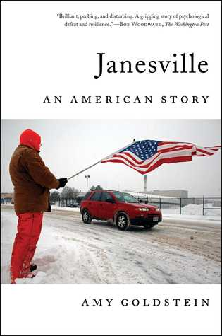

# Janesville: An American Story

Obama [recommended](https://www.facebook.com/barackobama/posts/10155532677446749) this [book](https://www.amazon.com/Janesville-American-Story-Amy-Goldstein/dp/1501102230) about [Janesville](https://en.wikipedia.org/wiki/Janesville,_Wisconsin), a town not so far from where I grew up in Wisconsin. So I read the book.

In 2008, the General Motors [factory](https://en.wikipedia.org/wiki/Janesville_Assembly_Plant) in Janesville shut down. Janesville is also House speaker [Paul Ryan](https://en.wikipedia.org/wiki/Paul_Ryan)'s home. The book follows related issues through 2013.

Many of the lost jobs were union jobs with relatively good pay, health care, and pensions after retirement. Jobs that came to Janesville later tended to be less generous.

Business leaders and politicians tried to help Janesville recover by offering incentives to businesses. They were pro-job in that sense, but anti-union.

Retraining was supposed to help people who lost jobs get new skills and new good jobs. But research showed that among people who lost jobs, those who retrained went on to do worse than those who didn't retrain.

Non-government aid organizations in Janesville were less able to help people when the economy suffered and more people needed help. Teachers faced homeless students.

For some time, businesses have been giving [a decreasing share of income](https://www.brookings.edu/research/thirteen-facts-about-wage-growth/) to their workers. I wonder whether the wage growth picture is worse if also considering disappearing benefits like health insurance and pensions.

At the same time, some politicians want to provide fewer benefits to citizens.

There are some good jobs out there with good pay, but not everyone can get them. Regardless of job, people should be able to live decent lives. It would be nice to see a clear path from where we are today to that ideal.

