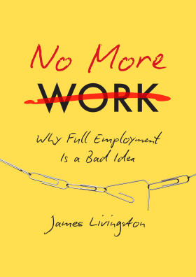

# No More Work by James Livingston

[James Livingston](http://history.rutgers.edu/faculty-directory/172-livingston-james)'s [book](https://www.uncpress.org/book/9781469630656/no-more-work/) feels like [drunk history](https://en.wikipedia.org/wiki/Drunk_History) about the future. To paraphrase, with the exception of "Fuck work," which appears multiple times:

> "The robots are taking all the jobs, man. Did you know that Nixon and _Cheney_ were [trying](https://www.jacobinmag.com/2016/05/richard-nixon-ubi-basic-income-welfare/) to do universal basic income way back in the 70's? They _knew_, man. Fuck work. We don't even _need_ jobs. Just take Social Security from every dollar, and tax companies a little more, no problem, man... We all just have to _love_ one another, that's all it is, man, can you even do that?"

He goes on about Marx and Freud and so on a good deal more, but that's basically it.

As Livingston points out quite a lot, he's not the only one to say that jobs are evaporating. He distinguishes himself by not thinking it's important that people do something "meaningful" like gardening or carpentry, regardless of whether they get paid. He's okay with everybody watching TV. I gather this is similar to his take in [Against Thrift](https://www.amazon.com/Against-Thrift-Consumer-Culture-Environment/dp/0465021867).

It is an interesting hodgepodge of ideas of varying goodness. For example, that if owning people is bad, then also renting people is bad.

I wonder what will happen. Are jobs on the way out? Will the world go post-scarcity, like Star Trek? Will poor people just get trampled on, as seems to largely be the case so far? If you've left the labor force already because you can survive by taking advantage of some existing device, are you the vanguard of the future jobless? What will society be like?

