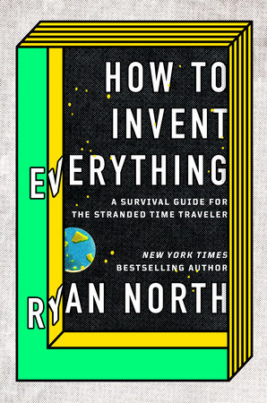

# How To Invent Everything

[How To Invent Everything](http://www.howtoinventeverything.com/) is like [Bill Nye](https://www.billnye.com/) writing how-tos for [Primitive Technology](https://www.youtube.com/channel/UCAL3JXZSzSm8AlZyD3nQdBA), in the distinctive voice of [Dinosaur Comics](https://www.qwantz.com/) writer and actual author [Ryan North](https://en.wikipedia.org/wiki/Ryan_North). It's fun!

> "Scientists are often seen as turbonerds, but the philosophical foundations of science are actually those of pure punk-rock anarchy: never respect authority, never take anyone's word on anything, and test all the things you _think_ you know to confirm or deny them for yourself." (page 34)

The book is a compendium of "[You](http://blog.sigfpe.com/2006/08/you-could-have-invented-monads-and.html) [could](http://www.ams.org/notices/200601/fea-chow.pdf) [have](https://reprog.wordpress.com/2010/05/13/you-could-have-invented-git-and-maybe-you-already-have/) [invented](http://luis.impa.br/aulas/lectures/inventingTopology.pdf)" [articles](http://blog.ezyang.com/2012/02/anatomy-of-you-could-have-invented/) for everything from language to selective breeding to steel to the [pelton wheel](https://en.wikipedia.org/wiki/Pelton_wheel) to computers. A lot of fun (and some dangerous) science fair projects could be adopted from these pages. Do you know how to make your own charcoal? Or that clover is a [legume](https://en.wikipedia.org/wiki/Legume) useful in crop rotation? This book is chockablock with [Minecraft recipes](https://minecraft.gamepedia.com/Recipe) for the real world.

The "survival guide for the stranded time traveler" framing is amusing, but it's historical details (like the story of the [Semmelweis reflex](https://en.wikipedia.org/wiki/Semmelweis_reflex)) that really add interest. There are a few [errata](http://www.howtoinventeverything.com/errata) but overall this is the most easily recommendable book I've read in some time.

