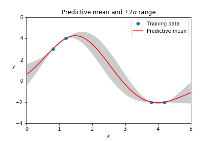
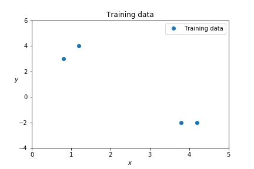
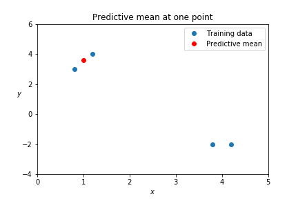
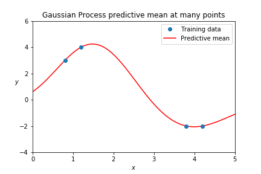
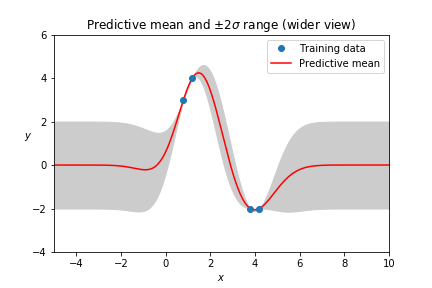
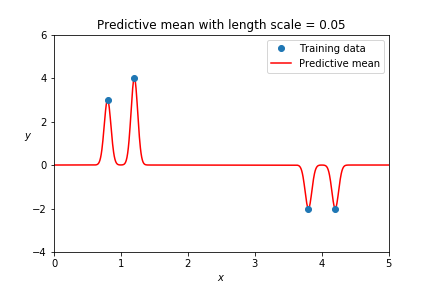

# Gaussian Processes are Not So Fancy

[Gaussian Process](https://en.wikipedia.org/wiki/Gaussian_process)es
have a mystique related to the dense probabilistic terminology that's
already evident in their name. But Gaussian Processes are just models,
and they're much more like k-nearest neighbors and linear regression
than may at first be apparent.




---

### A simple training data set

A model is trained with predictors \\( X \\) and known labels \\( y
\\). Here's some data in Python:

```python
train_X = [[0.8], [1.2], [3.8], [4.2]]
train_y = [   3,     4,    -2,    -2 ]
```

Since elements of \\( X \\) are one-dimensional, all the data can be
shown in a simple figure:



The task of a model is to predict \\( y \\) values for test points \\(
x \\).


---

### Applying a kernel function

Like [SVM](https://en.wikipedia.org/wiki/Support_vector_machine)s,
Gaussian Processes use kernel functions. A kernel gives a closeness,
or similarity, between two points. This is related to distances, and a
kernel may involve distance. Here's the matrix of Euclidean distances
between points in our training data \\( X \\):

```python
dist_XX = sklearn.metrics.pairwise_distances(train_X)
## array([[0. , 0.4, 3. , 3.4],
##        [0.4, 0. , 2.6, 3. ],
##        [3. , 2.6, 0. , 0.4],
##        [3.4, 3. , 0.4, 0. ]])
# Recall:
# train_X = [[0.8], [1.2], [3.8], [4.2]]
```

The Gaussian radial basis function (RBF) kernel is commonly used. In
[Gaussian Processes for Machine Learning](http://gaussianprocess.org/gpml/chapters/),
Rasmussen and Williams call it the _squared exponential_ kernel,
probably to avoid confusion with other things that are Gaussian. For
distance \\( d \\), it's \\( e^{-\frac{1}{2}d^2}\\):

```python
def squared_exponential(distance):
    return np.exp(distance**2 / -2)
```

It's one when distance is zero, and it goes to zero when distance is
big. This is evident for our data when we make the matrix of kernel
values for the training data \\( X \\):

```python
kern_XX = squared_exponential(dist_XX)
## array([[1.  , 0.92, 0.01, 0.  ],
##        [0.92, 1.  , 0.03, 0.01],
##        [0.01, 0.03, 1.  , 0.92],
##        [0.  , 0.01, 0.92, 1.  ]])
# Recall:
# train_X = [[0.8], [1.2], [3.8], [4.2]]
```

This matrix \\( K(X, X) \\) is a core component of Gaussian Processes,
and as the example shows, it reflects a core concern with nearness as
represented via a kernel function.


---

### Using the Gaussian Process prediction equation

This is Rasmussen and Williams' Equation 2.19 for the predictive
posterior distribution, which I promise isn't as bad as it looks:

\\[ \mathbf{f_{\ast}} | X_{\ast}, X, \mathbf{f} \sim \mathcal{N}( K(X_{\ast}, X) K(X,X)^{-1} \mathbf{f}, \\\\ K(X_{\ast}, X_{\ast}) - K(X_{\ast}, X) K(X,X)^{-1} K(X, X_{\ast}) ) \\]

Here \\( \mathbf{f_{\ast}} \\) is the predicted \\( y \\) for a test
point in \\( X_{\ast} \\) based on the training data \\( X \\) and \\(
y \\) labels \\( \mathbf{f} \\). It's predicted to be normally
distributed with mean \\( K(X_{\ast}, X) K(X,X)^{-1} \mathbf{f} \\)
and the given covariance. The mean can be considered "the" prediction,
though you can also sample.


---

### Behaves like nearest neighbors

Let's use Equation 2.19 to make a prediction for this \\( X_{\ast} \\):

```python
test_X = [[1]]
```

We find the kernel similarities between the test point and each point
of training data:

```python
kern_xX = squared_exponential(
              sklearn.metrics.pairwise_distances(test_X, train_X))
## array([[0.98019867, 0.98019867, 0.01984109, 0.00597602]])
```

The test point is close to the first two training points, and far from
the second two.

Let's evaluate just the first two terms of the predictive mean given
in Equation 2.19:

```python
kern_xX.dot(np.linalg.inv(kern_XX))
## array([[ 0.50835358,  0.51127124, -0.01378216,  0.01144869]])
```

It isn't exactly, but this looks a lot like a weighting for a weighted
average. And the prediction roughly fits that interpretation:

```python
test_y = kern_xX.dot(np.linalg.inv(kern_XX)).dot(train_y)[0]
## 3.57
```



This behavior is similar to k-nearest neighbors. Nearby points matter;
points that are far away don't. Nearest neighbors can even include a
weighting based on a kernel function.

Also like k-nearest neighbors, you have to use the whole training set
for every Gaussian Process prediction, comparing the test point to
every training point.

With Gaussian Processes, however, you don't have to specify a number
of neighbors \\( k \\). Every point that is near enough contributes to
the prediction. And it isn't really quite as simple as a weighted
average; there's a little bit more curve-fitting going on.


---

### It's linear regression

The mean prediction of a Gaussian Process is the same as a linear
regression with a particular choice of coordinates. Let's talk about
how.

Why is \\( K(X,X)^{-1} \\) involved in the predictive mean?

Consider the kernel matrix as a transformation of the original
training data \\( X \\) into new variables, where each of the new
variables is kernel-nearness to one of the points of training data.
This is very much like transforming raw data to include interactions
or polynomial terms, as is common in regression. Say the transformed
data is \\( Z \\).

Linear regression coefficients
[can be solved for](https://en.wikipedia.org/wiki/Ordinary_least_squares#Matrix/vector_formulation)
with \\( (Z^T Z)^{-1} Z^T \\). But with a nice symmetric square matrix
like \\( K(X,X) \\), this is the same as just taking \\( Z^{-1} \\)
directly.

So the mean prediction of a Gaussian Process is the same as linear
regression in the coordinates defined by kernel similarities with each
training point. It _is_ linear regression.

---

### With covariance

With Gaussian Processes, kernel functions are also called covariance
functions. Things that are kernel-near vary together—they have similar
values—and this enforces smoothness.

Here's the covariance part of Equation 2.19 again. It has two terms:

\\[ K(X_{\ast}, X_{\ast}) - K(X_{\ast}, X) K(X,X)^{-1} K(X, X_{\ast}) ) \\]

The positive first term shows that test point(s) vary together when
they're close to one another. The negative second term (which is also
a linear regression solution, like the mean) captures how much
variance is eliminated due to being close to observed points.

<!-- How to read the negative term as linear regression: The data set
X is, for each training point, kernel nearness to each other training
point. The training labels y are kernel nearness from test data to
training data. Then the test point has its nearness to the training
data, and we get out a consolidated estimate of nearness of this test
point to the training data. It can be thought of like a local weighted
average, just like for the mean. -->

---

### Predicting for multiple points

If you get the predictive mean for many points, you can draw out a
curve:



You may instead want to use the predictive mean and variance at some
test point to _sample_ an outcome \\( y \\). If you then take that
sampled value as a new point of training data (adding it to your
training set) future predictions will be consistent with that first
one, and so on.

You can equivalently make multiple consistent predictions
simultaneously by putting multiple test points in \\( X_{\ast} \\) and
sampling from a multivariate Gaussian.

Just like the mean alone, values sampled this way will draw out a
smooth curve. But unlike the mean alone, each random draw will be a
different curve: Gaussian Processes are random over a space of
functions. An approachable
[post by Bailey](http://katbailey.github.io/post/gaussian-processes-for-dummies/)
focuses on this.

It can be fun to sample curves, but often the mean and variance alone
are useful.


---

### The Bayesian prior away from data

Gaussian Processes have Bayesian priors. For the example here, the
assumption is that the function is always zero with covariance one,
until we see training data showing otherwise.



This is visible when the bounds of the plot are expanded. Gaussian
Processes focus on local interpolation more than extrapolation.


---

### Length scale matters

The kernel specifies the scale of the variance, and in the case of the
squared exponential kernel, there's also a length scale parameter that
has significant effects.

```python
def squared_exponential(distance, length_scale=1):
    return np.exp((distance / length_scale)**2 / -2)
```

For our example, a length scale of one works reasonably well. For a
smaller length scale, the function is allowed to change faster, and
the prior asserts itself more quickly:



For a Gaussian Process to capture a trend, its kernel needs to support
it. In the case of the squared exponential kernel, this means a long
enough length scale.


---

### When hyperparameters are your parameters

As presented here, a Gaussian Process will always exactly fit its
training data. This is often considered a sign of overfitting, and
regardless it's clearly unsustainable if training data ever has two
different \\( y \\) values for identical \\( x \\) values.

Noise can be added to address these issues, and the scale of the noise
is another hyperparameter, joining the overall scale and length scale
of the covariance function.

To get really interesting behavior may require composing kernel
functions, altering what "near" means for the model and adding even
more hyperparameters, as in
[this example](https://scikit-learn.org/stable/modules/gaussian_process.html#gpr-on-mauna-loa-co2-data).

Gaussian Process implementations like
[sci-kit's](https://scikit-learn.org/stable/modules/generated/sklearn.gaussian_process.GaussianProcessRegressor.html)
try to automatically fit these hyperparameters, which may remove some
of the need to know what they should be in advance. But optimization
can't do all the work of designing an appropriate kernel for a
problem, or eliminate the difficulty of distances in high-dimensional
spaces.

There are also some approaches for improving computational efficiency.


---

### Not useless, but not magical

Even with enhancements, the fundamental nature of Gaussian Processes
is as presented here: local smooth curve fitting built on linear
regression.

A Gaussian Process might be useful for you. But please don't assume
that it is sophisticated just because the language around it often is,
or that its results are automatically true just because they have
error bars.

<!-- I thought about linking to something on kriging, whether for gold
or for hyperparameter optimization, but in the end I thought it would
just confuse things. For example,
http://efavdb.com/gaussian-processes/ is one of the better posts, and
it's just unbearably bad. Maybe Google has something decent in their
documentation, but it would also be basically an ad for their cloud
machine learning products. -->

---

The code and plots from this post are all in
[a Jupyter notebook](https://github.com/ajschumacher/ajschumacher.github.io/blob/master/20181226-gaussian_processes_are_not_so_fancy/gaussian_processes.ipynb).

Thanks to Erica Blom, Marco Pariguana, Sylvia Blom, and Travis Hoppe
for reading drafts of this post and providing feedback.
