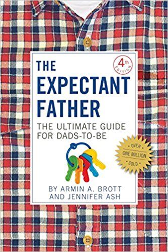

# The Expectant Father and so on

I read some baby books in 2018. I got a copy of [The Expectant Father](https://smile.amazon.com/Expectant-Father-Ultimate-Dads-Be/dp/0789212137/), and then I got [The New Father](https://smile.amazon.com/New-Father-Dads-Guide-First/dp/0789211777/), by the same author. I also got the [FAQ](https://smile.amazon.com/FAQ-Expectant-Fathers-Armin-Brott/dp/0789212692/) [versions](https://smile.amazon.com/FAQ-New-Fathers-Armin-Brott/dp/0789212706/), thinking (mostly wrongly) that it would be fun to see the material in multiple-choice-question form. And Erica read [What to Expect When You're Expecting](https://smile.amazon.com/What-Expect-When-Youre-Expecting/dp/0761187480/), so I saw bits of that as well.

I have mixed feelings on these baby books. Some things you can't prepare for. I think a lot of baby books are sold just to make people feel better. It's like reading about dancing: you might learn something, but you won't become a great dancer with books alone.

As far as facts, there are lots that you'll care about with some lowish probability. Baby books can be like encyclopedias that way. And for nearly everything, if you don't know in advance, you'll find out when you need to know. You can learn in advance about [meconium](https://en.wikipedia.org/wiki/Meconium), or later as needed, or not at all. Regardless, the baby poops.

For example, information about induction turned out to be relevant for our family. I don't recall reading much about induction, maybe because I didn't think it would be so relevant. As it happened, the best preparation I had came not from a book but from an in-person session we did at our hospital. Regardless, we relied on the medical professionals at the hospital, and I think it would have been a big mistake to favor an opinion from elsewhere over our nurses and doctors, who did a great job.

There is good general advice, but the parts most people agree on are pretty well known: don't smoke, eat healthy, etc. I think I prefer [Brain Rules for Baby](/20181209-brain_rules_for_baby/) over more conventional baby books for summarizing such advice.

There are two things in particular that I would have liked to be more prepared for:

 * During delivery, pushing changes at the last moment, when it's most painful, just as the baby's head is about to pop out. All of a sudden you're supposed to basically stop pushing so they can try to ease the head out without tearing anything. I don't recall hearing about this in advance. Maybe not everybody does it this way. We got these surprise directions in the middle of what was already a very intense process, and everything worked out reasonably well, but I feel like we wouldn't have minded learning about this in advance.
 * Babies cry sometimes for no apparent reason. Sometimes for considerable time (even if less than the pseudoscientific definitions associated with "colic"). I knew that babies cry, of course, but nothing prepared me for the feeling of my own daughter crying inconsolably in my arms. I don't know how much it would have helped, but I think I would have liked to hear more advice like, "Sometimes your baby will cry no matter what you do. It will be painful, but here are some things you can try. It will be okay."

I'm new to all this. I'm trying to learn as much as I can. You can always learn some things from books, and there are always some things you can't. For having a child, I am strongly impressed with how valuable social learning and direct experience are when stacked against the information for sale in books.

