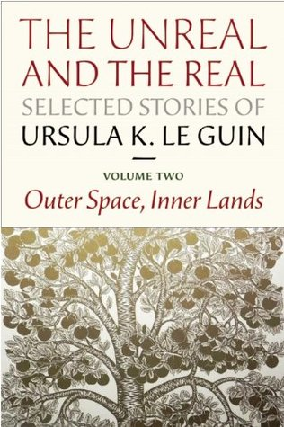

# The Unreal and The Real, Volume Two

I bought
[this](https://smile.amazon.com/Unreal-Real-Selected-Stories-Outer/dp/1618730355/)
collection of
[Le Guin](https://en.wikipedia.org/wiki/Ursula_K._Le_Guin)'s short
stories and then she died before I read it. Before that, I once bought
a Kurt Vonnegut print and he died before it was delivered. I'm cursed!

I got the book because it has The Ones Who Walk Away From Omelas,
which I heard about in
[How to Think](https://www.amazon.com/How-Think-Survival-Guide-World/dp/0451499603)
(which by the way is better for reacting to than learning from, if
there's a difference). Le Guin notes that Omelas "has had a long and
happy career of being used by teachers to upset students and make them
argue fiercely about morality." I missed that class, so it was nice to
catch up. File with:
[trolley problems](https://en.wikipedia.org/wiki/Trolley_problem)?

To guess how Le Guin chose the stories for this volume, I'd say she
was trying to span the largest possible space of worlds. There are
lots of different universes. For example:

What if:

 * the ratio of boy babies to girl babies was 1:16 instead of close to
   1:1?
 * one in a thousand people grew working, flying wings around age 20?
 * wolves were occasionally werepeople?
 * a peasant broke into Sleeping Beauty's castle and lived there while
   she slept?
 * an all-woman party of explorers reached the South Pole a couple
   years before
   [Amundsen](https://en.wikipedia.org/wiki/Amundsen%27s_South_Pole_expedition),
   but left no trace?

Spoiler alert! A lot of the fun of many of these stories is figuring
out the premise, because the perspective doesn't always make it
obvious from the beginning.

In The Author of the Acacia Seeds, either people actually figure out
how to study the writing of ants and penguins and so on, or it's sort
of a joke about the modern academy inventing the study of everything,
whether there's really anything there to study or not.

My favorite story is probably Solitude.

Recommended reading order: As printed, but then re-read the
introduction.

