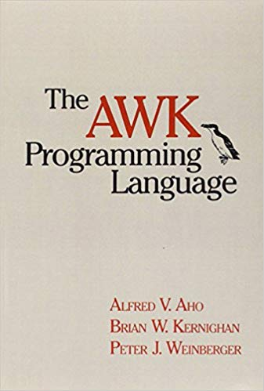

# The AWK Programming Language

The 1988 [book](https://en.wikipedia.org/wiki/The_AWK_Programming_Language) on [`awk`](https://en.wikipedia.org/wiki/AWK) by Aho, Weinberger, and Kernighan is as good as everyone says, and I will highly recommend it for programmers and data science folks.

Specialized tools [like `cut` and `bc`](/2013/05/21/command-line-data-manipulation/) handle many simple tasks, and general languages like Python can do pretty complicated things. For a long time I avoided properly learning `awk`, perhaps because I didn't understand that it fills such a useful space between those two extremes, and that the learning curve is really reasonable.

Awk is good at processing lines of delimited text quickly and easily, with defaults that are often convenient. For example, here's adding a [BMI](https://en.wikipedia.org/wiki/Body_mass_index) column to [this file](biostats.csv) I [found](https://people.sc.fsu.edu/~jburkardt/data/csv/csv.html):

```bash
cat biostats.csv | awk -F, 'NR == 1 {print $0, ",BMI"} \
                            NR > 1 {print $0, "," ($5/2.205) / ($4/39.37)^2}'
```

That would probably take more effort with most other tools.

Unfortunately `awk` doesn't make it very easy to deal with some complications that can show up in CSV (quoting, newlines inside fields, etc.). A Python project called [`pawk`](https://github.com/alecthomas/pawk) looks like it could be the answer, if you don't mind installing it and using Python syntax.

Here's the conclusion from the book:

> Awk is not a solution to every programming problem, but it's an
> indispensible part of a programmer's toolbox, especially on Unix,
> where easy connection of tools is a way of life. Although the larger
> examples in the book might give a different impression, most awk
> programs are short and simple and do tasks the language was
> originally meant for: counting things, converting data from one form
> to another, adding up numbers, extracting information for reports.
>
> For tasks like these, where program development time is more
> important than run time, awk is hard to beat. The implicit input
> loop and the pattern-action paradigm simplify and often entirely
> eliminate control flow. Field splitting parses the most common forms
> of input, while numbers and strings and the coercions between them
> handle the most common data types. Associative arrays provide both
> conventional array storage and the much richer possibilities of
> arbitrary subscripts. Regular expressions are a uniform notation for
> describing patterns of text. Default initialization and the absence
> of declarations shorten programs.
>
> What we did not anticipate were the less conventional applications.
> For example, the transition from "not programming" to "programming"
> is quite gradual: the absence of the syntactic baggage of
> conventional languages like C or Pascal makes awk easy enough to
> learn that it has been the first language for a surprising number of
> people.
>
> The features added in 1985, especially the ability to define
> functions, have led to a variety of unexpected applications, like
> small database systems and compilers for little languages. In many
> cases, awk is used for a prototype, an experiment to demonstrate
> feasibility and to play with features and user interfaces, although
> sometimes the awk program remains the production version. Awk has
> even been used for software engineering courses, because it's
> possible to experiment with designs much more readily than with
> larger languages.
>
> Of course, one must be wary of going too far — any tool can be
> pushed beyond its limits — but many people have found awk to be
> valuable for a wide range of problems. We hope we have suggested
> ways in which awk might be useful to you as well.

They take `awk` pretty far in the book, and it's delightful to see, even if you only end up using `awk` for simpler things like my example above.


