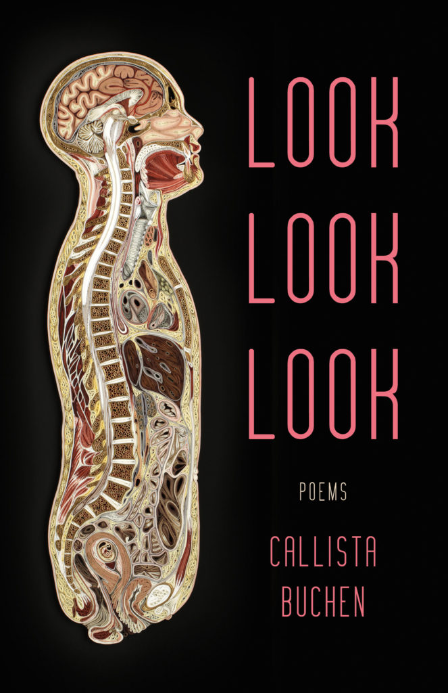

# Look Look Look, by Callista Buchen

This short [book][] of prose poems is an intensely personal,
frequently painful look at the author's experiences of motherhood. I'm
no expert in poetry, but it seems like a success.

There are five untitled parts, the first three of which correspond to
periods around the birth of a first child, then the loss before birth
of a child, and then the birth of a second child. The last two parts
might be less obviously demarcated subsequent periods or aspects. None
of the parts seem to have been particularly easy for the author.

One short sentence, "We do the research," stuck out to me as
emblematic of the modern experience of educated people approaching the
enigmatic corporeal realities of fertility.

The author and her husband and I were high school classmates, which
adds something. Reading the poem "Sadness" on page 49, there's the
abstract author, there are the people I went to school with, and
there's the recasting with my family and others. It's also interesting
to see the language change, becoming more direct, at the beginning of
the third part—a deliberate device, or the unconscious development of
the author over time?

It's like reading a diary, but everyone has been invited to look,
look, look.

[book]: https://www.blacklawrence.com/look-look-look/

