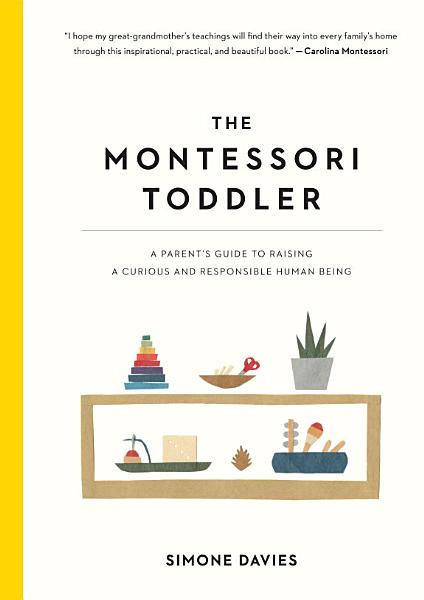

# The Montessori Toddler, by Simone Davies

We saw [this book][] at [TOTH][] and subsequently picked up a copy.
It's a very nice book with lots of good advice for living with
toddlers, and plenty of universally good advice.

[this book]: https://www.workman.com/products/the-montessori-toddler
[TOTH]: https://toddlersonthehill.org/

I like [Montessori][] in general. I read _The Absorbent Mind_ a long
time ago and recall it fondly. There's room for debate around exactly
how to operationalize it, but the underlying idea is that people are
good and will do well, on the basis of internal motivation, if they're
supported appropriately.

[Montessori]: https://en.wikipedia.org/wiki/Maria_Montessori

This comparison resonates with me:

> "...the children in the [other] school always put up their
> hands to ask the teacher if something was on the test. The
> Montessori children were used to learning because they loved to do
> so, not because they were being tested." (page 231)

The author also draws from [non-violent communication][] and there's
an "Instead of This, Say That" section at the back, with
recommendations (like "Instead of blaming others, take
responsibility") that are good regardless of the age of the person
you're speaking with.

[non-violent communication]: https://en.wikipedia.org/wiki/Nonviolent_Communication

