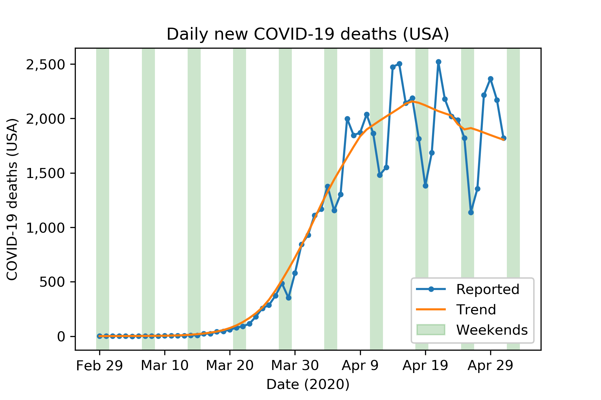
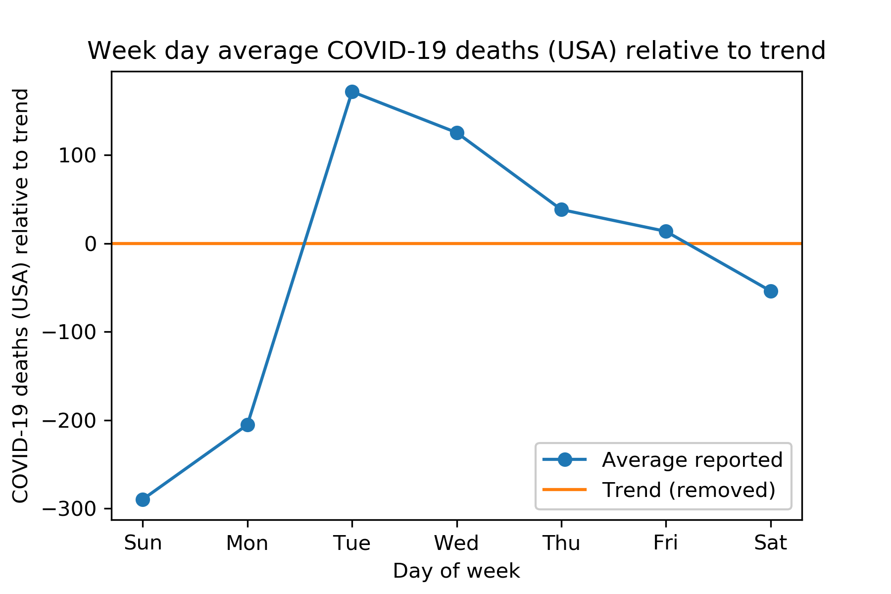
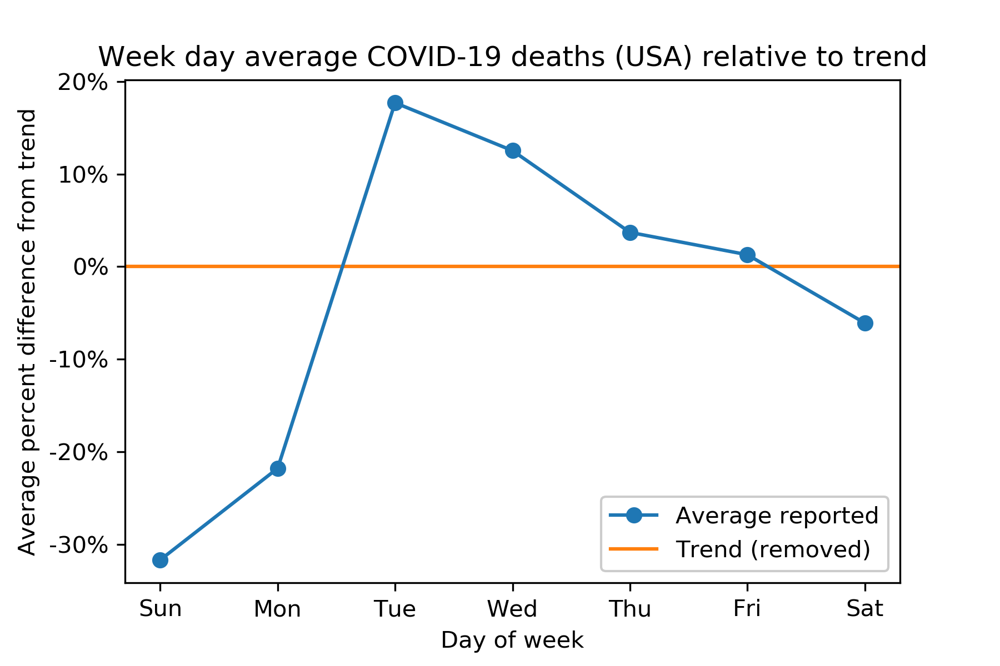

# Looks like people don't die on weekends

Like a lot of people, my hobby recently has been checking COVID-19
stats more often than is helpful. It can be hard to tell if a new
day's numbers are relatively good or bad, in part because of a
distinct weekly pattern.

If you take out the trend, it's clear that there are consistently
relatively fewer deaths reported on Sundays and Mondays. There's a
compensatory tendency for Tuesdays and Wednesdays to have higher
numbers of deaths reported.

This clearly shows that the way to fight COVID-19 is by instituting an
all-weekend policy.

But it really is an interesting phenomenon. What's causing this effect
in the data?

 * Do people really avoid death on weekends? I could imagine a small
   effect in that direction, but I wouldn't think it would be anything
   like this big.
 * Is it purely a reporting effect? Lots of health professionals are
   working weekends these days, I suspect, but maybe clerical staff or
   others in the reporting chain take consistent weekends? I suspect
   this is the main explanation.
 * Why is it primarily Sunday and Monday rather than Saturday and
   Sunday? Do the daily numbers correspond more accurately to the
   prior day?

In any event, it's a good idea to, for example, use a 7-day rolling
average (as [in the Financial Times][]) to avoid being mislead by this
weekly pattern.

[in the Financial Times]: https://www.ft.com/coronavirus-latest

---

Update 2020-05-04: The plot above uses an average of numbers of
deaths, which feels raw and real, but isn't super meaningful against
the changing scale of the pandemic in the US over time. The version
below is by percent difference (weighted by the trend, to avoid undue
influence when the numbers were all small and the fit of the trend
isn't as good.)

The plot looks very similar, but these percentages can be used (with a
little math) to try to "seasonally adjust" daily US COVID-19 death
numbers. I'm not saying this has any particular statistical validity,
but it's one way to try to guess what a Sunday or Monday number really
means, for example.

---

I used the New York Times' [covid-19-data][]. My code is all up
[on GitHub][].

[covid-19-data]: https://github.com/nytimes/covid-19-data
[on GitHub]: https://github.com/ajschumacher/covid_weekend
