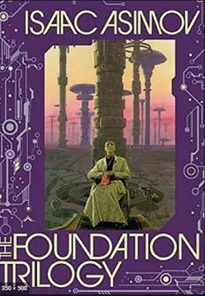

# Asimov's Foundation trilogy

I was [inspired][] to read the core trilogy of Asimov's [Foundation][]
series. Started in 1942, it's in many ways a relic, but it's
interesting for its [influence][] and explorations of how history
develops, what matters, what can be predicted, and what can be
controlled.

[inspired]: https://www.youtube.com/watch?v=3Gdm40MPYnw
[Foundation]: https://en.wikipedia.org/wiki/Foundation_series
[influence]: https://en.wikipedia.org/wiki/Foundation_series#Cultural_impact

Hari Seldon comes up with a mathematical [psychohistory][] for
predicting the future of society, obtaining predictions we are to take
as correct for up to 30,000 years in the future. As a kind of
[statistical mechanics][] for humanity, it seems like
[history from below][]. This conflicts with [Great Man Theory][]—and
the author's desire to have characters drive developments (though the
main characters do once turn out to be totally irrelevant).

[psychohistory]: https://en.wikipedia.org/wiki/Psychohistory_(fictional)
[statistical mechanics]: https://en.wikipedia.org/wiki/Statistical_mechanics
[history from below]: https://en.wikipedia.org/wiki/People%27s_history
[Great Man Theory]: https://en.wikipedia.org/wiki/Great_man_theory

I usually think of the future as hard to [predict][], so just
imagining there could be such good predictions is kind of fun. Is it
just that we don't know how, or (as the book suggests) that it's only
possible on scales greater than one planet?

[predict]: /20200112-predicting_the_future_from_2020/

I've recently been [learning][] about supposed economic cycles as long
as 50 to 60 years, but it isn't clear how truly predictive these are.

[learning]: https://en.wikipedia.org/wiki/Technological_Revolutions_and_Financial_Capital

> "The current view of mainstream economics is that business cycles
> are essentially the summation of purely random shocks to the economy
> and thus are not, in fact, cycles, despite appearing to be so."
> [[wiki][]]

[wiki]: https://en.wikipedia.org/wiki/Business_cycle

Also, if a prediction is widely known then it may no longer be valid,
which is then a possible incentive to secrecy. Regardless, it's fun to
think about how much can be predicted, how it might be done, and what
might invalidate predictions.

