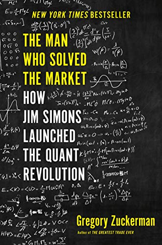

# The Man Who Solved the Market, by Zuckerman

This [book][] demystifies [Jim Simons][] and makes his
[Medallion Fund][] seem more like grinding at a poker table than like
solving the market. I was interested to read about his connection to
[Robert Mercer][] and otherwise hiring "smart people" regardless of
[other characteristics][].

[book]: https://www.penguinrandomhouse.com/books/557104/the-man-who-solved-the-market-by-gregory-zuckerman/
[Jim Simons]: https://en.wikipedia.org/wiki/Jim_Simons_(mathematician)
[Medallion Fund]: https://en.wikipedia.org/wiki/Renaissance_Technologies#Monemetrics
[Robert Mercer]: https://en.wikipedia.org/wiki/Robert_Mercer
[other characteristics]: https://en.wikipedia.org/wiki/The_No_Asshole_Rule

Technical detail is light, but Zuckerman emphasizes that Renaissance
used a monolithic trading model that could accept additional signals
over time, manage [slippage][] sometimes to the extent that signals
Renaissance was using could be made to disappear to outside observers
while exploited, and that frequently was basically based on reversion
to the mean. And Renaissance was not at all shy about using any
available tax dodges.

[slippage]: https://en.wikipedia.org/wiki/Slippage_(finance)

---

> "Simons was struck by the unique way talented researchers were
> recruited and managed in his unit [of [IDA][]]. Staff members, most
> of whom had doctorates, were hired for their brainpower, creativity,
> and ambition, rather than for any specific expertise or background.
> The assumption was that researchers would find problems to work on
> and be clever enough to solve them. Lenny Baum, among the most
> accomplished code-breakers, developed a saying that became the
> group's credo: "Bad ideas is good, good ideas terrific, no ideas is
> terrible."" (pages 24-25)

[IDA]: https://en.wikipedia.org/wiki/Institute_for_Defense_Analyses "the Institute for Defense Analyses"

---

> "Courting accomplished candidates, Simons developed a unique
> perspective on talent. He told one Stony Brook professor, Hershel
> Farkas, that he valued "killers," those with a single-minded focus
> who wouldn't quit on a math problem until arriving at a solution.
> Simons told another colleague that some academics were "super smart"
> yet weren't original thinkers worthy of a position at the
> university.
>
> ""There are guys and there are _real_ guys," he said." (pages 34-35)

---

> "Truth ... is much too complicated to allow for anything but
> approximations." (page 67, epigraph quoting John von Neuman)

---

> "No one ever made a decision because of a number. They need a
> story." (page 161, epigraph quoting Daniel Kahneman)

---

> "Early one evening, his eyes blurry from staring at his computer
> screen for hours on end, Magerman spotted something odd: A line of
> simulation code used for Brown and Mercer’s trading system showed
> the Standard & Poor’s 500 at an unusually low level. This test code
> appeared to use a figure from back in 1991 that was roughly half the
> current number. Mercer had written it as a static figure, rather
> than as a variable that updated with each move in the market.
>
> "When Magerman fixed the bug and updated the number, a second
> problem—an algebraic error—appeared elsewhere in the code. Magerman
> spent most of the night on it but he thought he solved that one,
> too. Now the simulator’s algorithms could finally recommend an ideal
> portfolio for the Nova system to execute, including how much
> borrowed money should be employed to expand its stock holdings. The
> resulting portfolio seemed to generate big profits, at least
> according to Magerman’s calculations.
>
> "Overcome with excitement, he raced to tell Brown what he had
> discovered. Brown flashed his breathless colleague a look of deep
> skepticism but agreed to hear Magerman out. Afterward, Brown still
> showed little enthusiasm. Mercer had done the coding for the system,
> after all. Everyone knew Mercer rarely made errors, especially
> mathematical ones. Crestfallen, Magerman slunk away. His screwup had
> branded him a nuisance, not any kind of potential savior.
>
> "Without much to lose, Magerman brought his work to Mercer, who also
> agreed to take a look. Sitting at his desk, hunched over his
> computer, Mercer patiently examined the old code, line by line,
> comparing it to Magerman’s new code. Slowly, a smile formed on his
> face. Mercer reached for some paper and a pencil from his desk and
> began working on a formula. He was checking Magerman’s work. After
> about fifteen minutes of scribbling, Mercer put his pencil down and
> looked up.
>
> "“You’re right,” Mercer told Magerman.
>
> "Later, Mercer convinced Brown that Magerman was on to something.
> But when Brown and Mercer told other staffers about the problem that
> had been uncovered, as well as the fix, they were met with
> incredulity, even laughter. A junior programmer fixed the problem?
> The same guy who had crashed the system a few weeks after being
> hired?
>
> "Brown and Mercer ignored the doubts and restarted the system, with
> Simons’s backing, incorporating the improvements and corrections.
> Instant gains resulted, defying the skeptics. The long losing streak
> was over. Magerman finally received the appreciation he longed for,
> receiving a cherished pat on the back from Brown.
>
> "“This is great,” Simons boomed at a weekly meeting. “Let’s keep it
> going.”
>
> "A new era for both Magerman and the firm seemed within reach."
> (pages 194-195)

---

> "When asked to comment, Bannon said there are "errors of fact" in
> this description of events surrounding the election and his
> interactions with the Mercers, though he wouldn't specify the
> inaccuracies. "Dude, it's not my fucking book," he said in an
> email." (footnote page 280)

---

> “We can teach you about money,” Patterson explains. “We can’t teach
> you about smart.” (page 284)
