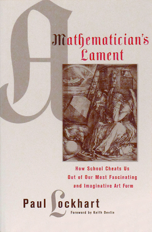

# A Mathematician's Lament, by Lockhart

[Lockhart’s Lament][] (and [Exultation][]!) is [available][] as a
beautiful little book. It’s in the familiar territory of balancing
doing original things versus learning what others have done, but he’s
probably right that many people don’t really know what _doing_ math
is. I particularly identify with his emphasis on understanding and
good explanations.

[Lockhart’s Lament]: https://www.maa.org/external_archive/devlin/LockhartsLament.pdf
[exultation]: https://en.wikipedia.org/wiki/A_Mathematician%27s_Lament
[available]: https://smile.amazon.com/Mathematicians-Lament-School-Fascinating-Imaginative/dp/1934137170/

Lockhart’s recommendation to do math for the pleasure of it reminds me
of McCullough’s similar thought on history:

> "It should be taught for pleasure: The pleasure of history, like art
> or music or literature, consists of an expansion of the experience
> of being alive, which is what education is largely about."
> ([McCullough][])

[McCullough]: https://imprimis.hillsdale.edu/knowing-history-and-knowing-who-we-are/

This is important to remember: People don’t really do things they
don’t enjoy. Pleasure can be found in most things, but it can be more
or less difficult to find. Finding it is important.

Lockhart correctly identifies the epistemology of math, in my opinion.
He points out that most people don’t need or use the math that’s
currently taught in schools, so losing it wouldn't be a great loss.
Carpenters don’t use trigonometry. Have you ever used the quadratic
formula?

I’m not sure Lockhart wrote to change anyone’s mind, and he doesn’t
include many approachable recommendations. On page 82 he says, "There
should be no standards, and no curriculum." He recommends [games][],
which is something, at least. He also teaches at a K-12 school where
students interview for a chance to pay $50k [tuition][]. I like his
ideas, but is there an accessible implementation?

[games]: https://www.usgo.org/news/2016/07/paul-lockhart-named-teacher-of-the-year/
[tuition]: https://saintannsny.org/divisions-and-offices/finance/parents/tuition-financial-aid/tuition/

---

> "By concentrating on _what_, and leaving out _why_, mathematics is
> reduced to an empty shell. The art is not in the “truth” but in the
> explanation, the argument. It is the argument itself that gives the
> truth its context, and determines what is really being said and
> meant. Mathematics is _the art of explanation_." (page 29)

---

> "Mental acuity of any kind comes from solving problems yourself, not
> from being told how to solve them." (pages 53-54)

---

> "[Accepting the standard math curriculum as being synonymous with math itself]
> is intimately connected to what I call the “ladder myth”—the idea
> that mathematics can be arranged as a sequence of “subjects” each
> being in some way more advanced, or “higher,” than the previous. The
> effect is to make school mathematics into a race—some students are
> “ahead” of others, and parents worry that their child is “falling
> behind.”" (page 56)

---

> "High school students must learn to use the secant function, ‘sec
> _x_,’ as an abbreviation for the reciprocal of the cosine function,
> ‘1 / cos _x_,’ a definition with as much intellectual weight as the
> decision to use ‘&’ in place of “and.” That this particular
> shorthand, a holdover from fifteenth-century nautical tables, is
> still with us (whereas others, such as “versine,” have died out) is
> mere historical accident, and is of utterly no value in an era when
> rapid and precise shipboard computation is no longer an issue. Thus
> we clutter our math classes with pointless nomenclature for its own
> sake." (pages 58-59)

---

> "Mathematics is about problems, and problems must be made the focus
> of a student’s mathematical life." (pages 60-61)

---

> "I was made to learn by heart: “The square of the sum of two numbers
> is equal to the sum of their squares increased by twice their
> product.” I had not the vaguest idea what this meant and when I
> could not remember the words, my tutor threw the book at my head,
> which did not stimulate my intellect in any way." (quoting Bertrand
> Russell, pages 61-62)

---

> "There should be no standards, and no curriculum." (page 82)

---

> "Ultimately you have to face the fact that people are different, and
> that’s just fine." (page 82)

---

