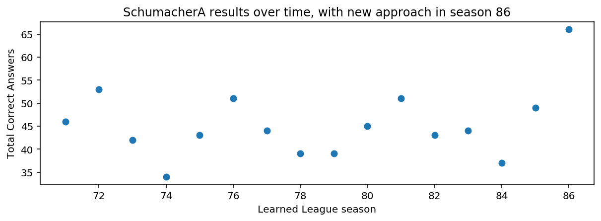
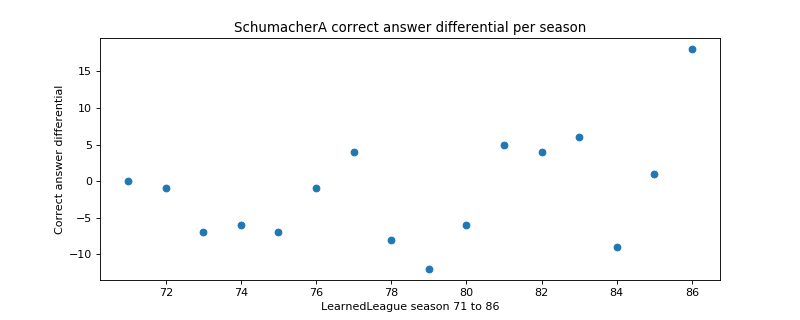

# Trivia rewards test-time effort

I've been a casual [LearnedLeague][] trivia player for a while. I was
inspired by [Lateral Thinking][] (the book) to try typing out
"conversations with myself" as I thought about the questions during
season 86. I didn't study or change anything else. Directing effort
during question-answering seems to have helped me answer more
questions correctly.

[LearnedLeague]: https://www.learnedleague.com/
[Lateral Thinking]: /20200716-lateral_thinking_creativity_step_by_step/

 * [Am I sure I did better?](#sure)
 * [What did I do differently?](#diff)
 * [Is the benefit of effort obvious?](#obvious)

_There are four LearnedLeague seasons per year, each with 25 match
days of 6 questions each. My performance has ranged from 34 to 66
correct out of 150, or 22.7% to 44.0% correct._

---

### Am I sure I did better?

A change in question difficulty could also lead to me getting more
right. I've been in Rundle E for all the seasons shown, which means
I'm in with a bunch of other casual players. Since the mix of people
isn't likely to suddenly change, the performance of my opponents is a
rough control for question difficulty. Looking at the difference
between my number of correct answers and my opponents', the season 86
improvement is still clear.

Looking at the league-wide correct answer percentage, it does seem
that this season was slightly easier than last season, but the
difference is small (50.71% vs. 49.06%). There are fancier ways to try
to control for question difficulty, but I'm satisfied that the change
in my performance isn't primarily due to changes in question
difficulty.

I also don't think the change is explained by a gradual process of
natural learning over time. I don't see any compelling pattern in the
first fifteen data points.

If you assume the earlier 15 season results were samples from the same
distribution, my season 86 result is very unlikely to arise from that
distribution by chance (p-value well under 0.01) for either view of
the data. ([calculations][])

[calculations]: https://github.com/ajschumacher/ajschumacher.github.io/blob/master/20200924-trivia_rewards_effort/analyze.ipynb

---

### What did I do differently?

Previously, I'd look at the questions online, think about them, and
write in my answers. For season 86, I inserted an extra step. I copied
the questions into a text file on my computer, and I typed out my
thinking process, using lots of question marks and thinking of lots of
related things, even sometimes free-associating.

Here's an example [question][]:

[question]: https://www.learnedleague.com/question.php?86&7&1

> The decade of chaos and political upheaval in China that began in
> 1966, grounded in a factional conflict over the future of Chinese
> socialism, and ended with Mao's death in 1976, is best known in the
> west as what "Revolution"?

It's not a hard question, but I didn't remember the answer at first.
In fact, I had a wrong answer that I was nearly ready to use. Here's
what I wrote in my file:

> Children's? Somehow I think "Children's Revolution"... Was that
> something from 3 Body Problem? Seems like a weird revolution name.
> What else... Green Revolution was/is a big agriculture thing... That
> other Chinese thing is "The Great Leap Forward" when lots of people
> died... Mao's Revolution? People's Revolution? Socialist Revolution?
> Weird Revolution? Party Revolution? Dance Dance Revolution? Red
> Revolution? "It was known in the west as the ..." Decade? 10-year
> Revolution? Slow revolution? Is it named after a leader? Other than
> Mao? Cultural Revolution? Hmm... That sounds right somehow. Great
> Leap Forward, Cultural Revolution... both of those sound like
> history things.

It took me a while to finally get to the right answer. If I hadn't
been writing things out like this, I might have just written down my
first guess. There were many questions like this, when I felt like the
extra process helped me get to a correct answer.

The extra process also led to me getting more mentally and emotionally
involved in the season. I felt like I was doing a little bit better,
and it made me care more. A seemingly mechanical task change ended up
increasing my motivation.

---

### Is the benefit of effort obvious?

In the extreme, low effort can lead to scores of zero, so effort
certainly has some effect. But I've never "blown off" LearnedLeague;
I've always tried to answer as best I can. So the possibly surprising
thing is that I was able to improve markedly from that baseline.

Trivia is pretty close to a pure knowledge test: "either you know it
or you don't." It isn't surprising that performance improves with
study in advance, and it isn't surprising that performance varies by
person based on strength of memory, etc. But it might be surprising
that performance can vary for an individual, depending on approach
during the test itself.

If performance changes measurably on a task like this, how much more
so for process tasks like mathematics? How large must be the
contribution to a student's standardized test scores from motivation
and focus on a particular day?

On the other hand, the observed effect doesn't move me at all into the
ranks of the strongest competitors on LearnedLeague, who routinely get
70% of questions correct, compared to my new record of 44%.

Nevertheless, the effect is large enough that it seems like it
matters, and it certainly matters psychologically to me. Something
like a [growth mindset][], it motivates me a lot more to think about
LearnedLeague as something that responds to effort, rather than just a
test of what I happen to know... It's more like climbing a rope than
checking oil with a dipstick. (More like climbing a rope than
measuring a rope? I'm liking this image...)

[growth mindset]: https://www.mindsetworks.com/science/
