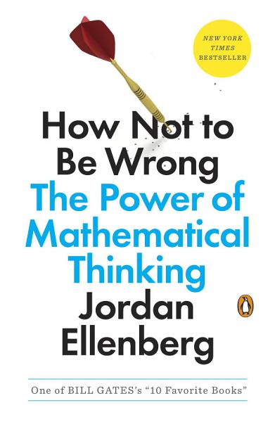

# How Not to Be Wrong, by Ellenberg

I like [this book][] a lot. The five parts (Linearity, Inference,
Expectation, Regression, Existence) provide beautiful large-scale
structure, and it also shimmers on every page. Supreme court justices
encounter the word "orthogonal." There's a beautiful proof of
[Buffon's needle problem][]. There's some philosophy of math.
Ellenberg is a delight.

[this book]: https://www.jordanellenberg.com/how-not-to-be-wrong/
[Buffon's needle problem]: https://en.wikipedia.org/wiki/Buffon%27s_needle_problem

In some ways, How Not to Be Wrong is like a long version of
[Lockhart's exultation][], with examples. Lockhart extols the
[method of exhaustion][]; Ellenberg teaches it. The author clearly
loves math, and shares it generously with the reader.

[Lockhart's exultation]: /20200909-mathematicians_lament_by_lockhart/
[method of exhaustion]: https://en.wikipedia.org/wiki/Method_of_exhaustion

The "How Not to Be Wrong" is delivered by exposing numerous common
fallacies or errors in understanding. Not every phenomenon is linear.
"Don't talk about percentages of numbers when the numbers might be
negative." "Improbable things happen a lot," and that affects how you
should think about significance tests and related things. The book is
a joy to read, I'd also read a "handbook" version collecting just the
main ideas.

---

### Selected quotations and (rarely) comments

---

> "Those [homework] integrals are to mathematics as weight training
> and calisthenics are to soccer. If you want to play soccer—I mean,
> _really play_, at a competitive level—you've got to do a lot of
> boring, repetitive, apparently pointless drills." (page 2)

---

> "Math is woven into the way we reason." (page 2)

---

> "Here's an old mathematician's trick that makes the picture
> perfectly clear: _set some variables to zero_." (pages 6-7)

---

> "What assumptions are you making? And are they justified?" (page 7)

---

> "Mathematics _is_ common sense." (page 10)

---

> "Mathematicians like to give names to the phenomena our common sense
> describes: instead of saying “_This_ thing added to _that_ thing is
> the _same_ thing as _that_ thing added to _this_ thing,” we say
> “Addition is commutative.”" (page 11)

Seems like a philosophy similar to [Where Mathematics Comes From][].

[Where Mathematics Comes From]: https://en.wikipedia.org/wiki/Where_Mathematics_Comes_From

---

> "We tend to teach mathematics as a long list of rules. You learn
> them in order and you have to obey them, because if you don’t obey
> them you get a C-. _This is not mathematics._ Mathematics is the
> study of things that come out a certain way because there is no
> other way they could possibly be." (page 12)

---

> "The specialized language in which mathematicians converse with one
> another is a magnificent tool for conveying complex ideas precisely
> and swiftly. But its foreignness can create among outsiders the
> impression of a sphere of thought totally alien to ordinary
> thinking. That's exactly wrong." (page 12)

---

> "Mathematics is the extension of common sense by other means." (page
> 13)

---

> "School mathematics is largely made up of a sequence of facts and
> rules, facts which are certain, rules which come from a higher
> authority and cannot be questioned." (page 14)

---

> "Mathematics is not settled." (page 14)

---

> "(Aside: it's important to point out here that people with
> out-of-the-mainstream ideas who compare themselves to Edison and
> Galileo are _never actually right_. I get letters with this kind of
> language at least once a month, usually from people who have
> “proofs” of mathematical statements that have been known for
> hundreds of years to be false. I can guarantee you Einstein did not
> go around telling people, “Look, I know this theory of general
> relativity sounds wacky, but that's what they said about Galileo!”)"
> (page 27)

---

> "... the oldest false syllogism in the book:"
>
> "It _could_ be the case that lowering taxes will increase government
> revenue;"
>
> "I _want_ it to be the case that lowering taxes will increase
> government revenue;"
>
> "Therefore, _it is_ the case that lowering taxes will increase
> government revenue." (page 30)

---

> "The Pythagoreans, you have to remember, were extremely weird."
> (page 33)

---

> "A basic rule of mathematical life: if the universe hands you a hard
> problem, try to solve an easier one instead, and hope the simple
> version is close enough to the original problem that the universe
> doesn't object." (page 35)

---

> "What's the numerical value of an infinite sum? It doesn't have
> one—_until we give it one_." (page 47)

---

> "(In mathematics, you very seldom get the clearest account of an
> idea from the person who invented it.)" (page 49)

---

> "Cauchy was not interested in the needs of engineers. Cauchy was
> interested in the truth. It's hard to defend Cauchy's stance on
> pedagogical grounds." (page 49)

---

> "Working an integral or performing a linear regression is something
> a computer can do quite effectively. Understanding whether the
> result makes sense—or deciding whether the method is the right one
> to use in the first place—requires a guiding human hand. When we
> teach mathematics we are supposed to be explaining how to be that
> guide. A math course that fails to do so is essentially training the
> student to be a very slow, buggy version of Microsoft Excel." (page
> 56)

---

> "there are algorithms I think we can safely discard in the modern
> world. We don't need to teach students how to extract square roots
> by hand, or in their head ..." (page 57)

---

> "Of course it's no better (in fact, it's substantially worse) to
> pass along a population of students who've developed some wispy
> sense of mathematical meaning but can't work examples swiftly and
> correctly. A math teacher's least favorite thing to hear from a
> student is “I get the concept, but I couldn't do the problems.”
> Though the student doesn't know it, this is shorthand for “I don't
> get the concept.” The ideas of mathematics can sound abstract, but
> they make sense only in reference to concrete computations. William
> Carlos Williams put it crisply: _no ideas but in things_." (page 58)

---

> "The situation [of school geometry] is so dire that the Fields
> Medalist David Mumford has suggested that we might dispense with
> plane geometry entirely and replace it with a first course in
> programming." (page 58)

Mumford [links][] to his [manuscript][], "What Mathematics Serves the
Majority of 21st Century American Students?"

[links]: https://www.dam.brown.edu/people/mumford/beyond/education.html
[manuscript]: https://www.dam.brown.edu/people/mumford/beyond/papers/CurtisArticleRev10-6.pdf

---

> "If a tiny state like South Dakota experiences a rash of brain
> cancer, you might presume that the spike is in large measure due to
> luck, and you might estimate that the rate of brain cancer in the
> future is likely to be closer to the overall national number. You
> could accomplish this by taking some kind of weighted average of the
> South Dakota rate with the national rate. But how to weight the two
> numbers? That's a bit of an art, involving a fair amount of
> technical labor I'll spare you here." (pages 70-71)

I think he's referring to [multi-level modeling][], in the Gelman
style.

[multi-level modeling]: https://en.wikipedia.org/wiki/Multilevel_model

---

> "_Don't talk about percentages of numbers when the numbers might be
> negative._" (page 78)

---

> "_Improbable things happen a lot._" (page 98)

---

> "When we are scientists, or Torah scholars, or toddlers gaping at
> the clouds, we are presented with _observations_ and asked to build
> _theories_–what went into the box to produce the world that we see?
> Inference is a hard thing, maybe the hardest thing." (page 110)

Ellenberg says "inference" but I might say "abduction."

---

Dangers of comparing very small rates:

> "... _twice a tiny number is a tiny number_. How good or bad it is
> to double something depends on how big that something is!" (page
> 120)

> "Risk ratios are much easier for the brain to grasp than tiny
> splinters of probability like 1 in 7,000. But risk ratios applied to
> small probabilities can easily mislead you." (page 120)

---

> "The truth is, the null hypothesis, if we take it literally, is
> probably just about always false." (page 120)

---

> "If only we could go back in time to the dawn of statistical
> nomenclature and declare that a result passing Fisher's test with a
> p-value of less than 0.05 was “statistically noticeable” or
> “statistically detectable” instead of “statistically significant”!
> That would be truer to the meaning of the method, which merely
> counsels us about the existence of an effect but is silent about its
> size or importance. But it's too late for that. We have the language
> we have." (page 121)

---

> "It has come to my attention that hardly anybody knows what the
> logarithm is. Let me take a step toward fixing this. The logarithm
> of a positive number _N_, called _log N_, is the number of digits it
> has." (page 139)

He goes on to call this the "fake logarithm," of "flogarithm."

---

> "In particular, the view that the primary concern of statistics is
> making decisions is more closely associated with Neyman than with
> Pearson." (page 159)

Reminds me of [Cassie Kozyrkov][], the Google Decision Scientist.

[Cassie Kozyrkov]: https://en.wikipedia.org/wiki/Cassie_Kozyrkov

---

> "_The significance test is the detective, not the judge._" (page
> 161)

---

I have _tried_ to find the origin of the Target pregnancy prediction
story before, but somehow I never tracked it down. Ellenberg has it!

[How Companies Learn Your Secrets][], by Charles Duhigg

[How Companies Learn Your Secrets]: https://charlesduhigg.com/how-companies-learn-your-secrets-part-1/

---

> "The p-value is the answer to the question
>
> ""The chance that the observed experimental result would occur,
> given that the null hypothesis is correct."
>
> "But what we _want_ to know is the other conditional probability:
>
> ""The chance that the null hypothesis is correct, given that we
> observed a certain experimental result."" (page 170)

This is connected to Bayesian stats as "inverse probability", and he
also notes that it's referred to as "[the prosecutor's fallacy][]" and
references the book _Math on Trial_.

[the prosecutor's fallacy]: https://en.wikipedia.org/wiki/Prosecutor%27s_fallacy

---

> "no scientific worker has a fixed level of significance at which
> from year to year, and in all circumstances, he rejects hypotheses;
> he rather gives his mind to each particular case in the light of his
> evidence and his ideas" (page 180, quoting Fisher)

Saying that even Fisher thinks our prior beliefs enter our work;
Fisher just has certain ideas about when it's appropriate to invoke
probability: he insists on some actual chance process.

---

> "We tend to like simpler theories better than more complicated ones;
> theories that rest on analogies to things we already know about
> better than theories that posit totally novel phenomena." (page 182)

---

> "... you have to be careful about the universe of theories you
> consider. Just as there may be more than one solution to a quadratic
> equation, there may be multiple theories that give rise to the same
> observation, and if we don't consider them all, our inferences may
> lead us badly astray." (page 185)

---

> "It is an old maxim of mine that when you have excluded the
> impossible, whatever remains, however improbably, must be the truth,
> unless the truth is a hypothesis it didn't occur to me to consider."
> (page 188)

---

> "And as much as I love Bayesian inference, I think people are
> probably best off arriving at their faith, or discarding it, in a
> non-quantitative way." (page 191)

---

> "Expected value is not the value you expect" (page 198)

---

[Finding Good Bets in the Lottery, and Why You Shouldn’t Take Them](https://www.maa.org/sites/default/files/pdf/upload_library/22/Ford/Abrams2011.pdf) is a great reference, which I connect to my [Expected value is not useful for making decisions about lottery tickets](/2012/06/04/expected-value-is-not-useful-for-making/).

---

> "Any given ticket is probably worthless, but if you've got a
> thousand tickets, it's essentially certain that you'll make your
> money back and then some." (page 209)

This gets at what I think is important: It isn't the expected value
you care about, it's your probability of being in a state that doesn't
suck. You want P(losing money) to become negligible, and that can
happen if you have positive expected value _and_ enough tickets.

---

> "When you're faced with a math problem you don't know how to do,
> you've got two basic options. You can make the problem easier, or
> you can make it harder." (page 218)

---

> "Mathematics as currently practiced is a delicate interplay between
> monastic contemplation and blowing stuff up with dynamite." (page
> 223)

---

> "If gambling is exciting, you're doing it wrong" (page 227)

---

> The doctrine of expected utility is appealingly straightforward and
> simple: presented with a set of choices, pick the one with the
> highest expected utility. It is perhaps the closest thing we have to
> a simple mathematical theory of individual decision making. And it
> captures many features of the way humans make choices, which is why
> it remains a central part of the quantitative social scientist's
> tool kit. (page 248)

---

> "In the decision-theory literature, the former kind of unknown is
> called _risk_, the latter _uncertainty_." (page 251)

The former is known unknowns (30% chance of drawing a black ball) and
the latter is unknown unknowns (maybe we're wrong about what the
chance is).

---

> "As always, it can be easier to see what's going on with the math if
> we make the numbers small enough that we can draw pictures." (page
> 258)

---

> "Mathematical elegance and practical utility are close companions,
> as the history of science has shown again and again." (page 266)

---

> "The Patent Department would not release the thing until they had
> patent coverage. ... I didn't believe that they could patent a bunch
> of mathematical formulas. I said they couldn't. They said, "Watch
> us." They were right. And since then I have known that I have a very
> weak understanding of patent laws because, regularly, things that
> you shouldn't be able to patent–it's outrageous–you can patent."
> (page 276, quoting Hamming)

---

> "Cohn works at Microsoft Research, which is in a way a continuation
> of the Bell Labs model of pure math supported by high-tech industry,
> hopefully to the benefit of both." (page 281)

---

Apparently Galton wrote an article called "Statistical Inquiries into
the Efficacy of Prayer". (page 299)

---

> "You have made a convert of an opponent in one sense, for I have
> always maintained that excepting fools, men did not differ much in
> intellect, only in zeal and hard work; and I still think this is an
> eminently important difference." (page 300, quoting Charles Darwin's
> letter to his cousin Francis Galton on the effect of reading
> Galton's "Hereditary Genius")

---

Ellenberg includes a fun table of Galton's on page 316, which has the
character of a visualization in that you can see an ellipse, sort of
like a two-dimensional stem and leaf plot...

---

[Bertillonage][] (page 325) is kind of interesting and can be related
to modern systems that use data to track people, but it's also a lot
like a primitive "hashing" method for more quickly finding a record.

[Bertillonage]: https://en.wikipedia.org/wiki/History_of_anthropometry#Forensic_anthropometry

---

[Parsons code][] is pretty neat, and can be used for contour search at
[Musipedia][]. (page 329)

[Parsons code]: https://en.wikipedia.org/wiki/Parsons_code
[Musipedia]: https://www.musipedia.org/

---

> "A democracy cannot endure unless it be composed of able citizens;
> therefore it must in self-defence withstand the free introduction of
> degenerate stock." (page 335, quoting Galton)

> "There is real danger that, by strengthening our abilities to
> analyze some questions mathematically, we acquire a general
> confidence in our beliefs, which extends unjustifiably to those
> things we're still wrong about." (page 335)

---

> "Darwin showed that one could meaningfully talk about progress
> without any need to invoke purpose. Galton showed that one could
> meaningfully talk about association without any need to invoke
> underlying cause." (page 336)

---

> "Mathematicians ever since Descartes have enjoyed the wonderful
> freedom to flip back and forth between algebraic and geometric
> descriptions of the world. The advantage of algebra is that it's
> easier to formalize and to type into a computer. The advantage of
> geometry is that it allows us to bring our physical intuition to
> bear on the situation, particularly when you can draw a picture. I
> seldom feel I _really_ understand a piece of mathematics until I
> know what it's about in geometric language." (page 336)

This relates to "The Rule of Three" in the McCallum et al. _Multivariable Calculus_:

> "Every topic should be presented geometrically, numerically and
> algebraically." (page v)

---

> "It may sound impressive that we can do geometry in ten dimensions
> (or a hundred, or a million...), but the mental pictures we keep in
> our mind are two- or at most three-dimensional. That's all our
> brains can handle. Fortunately, this impoverished vision is usually
> enough." (page 338)

---

> "... a mathematical tool that's just right for one purpose tends to
> make itself useful again and again." (page 340)

---

> "Correlation is not transitive. It's more like "blood relation"–I'm
> related to my son, who's related to my wife, but my wife and I
> aren't blood relatives to each other. In fact, it's not a terrible
> idea to think of correlated variables as "sharing part of their
> DNA."" (page 342)

---

> "Undecided voters, by and large, aren't undecided because they're
> carefully weighing the merits of each candidate, unprejudiced by
> political dogma. They're undecided because they're barely paying
> attention." (page 346)

---

A section titled "It's not always wrong to be wrong" on page 354
suggests decision-making by expected value can be appropriate even if
it turns out later that a risk isn't as previously believed.

---

> "There is no such thing as public opinion" (page 365)

---

> "The "majority rules" system is simple and elegant and feels fair,
> but it's at its best when deciding between just two options. Any
> more than two, and contradictions start to seep into the majority's
> preferences." (page 368)

Ellenberg's immediate (and real, October 2010) example:

 * 52% oppose ACA
 * 41% support ACA

But:

 * 37% favor repeal of ACA
 * 10% favor weakening ACA
 * 15% favor maintaining ACA
 * 36% favor expanding ACA

This implies that some of the "oppose" people oppose it because they
want _more extreme_ policy than ACA, not less.

> "The poll watcher who aspires not to be wrong has to test each of
> the poll's options, to see whether it might break down into
> different-colored pieces." (page 368)

---

> "Public opinion doesn't exist. More precisely, it exists sometimes,
> concerning matters about which there's a clear majority view." (page
> 369)

---

> "the inconsistency of aggregate judgments." (page 374)

---

> "Maybe individual people seem irrational because they aren't really
> individuals." (page 383)

---

> "For most people, nowadays, the appeal of democratic choice is that
> it's _fair_; we speak in the language of rights and believe on moral
> grounds that people should be able to choose their own rulers,
> whether these choices are wise or not." (page 393)

---

> "This is a story told in mathematics again and again: we develop a
> method that works for one problem, and if it is a _good_ method, one
> that really contains a new idea, we typically find that the same
> proof works in many different contexts, which may be as different
> from the original as a sphere is from a plane, or more so." (page
> 399)

---

Describes formalism as being the tradition of definition; thinking
about what "1 - 1 + 1 -1 + ..." should be _defined as_, rather that
what it _is_. This can have the effect of replacing _meaning_ with
definition.

---

> "If we're to be precise, Russell was not a formalist, like Hilbert,
> who declared that the axioms were just strings of symbols with no
> defined meaning; rather, he was a "logicist," whose view was that
> the axioms were actually true statements about logical facts. Both
> groups shared a vigorous interest in figuring out which statements
> could be deduced from the axioms. The extent to which you care about
> this distinction is a good measure of whether you would enjoy going
> to graduate school in analytic philosophy." (page 409)

---

> "The genius cult tells students it's not worth doing mathematics
> unless you're the _best_ at mathematics, because those special few
> are the only ones whose contributions matter." (page 412)

---

> "The cult of genius also tends to undervalue hard work." (page 413)

---

> "Sitting around waiting for inspiration leads to failure, no matter
> how much of a whiz kid you are." (page 414)

---

Poincaré's essay _Mathematical Creation_ is in his book
[The Foundations of Science][].

[The Foundations of Science]: https://www.google.com/books/edition/_/qgkeAAAAMAAJ

---

> "Genius is a thing that happens, not a kind of person." (page 416)

---

> "Political logic is not a formal system in the sense that Hilbert
> and the mathematical logicians meant, but mathematicians with a
> formalist outlook couldn't help but approach politics with the same
> kind of methodological sympathies. They were encouraged in this by
> Hilbert himself, who in his 1918 lecture "[Axiomatic Thought][]"
> advocated that the other sciences adopt the axiomatic approach that
> had been so successful in mathematics."

[Axiomatic Thought]: /20200923-axiomatic_thinking_hilbert_1918/

---

> "There's such a thing as being too precise." (page 430)

---

> "Philosophers of a mathematical bent call this brittleness in formal
> logic _ex falso quodlibet_, or, among friends, "the principle of
> explosion."" (page 433)

Say we have a contradiction, both A and not A, and want to show B.

Consider A and not B. A is false, so A and not B is false. Then since
A and not B is false, and A is true, not B is false, so B is true.

---

> "Believe whatever you believe by day; but at night, argue against
> the propositions you hold most dear." (page 434)

---

> "[F. Scott Fitzgerald's] endorsement of holding contradictory
> beliefs ["the test of a first-rate intelligence is the ability to
> hold two opposed ideas in the mind at the same time, and still
> retain the ability to function"] comes from "The Crack-Up," his
> 1936 essay about his own irreparable brokenness. The opposing ideas
> he has in mind there are "the sense of futility of effort and the
> sense of the necessity to struggle."" (page 434)

---

> "All mathematical writing is creative writing." (page 436)

---

> "Logic forms a narrow channel through which intuition flows with
> vastly augmented force." (page 437)

---

> "... mathematical certainty is one thing, the softer convictions we
> find attached to us in everyday life another, and we should keep
> track of the difference if we can." (page 437)

---

### Some fun words

demotic: denoting or relating to the kind of language used by ordinary
people; popular or colloquial. (page 340)

diverticular disease: bulges in the large intestine; diverticulosis.
(page 309)

physiognomy: a person's facial features or expression, especially when
regarded as indicative of character or ethnic origin. (page 328)

recondite: (of a subject or knowledge) little known; abstruse. (page 3)

---

