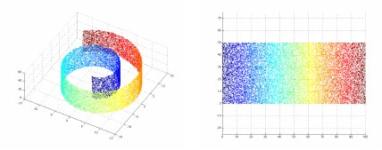

# Estimate manifold dimensionality with LID

Local Intrinsic Dimensionality (LID) is based on assuming locally
uniform density and using the geometric idea that in \\( D \\)
dimensions the volume of a ball with radius \\( r \\) goes as \\( r^D
\\). With an outer radius \\( r_{\text{bound}} \\) from some point and
a distance \\( r \lt r_{\text{bound}} \\) to a neighboring point, the
maximum likelihood estimator of LID is \\( 1 / \log{\left(
r_{\text{bound}}/r \right)} \\), and multiple estimates are averaged
with the harmonic mean.


<a href="https://www.researchgate.net/publication/200688576_Non-linear_scaling_techniques_for_uncovering_the_perceptual_dimensions_of_timbre/figures"></a>

For example, Swiss roll data curves through three dimensions but only
on a two-dimensional manifold. LID for the three-dimensional Swiss
roll data is about two, which is informative.

 * [Calculating LID with Python](#calculating)
     * [In a cloud of points](#cloud)
     * [For a Swiss roll dataset](#roll)
 * [Mathematical derivation of LID](#derivation)
     * [Cumulative Distribution Function (CDF) of radius](#cdf)
     * [Probability Density Function (PDF) of radius](#pdf)
     * [Expected Value of radius](#ev)
     * [Maximum Likelihood Estimate of dimension](#mle)
     * [Harmonic mean for dimensionality](#harmonic)
 * [Caveats](#caveats)
 * [LID in the literature](#literature)
 * [Topological extensions of LID](#topological)


### <a name="calculating" href="#calculating">Calculating LID with Python</a>

The maximum likelihood estimator of Local Intrinsic Dimensionality is
\\( 1 / \log{\left( r_{\text{bound}}/r \right)} \\).

```python
import math

def lid(radius, radius_bound):
    return 1 / math.log(radius_bound / radius)
```

The radii will be distances measured from data using
[Euclidean distance][].

[Euclidean distance]: https://en.wikipedia.org/wiki/Euclidean_distance

```python
def euclidean(xs, ys):  # Euclidean distance
    return math.sqrt(sum((x - y)**2 for x, y in zip(xs, ys)))
```

To average multiple estimates of dimensionality, use the
[harmonic mean][].

[harmonic mean]: https://en.wikipedia.org/wiki/Harmonic_mean

```python
def harmonic_mean(numbers):
    return len(numbers) / sum(1 / number for number in numbers)
```

Filter out zeros (such as the distance from a point to itself).

```python
def positive(numbers):
    return [number for number in numbers if number > 0]
```

For a point in some data, find the distances to its \\( k+1 \\)
nearest neighbors. The greatest of these is \\( r_{\text{bound}} \\),
and the estimates based on the \\( k \\) nearest neighbors are
averaged.

```python
def neighbors_lid(origin, points, k=1, distance=euclidean):
    radii = sorted(positive([distance(origin, point) for point in points]))
    return harmonic_mean([lid(radius, radii[k]) for radius in radii[:k]])
```


#### <a name="cloud" href="#cloud">In a cloud of points</a>

A random cloud of points in \\( D \\) dimensions has dimensionality
equal to \\( D \\).

```python
import random

def cloud(dimensions, count=100, bounds=(-1, 1)):
    return [[random.uniform(*bounds) for _ in range(dimensions)]
            for _ in range(count)]
```

LID can be calculated from anywhere in the cloud, such as the origin,
as in this seven-dimensional example.

```python
neighbors_lid([0]*7, cloud(7))
## 6.851551579378687
```

These estimates are very noisy; it's very likely that a given run
won't be so close to seven. Repeating the experiment many times is
more reassuring.

```python
harmonic_mean([neighbors_lid([0]*7, cloud(7)) for _ in range(1000)])
## 7.006859728132216
```


#### <a name="roll" href="#roll">For a Swiss roll dataset</a>

To estimate a dataset's dimensionality, average LID from each point in
the dataset.

```python
def data_lid(points, k=1, distance=euclidean):
    return harmonic_mean([neighbors_lid(point, points, k=k, distance=distance)
                          for point in points])
```

[Swiss roll][] data, first introduced in the [Isomap paper][], is a
two-dimensional [manifold][] embedded in three dimensions. It's not
terribly hard to make from scratch, but the
[scikit-learn implementation][] is convenient.

[Swiss roll]: https://en.wikipedia.org/wiki/Swiss_roll
[Isomap paper]: https://web.mit.edu/cocosci/Papers/sci_reprint.pdf
[manifold]: https://en.wikipedia.org/wiki/Manifold
[scikit-learn implementation]: https://github.com/scikit-learn/scikit-learn/blob/42aff4e2e/sklearn/datasets/_samples_generator.py#L1402

[](https://www.researchgate.net/publication/200688576_Non-linear_scaling_techniques_for_uncovering_the_perceptual_dimensions_of_timbre "Image from: Non-linear scaling techniques for uncovering the perceptual dimensions of timbre")

```python
import sklearn.datasets

roll, _ = sklearn.datasets.make_swiss_roll()
data_lid(roll)
## 2.0706005383894444
```

The code here is also available in a [notebook][] with slightly more
technical commentary.

[notebook]: https://github.com/ajschumacher/ajschumacher.github.io/blob/master/20201227-estimate_manifold_dimensionality_with_lid/lid.ipynb


### <a name="derivation" href="#derivation">Mathematical derivation of LID</a>

Local Intrinsic Dimensionality arises from considering radius from a
given point to another nearer than \\( r_{\text{bound}} \\) as a
random variable \\( R \\) which takes a specific value \\( r \\).


#### <a name="cdf" href="#cdf">Cumulative Distribution Function (CDF) of radius</a>

With uniform density, the probability of encountering a point is
proportional to volume, and the volume of a radius \\( r \\) ball in
\\( D \\) dimensions is proportional to \\( r^D \\), giving the
[CDF][].

[CDF]: https://en.wikipedia.org/wiki/Cumulative_distribution_function

\\[ P(R<r) = \frac{r^D}{r_{\text{bound}}^D} = \left(\frac{r}{r_{\text{bound}}}\right)^D \\]


#### <a name="pdf" href="#pdf">Probability Density Function (PDF) of radius</a>

The [PDF][] is the derivative of the CDF with respect to \\( r \\).

\\[ P(R=r) = D \left( \frac{r}{r_{\text{bound}}} \right)^{D-1} \\]

[PDF]: https://en.wikipedia.org/wiki/Probability_density_function


#### <a name="ev" href="#ev">Expected Value of radius</a>

Integrating the PDF times \\( r \\) from 0 to \\( r_{\text{bound}} \\)
gives the [expected value][] of \\( R \\), which is \\( \frac{D}{D+1}
r_{\text{bound}} \\). This isn't terribly important to the derivation
here, but it shows that as dimensionality increases, points are likely
to be closer and closer to the outer radius. This is an aspect of the
[curse of dimensionality][] and the phenomenon that LID is based on.

[expected value]: https://en.wikipedia.org/wiki/Expected_value
[curse of dimensionality]: https://en.wikipedia.org/wiki/Curse_of_dimensionality


#### <a name="mle" href="#mle">Maximum Likelihood Estimate of dimension</a>

For a given measured \\( r \\) within \\( r_{\text{bound}} \\), some
dimensionality \\( D \\) maximizes the likelihood of that observation.
The probability density function is a likelihood, and the log of that
function has the same maximum where both derivatives are zero. Setting
the derivative with respect to \\( D \\) of the natural log likelihood
equal to zero gives a simple solution.

\\[ \log{\left( \frac{r}{r_{\text{bound}}} \right)} + \frac{1}{D} = 0 \\]

\\[ D = \frac{1}{\log{ \left( \frac{r_{\text{bound}}}{r} \right)}} \\]


#### <a name="harmonic" href="#harmonic">Harmonic mean for dimensionality</a>

With two observed radii \\( r_1 \\) and \\( r_2 \\), the joint
probability is two (PDF) likelihoods multiplied together, and the log
likelihood sums. Maximizing gives the [harmonic mean][] of two
individual estimates.

\\[ \log{\left( \frac{r_1}{r_{\text{bound}}} \right)} + \frac{1}{D} + \log{\left( \frac{r_2}{r_{\text{bound}}} \right)} + \frac{1}{D} = 0 \\]

\\[ D = \frac{2}{\log{\left( \frac{r_{\text{bound}}}{r_1} \right)} + \log{\left( \frac{r_{\text{bound}}}{r_2} \right)}} \\]

The same thing happens for any number of measurements; the harmonic
mean is the appropriate way to average estimates of dimensionality.

The harmonic mean is typically appropriate for averaging _rates_, so
its appearance here suggests thinking of _dimension_ as a _rate_.
Dimension is the rate at which space that becomes available, per
distance traveled.


### <a name="caveats" href="#caveats">Caveats</a>

It's very common for distance to not really make sense in a dataset.
Scaling of variables can be very important, for example (not to
mention categorical variables).

Even with a meaningful distance, in high dimensions, "nearest
neighbors" [may not be meaningful][].

[may not be meaningful]: https://members.loria.fr/MOBerger/Enseignement/Master2/Exposes/beyer.pdf

Euclidean distance is assumed here, but [other distances][] may also
be worth considering. There is also an [angle-based approach][] to
estimating LID.

[other distances]: https://bib.dbvis.de/uploadedFiles/155.pdf
[angle-based approach]: https://arxiv.org/abs/2006.12880


### <a name="literature" href="#literature">LID in the literature</a>

A common reference is [Levina and Bickel][], "Maximum Likelihood
Estimation of Intrinsic Dimension." Their derivation is slightly
different, but the result is the same: their Equation 8 is
[the MLE above](#mle) in different notation.

Levina and Bickel suggest an adjustment to the harmonic mean when \\(
k \rightarrow \infty \\). In practice it may be better to keep \\( k
\\) small in the interest of maintaining locality and not adjust.

[Levina and Bickel]: https://www.stat.berkeley.edu/~bickel/mldim.pdf

Another form of the MLE sometimes appears (e.g. [1][], [2][]) but is
not recommended.

[1]: https://arxiv.org/abs/1801.02613 "Characterizing Adversarial Subspaces Using Local Intrinsic Dimensionality"
[2]: https://epubs.siam.org/doi/abs/10.1137/1.9781611975673.21 "Intrinsic Dimensionality Estimation within Tight Localities"

\\[ \widehat{LID}(x) = -\left( \frac{1}{k} \sum_{i=1}^k{ \log{ \frac{r_i(x)}{r_k(x)} } } \right)^{-1} \\]

In this form, \\( r_i(x) \\) is the distance to the \\( i\text{-th}
\\) nearest neighbor of the point \\( x \\), and \\( r_k(x) \\) is the
maximum of these distances. Here the \\( k \\) neighbors include the
farthest one, defining \\( r_k(x) \\), which is elsewhere called \\(
r_{\text{bound}} \\). The effect of this inclusion is to add a \\(
\log(1) = 0 \\) term to the sum (which would not be meaningful as an
individual estimate) or equivalently to average \\( k-1 \\) estimates
as if there were \\( k \\). With two nearest neighbors, this will
incorrectly double the estimate, and it will always inflate it to some
degree.

In addition to the arithmetic mean, sometimes a regression approach is
used to combine estimates of dimensionality. [Facco et al.][] apply
such an approach, noting and dropping large outliers in order to get
more robust estimates. The [harmonic mean](#harmonic) (itself
[a kind of robust regression][]) is more appropriate.

[Facco et al.]: https://www.nature.com/articles/s41598-017-11873-y.pdf
[a kind of robust regression]: https://stats.stackexchange.com/questions/264368/harmonic-mean-minimizes-sum-of-squared-relative-errors


### <a name="topological" href="#topological">Topological extensions of LID</a>

Topological approaches use nearest neighbors to turn point-like data
into [graph][]-like data (okay, [simplicial complexes][]). [UMAP][] is
a popular modern technique based on this idea.

[graph]: https://en.wikipedia.org/wiki/Graph_(discrete_mathematics)
[simplicial complexes]: https://en.wikipedia.org/wiki/Simplicial_complex
[UMAP]: https://umap-learn.readthedocs.io/en/latest/

In [Isomap][], a graph enforces geodesic distances, staying on the
manifold via neighbors connected in the graph. For estimating
dimensionality, a graph lets you avoid polluting the set of nearest
neighbors with points from actually distant parts of the manifold
(imagine jumping between sheets in Swiss roll data, for example). Some
work on dimensionality (e.g. [A][], [B][]) involves this approach.

[Isomap]: https://web.mit.edu/cocosci/Papers/sci_reprint.pdf
[A]: https://www.nature.com/articles/srep31377 "Accurate Estimation of the Intrinsic Dimension Using Graph Distances: Unraveling the Geometric Complexity of Datasets"
[B]: http://hal.cse.msu.edu/assets/pdfs/papers/2019-cvpr-intrinsic-dimensionality.pdf "On the Intrinsic Dimensionality of Image Representations"

[Stephen Wolfram][] has some [topological ideas about physics][],
including a very literal [interpretation of dimensionality][] being
the rate at which traveling a distance gives you access to more space.

[Stephen Wolfram]: https://en.wikipedia.org/wiki/Stephen_Wolfram
[topological ideas about physics]: https://writings.stephenwolfram.com/2020/04/finally-we-may-have-a-path-to-the-fundamental-theory-of-physics-and-its-beautiful/
[interpretation of dimensionality]: https://www.wolframphysics.org/technical-introduction/limiting-behavior-and-emergent-geometry/the-notion-of-dimension/
