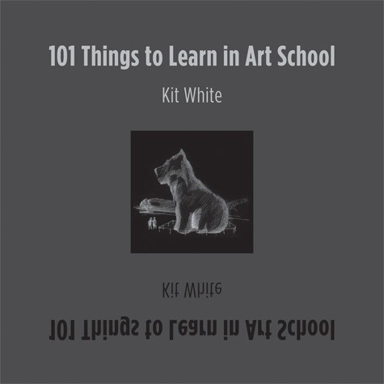

# 101 things to learn in art school, by Kit White

I picked up this little coffee table [book][] at the
[MIT Press Bookstore][] a while ago. It's cute. Some good stuff in
there. I'm a sucker for this kind of format recently.

[book]: https://mitpress.mit.edu/books/101-things-learn-art-school
[MIT Press Bookstore]: https://bookshop.org/shop/themitpressbookstore

---

### My four favorite items from the book:

> "16. Words are images. The power of the visual belongs to all things
> received visually. The written word is both symbol and cognitive
> catalyst; image and thought embodied. But words also conjure the
> image that lives only as a thought or non-embodied object. Some
> ideas are most potent when not embodied and exist as ephemeral,
> fleeting experiences. Concept has form."

> "25. Style is the consequence of something being described in the
> way most appropriate to its content. It is not a hemline height or a
> gratuitous decorative flourish added to modify or embellish an
> image. Style is the by-product of saying what has to be said in the
> most appropriate way a maker can say it. Meaningful style emerges
> from the necessity of description; it is not a product of
> self-conscious selection."

> "29. "Conception cannot precede execution." (Maurice Merleau-Ponty,
> _Sense and Non-Sense_) Art is a process of discovery through making,
> and our ability to discover is generally greater than our ability to
> invent. Think of your work process as a form of travel. Look for the
> things you don't know, the things that are revealed or inadvertently
> uncovered. It is easier to find a world than to make one."

> "45. Work from your intuition, analyze with your intellect. To keep
> your work spontaneous and inventive, try to draw upon what lies
> beneath normal cognition in an uninhibited way. Intuition is not
> hocus-pocus. It is simply a judgment system that operates without
> immediately available conscious evidence. Intuition draws upon
> subliminal knowledge and allows the unfiltered, unfamiliar, and
> unknown to enter your work. Once there, you can apply your powers of
> rational analysis to discover what you have done. At this stage, you
> can always edit, but don't edit or preclude what does not yet
> exist."
