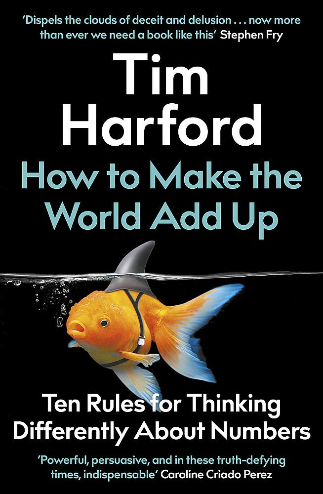

# How to Make the World Add Up, by Harford

Looks like I got the [UK edition][] rather than the [US edition][] (US
title: "The Data Detective"). Ties to audio are evident, from frequent
citations of podcasts to the titling and overall style. Probably good
as an audiobook too. I liked it a lot. Plenty of good examples and a
humane focus on aspects of understanding data that are too often
neglected.

[UK edition]: https://timharford.com/books/worldaddup/
[US edition]: https://timharford.com/books/datadetective/

### “Ten Rules for Thinking Differently About Numbers” (rules re-worded)

 1. [Be aware of your emotions.](#ch1)
 2. [Consider both first-person experience and statistical views.](#ch2)
 3. [Understand what definitions really mean.](#ch3)
 4. [Put things in appropriate context.](#ch4)
 5. [Be aware of publication bias and significance testing generally.](#ch5)
 6. [Consider what's missing (especially as a result of bias).](#ch6)
 7. [Overfitting can happen; models may be bad; demand transparency.](#ch7)
 8. [Value good official statistics.](#ch8)
 9. [Be skeptical of visualizations.](#ch9)
10. [Keep an open mind.](#ch10)

And the Golden rule: [Be curious](#golden)

---

> "I worry about a world in which many people will believe anything,
> but I worry far more about one in which people believe nothing
> beyond their own preconceptions." (page 15)

He references [How to Lie With Statistics][] but laments the
associated cynicism.

[How to Lie With Statistics]: https://en.wikipedia.org/wiki/How_to_Lie_with_Statistics

---

### Chapter 1: <a href="#ch1" name="ch1">Be aware of your emotions.</a>

---

> "Sometimes, we want to be fooled." (page 23)

---

> "All the statistical expertise in the world will not prevent you
> believing claims you shouldn't believe and dismissing facts you
> shouldn't dismiss." (page 23)

---

> "One survey of gay and bisexual men in the United States found that
> almost half believed HIV did not cause AIDS and more than half
> believed the standard treatments did more harm than good." (page 29)

 * ["There is no proof that HIV causes AIDS": AIDS denialism beliefs among people living with HIV/AIDS](https://pubmed.ncbi.nlm.nih.gov/20571892/)
 * [Conspiracy beliefs and trust in information about HIV/AIDS among minority men who have sex with men](https://psycnet.apa.org/record/2007-12149-013)

---

> "If doubt is the weapon, detail is the ammunition." (page 37)

Interesting comparison: "Must I believe this?" vs. "Can I believe
this?" With more detail, there are more things to find fault with, and
also more things to find convincing.

---

> "We can learn to control our emotions—that is part of the process of
> growing up." (page 42)

---

### Chapter 2: <a href="#ch2" name="ch2">Consider both first-person experience and statistical views.</a>

---

> "Sometimes personal experience tells us one thing, the statistics
> tell us something quite different, and both are true." (page 54)

---

> "Though a factor of sixteen is hardly a small effect, lung cancer is
> itself scarce enough to confuse our intuitions. The world is full of
> patterns that are too subtle or too rare to detect by eyeballing
> them, and a pattern doesn't need to be very subtle or rare to be
> hard to spot without a statistical lens." (page 54)

---

> "[Naive realism][] can lead us badly astray when we confuse our
> personal perspective on the world with some universal truth. We are
> surprised when an election goes against us: everyone in our social
> circle agreed with us, so why did the nation vote otherwise? Opinion
> polls don't always get it right, but I can assure you they have a
> better track record of predicting elections that simply talking to
> your friends." (page 57)

[Naive realism]: https://youarenotsosmart.com/2017/07/20/yanss-101-naive-realism-rebroadcast/

This [naive realism thing][] is interesting. I think it's
fundamentally the assumption that other people are basically the same
as us except for what they've experienced, so if only they saw that
article in The Atlantic, then we'd agree?

[naive realism thing]: https://en.wikipedia.org/wiki/Na%C3%AFve_realism_(psychology)

---

> "These news reports are data, in a way. They're just not
> representative data. But they certainly influence our views of the
> world." (page 59)

---

> "Social scientists have long understood that statistical metrics are
> at their most pernicious when they are being used to control the
> world, rather than try to understand it. Economists tend to cite
> their colleague Charles Goodhart, who wrote in 1975: 'Any observed
> statistical regularity will tend to collapse once pressure is placed
> upon it for control purposes.' (Or, more pithily: 'When a measure
> becomes a target, it ceases to be a good measure.') Psychologists
> turn to Donald T. Campbell, who around the same time explained: 'The
> more any quantitative social indicator is used for social
> decision-making, the more subject it will be to corruption pressures
> and the more apt it will be to distort and corrupt the social
> processes it is intended to monitor.'" (page 62)

Citations from page 299:

> "Charles Goodhart, 'Problems of Monetary Management: The U.K.
> Experience,' in Anthony S. Courakis (ed.), _Inflation, Depression,
> and Economic Policy in the West_, London: Mansell, 1981, pp. 111-46.
> The original paper was presented at a conference in 1975."

> "Donald T. Campbell, 'Assessing the impact of planned social
> change,' _Evaluation and Program Planning_, 2(1), 1979—an earlier
> version was published in 1976 and a conference paper existed in
> 1974."

Love the thorough sourcing!

---

> "Muhammad Yunus, an economist, microfinance pioneer and winner of
> the Nobel Peace Prize, has contrasted the 'worm's eye view' of
> personal experience with the 'bird's eye view' that statistics can
> provide. The worm and the bird see the world very differently, and
> Professor Yunus is right to emphasize the advantage of seeing it up
> close." (page 64)

---

### Chapter 3: <a href="#ch3" name="ch3">Understand what definitions really mean.</a>

---

Around page 70, interesting stuff on differences in infant mortality
rates being impacted by differences in how things are classified: if a
pregnancy ends without a live baby at week 22 or 23, is that a
miscarriage or the death of an infant? See for example the cited
[International comparisons of infant mortality and related factors: United States and Europe, 2010 ](https://pubmed.ncbi.nlm.nih.gov/25252091/)

---

> "Even the year of death, 2017, isn't as straightforward as you might
> think. For example, in the UK in 2016, the homicide rate rose
> sharply. This was because an official inquest finally ruled that
> ninety-six people who died in a crush at the Hillsborough football
> stadium in 1989 had been unlawfully killed. Initially seen as an
> accident, those deaths officially became homicides in 2016. This is
> an extreme example, but there are often delays between when somebody
> died and when the cause of death was officially registered." (page
> 77)

---

> "Clarity should come first; advocacy can come once we understand the
> facts." (page 78)

---

> "It is not always clear whether someone intended to kill themselves;
> sometimes people intended only to hurt themselves but died by
> accident. In the UK, the Office for National Statistics draws a
> clear line: if the child is fifteen or over, the death is assumed to
> be deliberate; under the age of fifteen, it is assumed to be an
> accident." (page 80)

---

### Chapter 4: <a href="#ch4" name="ch4">Put things in appropriate context.</a>

---

Cute idea re: [50-year newspaper][].

[50-year newspaper]: https://www.npr.org/sections/money/2017/12/29/574666409/the-50-year-newspaper

---

> "Less illuminating [than a meaningful comparison] is the habit of
> writing something along the lines of 'if the US national debt was a
> pile of dollar bills it would stretch all the way to space/to the
> moon/to the sun'. Some journalists seem to think this is a great way
> to put a big number into context. Is it? Generally I find myself
> stupider at reaching the end of such sentences. Do you know how many
> dollar bills there are in a pile a yard high? (About eight thousand.
> I had to look it up, of course. Anyone would.) Space is generally
> regarded as being 100 kilometres above us, the moon is nearly
> 400,000 kilometres away, and the sun 150 million kilometres away—so
> a pile that stretches to the sun is a lot bigger than one that
> stretches to space. By my calculations, the US national debt would
> be a pile of dollar bills reaching to the moon six times. Happy now?
> I find it much clearer to note that it is about $70,000 per US
> citizen." (page 100)

---

> "The good stories are everywhere. They are not made memorable by
> their rarity; they are made forgettable by their ubiquity." (page
> 104)

---

> "In the first chapter, I advised trying to notice your feelings
> about the claim; in the second chapter, constructively
> sense-checking the claim against your personal experience; in the
> third chapter, asking yourself if you really understand what the
> claim means. These are all simple, common-sense suggestions, and in
> this chapter I've added a fourth: step back and look for information
> that can put the claim into context." (page 108)

---

### Chapter 5: <a href="ch5" name="ch5">Be aware of publication bias and significance testing generally.</a>

---

> "If you have a result that looks publishable but fragile, the logic
> of science tells you to try to disprove it. Yet the logic of
> academic grants and promotions tells you to publish at once, and for
> goodness sake don't prod it too hard." (page 120)

---

> "In general, more data is better. But if data are gathered bit by
> bit, testing as we go, then the standard statistical tests aren't
> valid. Those tests assume that the data have simply been gathered,
> then tested—not that scientists have collected some data, tested
> them, and then maybe collected a bit more." (page 121)

---

> "Daniel Kahneman himself dramatically raised the profile of the
> issue [of reproducibility/reliability of research] when he wrote an
> open [letter][] to psychologists in the field warning them of a
> looming 'train wreck' if they could not improve the credibility of
> their research." (page 127)

[letter]: https://www.nature.com/news/polopoly_fs/7.6716.1349271308!/suppinfoFile/Kahneman%20Letter.pdf

---

> "The 'interestingness' filter is enormously powerful." (page 128)

---

> "There are encouraging signs that more researchers are welcoming
> replication efforts. For example, in 2010, political scientists
> Brendan Nyhan and Jason Reifler published a study on what became
> known as 'the backfire effect'—in brief, that people were more
> likely to believe a false claim if they'd been shown a fact-check
> that debunked the claim. This caused a moral panic among some
> journalists, particularly after the rise of Donald Trump.
> Fact-checking only makes matters worse! It hit that perfect
> counterintuitive sweet spot. But Nyhan and Reifler encouraged
> further studies, and those studies suggest that the backfire effect
> is unusual and fact-checking does help. One [summary][] of the
> research concluded: 'generally debunking can make people's beliefs
> in specific claims more accurate'. Nyhan himself has quoted this
> summary [on Twitter][] when he sees people relying on his original
> paper without considering the follow-ups." (page 135)

[on Twitter]: https://twitter.com/BrendanNyhan/status/1108377656414879744
[summary]: https://fullfact.org/blog/2019/mar/does-backfire-effect-exist/

---

> "Many statisticians believe the crisis points to the need to rethink
> the standard statistical tests themselves—that the very concept of
> 'statistical significance' is deeply flawed." (page 135)

---

> "In general, if the chances of randomly observing data at least as
> extreme as you collect are less than 5 per cent, the results are
> 'significant' enough to overturn the assumption: we can conclude
> with a sufficient degree of confidence that the drug works, large
> displays of jam discourage people from buying jam, and that
> precognition exists.
>
> "The problems are obvious. 5 per cent is an arbitrary cut-off
> point—why not 6 per cent, or 4 per cent?—and it encourages us to
> think in black-and-white, pass-or-fail terms, instead of embracing
> degrees of uncertainty." (page 136)

---

Page 136 also includes mention of a "journey towards more rigorous
science" which made me think. Statistical rigor is sort of the
problem, isn't it? At least, a certain interpretation of what rigor
is. The attraction of binary decision-making, significant or not
significant, has the feel of "rigor" - using a significance test feels
"rigorous." What we need is science that's more thoughtful, more
circumspect, less focused on reporting results via single-number
summaries. If that can be made to be what "rigor" means, then good.

---

The book introduces [Cochrane][] and [Campbell][], two neat
collaborations that focus on trying to figure out the truth by looking
at multiple studies.

[Cochrane]: https://en.wikipedia.org/wiki/Cochrane_(organisation)
[Campbell]: https://en.wikipedia.org/wiki/Campbell_Collaboration

---

### Chapter 6: <a href="#ch6" name="ch6">Consider what's missing (especially as a result of bias).</a>

---

> "The power to not collect data is one of the most important and
> little-understood sources of power that governments have... By
> refusing to amass knowledge in the first place, decision-makers
> exert power over the rest of us." (page 142, quoting
> [Anna Powell-Smith][] of [MissingNumbers.org][])

[Anna Powell-Smith]: https://twitter.com/darkgreener
[MissingNumbers.org]: https://missingnumbers.org/

---

[Closing the gender data gap](https://rss.onlinelibrary.wiley.com/doi/full/10.1111/j.1740-9713.2016.00899.x)

> "When Uganda revised its question about labour force participation
> in two contiguous surveys in 1992–93 – recording the main activity
> in one case, while expanding questions to cover secondary activities
> in the other – the percentage of working-age Ugandans in the labour
> force increased from 78% to 87%. These additional workers – 702 000
> of them, the majority women – went unacknowledged in the first
> survey that asked only about primary activities."

---

> "It is all too tempting to assume that what we do not measure simply
> does not exist." (page 149)

---

[Do Husbands and Wives Pool Their Resources? Evidence from the United Kingdom Child Benefit](http://apps.olin.wustl.edu/faculty/pollak/R_Lundberg_Pollak_Wales_1997_JHR_Do_husbands.pdf)

> "Common preference models of family behavior imply income pooling, a
> restriction on family demand functions such that only the sum of
> husband's income and wife's income affects the allocation of goods
> and time. Testing the pooling hypothesis is difficult because most
> family income sources are not exogenous to the allocations being
> analyzed. In this paper, we present an alternative test based on a
> "natural experiment"-a policy change in the United Kingdom that
> transferred a substantial child allowance to wives in the late
> 1970s. Using Family Expenditure Survey data, we find strong evidence
> that a shift toward greater expenditures on women's clothing and
> children's clothing relative to men's clothing coincided with this
> income redistribution."

---

> "Big found datasets can seem comprehensive, and may be enormously
> useful, but 'N = All' is often a seductive illusion: it's easy to
> make unwarranted assumptions that we have everything that matters.
> We must always ask who what is missing. And this is only one reason
> to approach big data with caution." (page 160)

---

### Chapter 7: <a href="#ch7" name="ch7">Overfitting can happen; models may be bad; demand transparency.</a>

---

> "We're awestruck by the algorithm in part because we don't
> appreciate the mundanity of what's happening underneath the
> magician's silk handkerchief." (page 169)

---

> "In Charles Duhigg's account, Target mixes in random offers, such as
> coupons for wine glasses, because pregnant customers would feel
> spooked if they realised how intimately the company's computers
> understood them. But Kaiser Fung has another explanation: Target
> mixes up its offers not because it would be weird to send an
> all-baby coupon book to a woman who was pregnant, but because the
> company knows that many of those coupon books will be sent to women
> who aren't pregnant after all." (page 170)

---

> "The problem [with Wunderlich's body temperature result] was
> exacerbated by a conversion of units. Wunderlich's original
> measurements were made in centigrade, and his results concluded that
> the typical body temperature was in a range around 37°C—implicitly,
> given that degree of precision, a range of up to a degree
> centigrade, somewhere above 36.5°C and below 37.5°C. But when
> Wunderlich's articles in German were translated into English,
> reaching a larger audience, the temperature was converted from
> centigrade to Fahrenheit and became 98.6°F—inviting physicians to
> assume that the temperature had been measured to one tenth of a
> degree Fahrenheit rather than one degree centigrade. The implied
> precision was almost twenty times greater—but all that had actually
> changed was a conversion between two temperature scales." (page 174)

---

[Amazon scraps secret AI recruiting tool that showed bias against women](https://www.reuters.com/article/us-amazon-com-jobs-automation-insight/amazon-scraps-secret-ai-recruiting-tool-that-showed-bias-against-women-idUSKCN1MK08G)

---

> "Remarkably often, Meehl found, experts faired poorly when compared
> with simple checklists. Meehl described his _Clinical vs.
> Statistical Prediction_ as 'my disturbing little book'."

This connects neatly with [Gawande][]'s modern checklist advocacy.
It's also a kind of condensed knowledge: automate the things we know
how to do into a checklist.

[Gawande]: https://en.wikipedia.org/wiki/Atul_Gawande

---

[Flaws in stupid horrible algorithm revealed because it made numerical predictions](https://statmodeling.stat.columbia.edu/2018/07/03/flaws-stupid-horrible-algorithm-revealed-made-numerical-predictions/)

---

> "What accounts for the difference, says David Wootton, a historian
> of science, is that alchemy was pursued in secret, while science
> depended on open debate." (page 183)

---

> "Eventually, ProPublica [published][] their conclusions. Although
> the COMPAS algorithm did not use an offender's race as a predictor,
> it nevertheless was producing racially disparate results. It tended
> to produce false positives for black offenders (predicting that they
> would re-offend, but then they did not) and false negatives for
> white offenders (predicting that they would not re-offend, but then
> they did).
>
> "That sounds very worrying: racial discrimination is both immoral
> and illegal when coming from a human; we shouldn't tolerate it if it
> emerges from an algorithm.
>
> "But then four academic researchers, Sam Corbett-Davies, Emma
> Pierson, Avi Feller and Sharad Goel, [pointed out][] that the
> situation wasn't so clear-cut. They used the data laboriously
> assembled by ProPublica to show that the algorithm was fair by
> another important metric, which was that if the algorithm gave two
> criminals—one black, one white—the same risk rating, then the actual
> risk that they re-offended was the saem. In that respect the
> algorithm was colour-blind.
>
> "What's more, the researchers showed that it was impossible for the
> algorithm to be fair in both ways simultaneously. It was possible to
> craft an algorithm that would give an equal rate of false positives
> for all races, and it was possible to craft an algorithm where the
> risk ratings matched the re-offending risk for all races, but it
> wasn't possible to do both at the same time: the numbers just
> couldn't be made to add up." (pages 187-188)

[published]: https://www.propublica.org/article/machine-bias-risk-assessments-in-criminal-sentencing
[pointed out]: https://arxiv.org/abs/1701.08230

At first I thought the incompatibility thing was some deep proof, but
it's unfortunately just a sad fact about empirical base rates not
being equal across groups. References:

 * [Machine Bias: There’s software used across the country to predict future criminals. And it’s biased against blacks.](https://www.propublica.org/article/machine-bias-risk-assessments-in-criminal-sentencing)
     * [How We Analyzed the COMPAS Recidivism Algorithm](https://www.propublica.org/article/how-we-analyzed-the-compas-recidivism-algorithm)
 * [A computer program used for bail and sentencing decisions was labeled biased against blacks. It’s actually not that clear.](https://www.washingtonpost.com/news/monkey-cage/wp/2016/10/17/can-an-algorithm-be-racist-our-analysis-is-more-cautious-than-propublicas/)
 * [Algorithmic decision making and the cost of fairness](https://arxiv.org/abs/1701.08230)
 * [Inherent Trade-Offs in the Fair Determination of Risk Scores](https://arxiv.org/abs/1609.05807)

---

### Chapter 8: <a href="#ch8" name="ch8">Value good official statistics.</a>

Yes, do this.

---

### Chapter 9: <a href="#ch9" name="ch9">Be skeptical of visualizations.</a>

---

> "[Florence Nightingale] corresponded with the great Belgian
> statistician Adolphe Quetelet. Quetelet was the person who
> popularised the idea of taking the 'average' or 'arithmetic mean' of
> a group, which was a revolutionary way to summarise complex data
> with a single number." (page 233)

Two paragraphs just taken from Wikipedia:

> "His most influential book was Sur l'homme et le développement de
> ses facultés, ou Essai de physique sociale, published in 1835 (In
> English translation, it is titled Treatise on Man, but a literal
> translation would be "On Man and the Development of his Faculties,
> or Essays on Social Physics"). In it, he outlines the project of a
> social physics and describes his concept of the "average man"
> (l'homme moyen) who is characterized by the mean values of measured
> variables that follow a normal distribution. He collected data about
> many such variables."

> "Adolphe Quetelet also had a significant influence on Florence
> Nightingale who shared with him a religious view of statistics which
> saw understanding statistics as revealing the work of God in
> addition to statistics being a force of good administration.
> Nightingale met Quetelet in person at the 1860 International
> Statistical Congress in London, and they corresponded for years
> afterwards."

So it seems from this that he was mostly popularizing quantitative
methods in the social sciences. He had some idea of the "average man"
as a kind of Platonic Ideal (see [Gould][]), and (at least in the
interpretation of some) that variation around the mean is "error"...

[Gould]: https://journalofethics.ama-assn.org/article/median-isnt-message/2013-01

---

> "without well-defined standards for statistical record-keeping,
> nothing adds up. Numbers can easily confuse us when they are
> unmoored from a clear definition." (page 235)

---

> "Trends and patterns will often leap out immediately if plotted in
> the right way. For example, visualization expert Robert Kosara
> suggests plotting linear data on a spiral. If there's a periodic
> pattern to the data—say, repeating every seven days or every three
> months—that may be concealed by other fluctuations in a conventional
> plot but will leap out in a spiral plot." (page 241)

See:

 * [Visualization: It’s More than Pictures!](http://stat-computing.org/newsletter/issues/scgn-22-1.pdf)
 * [Information Visualization vs. Statistical Graphics](https://eagereyes.org/blog/2011/information-visualization-vs-statistical-graphics)
 * [Spirals for Periodic Data](https://eagereyes.org/techniques/spirals)

The main example offered is a weekly pattern, which I think could be
visualized with a calendar plot (like on Github, or as in
[here](http://bl.ocks.org/ajschumacher/5127001)).

---

[Lies, damn lies, and statistics: How to take something positive from the UK’s EU referendum campaign](https://www.infoworld.com/article/3088166/why-how-to-lie-with-statistics-did-us-a-disservice.html)

The slug for this article is
"why-how-to-lie-with-statistics-did-us-a-disservice" which isn't
mentioned in the article itself, but is a sentiment Harford presents
early in his book.

---

### Chapter 10: <a href="ch10" name="ch10">Keep an open mind.</a>

---

> "The statistical lens is indeed powerful. Still, I hope that I have
> convinced you that for any problem, it takes more than mere numbers
> to make the world add up." (page 276)

---

> "This book has argued that it is possible to gather and to analyse
> numbers in ways that help us understand the world. But it has also
> argued that very often we make mistakes not because the data aren't
> available, but because we refuse to accept what they are telling
> us." (pages 277-278)

---

### Golden rule: <a href="#golden" name="golden">Be curious.</a>

---

 * [There may be an antidote to politically motivated reasoning. And it’s wonderfully simple.](https://www.vox.com/science-and-health/2017/2/1/14392290/partisan-bias-dan-kahan-curiosity)
 * [Science Curiosity and Political Information Processing](https://onlinelibrary.wiley.com/doi/full/10.1111/pops.12396)

> "The scientifically curious people Kahan's team studied were
> originally identified with simple questions, buried in a marketing
> survey so that people weren't conscious that their curiosity was
> being measured. One question, for example, was 'How often do you
> read science books?' Scientifically curious people are more
> interested in watching a documentary about space travel or penguins
> than a basketball game or a celebrity gossip show." (pages 283-284)

---

> "A surprising statistical claim is a challenge to our existing
> world-view. It may provoke an emotional response—even a fearful one.
> Neuroscientific studies [suggest][] that the brain responds in much
> the same anxious way to facts which threaten our preconceptions as
> it does to wild animals which threaten our lives. Yet for someone in
> a curious frame of mind, in contrast, a surprising claim need not
> provoke anxiety. It can be an engaging mystery, or a puzzle to
> solve." (page 285)

[suggest]: https://www.nature.com/articles/srep39589

---

 * [The Knowledge Illusion](https://www.amazon.com/Knowledge-Illusion-Never-Think-Alone/dp/039918435X)
 * [The misunderstood limits of folk science: an illusion of explanatory depth](https://www.ncbi.nlm.nih.gov/pmc/articles/PMC3062901/)
 * [Political Extremism Is Supported by an Illusion of Understanding](https://journals.sagepub.com/doi/abs/10.1177/0956797612464058)

Abstract for that last one:

> "People often hold extreme political attitudes about complex
> policies. We hypothesized that people typically know less about such
> policies than they think they do (the illusion of explanatory depth)
> and that polarized attitudes are enabled by simplistic causal
> models. Asking people to explain policies in detail both undermined
> the illusion of explanatory depth and led to attitudes that were
> more moderate (Experiments 1 and 2). Although these effects occurred
> when people were asked to generate a mechanistic explanation, they
> did not occur when people were instead asked to enumerate reasons
> for their policy preferences (Experiment 2). Finally, generating
> mechanistic explanations reduced donations to relevant political
> advocacy groups (Experiment 3). The evidence suggests that people’s
> mistaken sense that they understand the causal processes underlying
> policies contributes to political polarization."

---

[Using narratives and storytelling to communicate science with nonexpert audiences](https://www.pnas.org/content/111/Supplement_4/13614)

> "Although storytelling often has negative connotations within
> science, narrative formats of communication should not be
> disregarded when communicating science to nonexpert audiences.
> Narratives offer increased comprehension, interest, and engagement.
> Nonexperts get most of their science information from mass media
> content, which is itself already biased toward narrative formats.
> Narratives are also intrinsically persuasive, which offers science
> communicators tactics for persuading otherwise resistant audiences,
> although such use also raises ethical considerations. Future
> intersections of narrative research with ongoing discussions in
> science communication are introduced."
