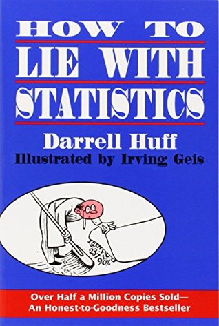

# How to Lie with Statistics, by Huff

[Darrell Huff][] and his [popular 1954 book][] have [received][]
criticism. Huff was wrong about cigarettes and cancer, but he did warn
us that people are biased. In 142 breezy pages, the book manages to
cover quite a lot, with perhaps moderate levels of prejudice for its
time.

[Darrell Huff]: https://en.wikipedia.org/wiki/Darrell_Huff
[popular 1954 book]: https://en.wikipedia.org/wiki/How_to_Lie_with_Statistics
[received]: /20210330-how_to_make_the_world_add_up_by_harford/

 * Chapter 1: “The Sample with the Built-in Bias” (sampling)
 * Chapter 2: “The Well-Chosen Average” (mean vs. median)
 * Chapter 3: “The Little Figures That Are Not There” (variance etc.)
 * Chapter 4: “Much Ado about Practically Nothing” (small differences and measurement uncertainty)
 * Chapter 5: “The Gee-Whiz Graph” (funny y-axes)
 * Chapter 6: “The One-Dimensional Picture” (dimensional distortion of comparisons)
 * Chapter 7: “The Semiattached Figure” (non-sequitur logic)
 * Chapter 8: “Post Hoc Rides Again” (correlation ≠ causation)
 * Chapter 9: “How to Statistculate” (“statistically
   manipulate”—nonsense math)
 * Chapter 10: “How to Talk Back to a Statistic” (ask questions)
     * “Who says so?”
     * “How does he know?”
     * “What’s missing?”
     * “Did somebody change the subject?”
     * “Does it make sense?”

---

> "There are at least three levels of sampling involved. Dr. Kinsey's
> samples of the population (one level) are far from random ones and
> may not be particularly representative, but they are enormous
> samples by comparison with anything done in his field before and his
> figures must be accepted as revealing and important if not
> necessarily on the nose. It is possibly more important to remember
> that any questionnaire is only a sample (another level) of the
> possible questions and that the answer the lady gives is no more
> than a sample (third level) of her attitudes and experiences on each
> question." (page 23)

---

> "Some of the strongest feeling against public-opinion polls is found
> in liberal or left-wing circles, where it is rather commonly
> believed that polls are generally rigged. Behind this view is the
> fact that poll results so often fail to square with the opinions and
> desires of those whose thinking is not in the conservative
> direction. Polls, they point out, seem to elect Republicans even
> when voters shortly thereafter do otherwise." (page 26)

Interesting historical perspective; modern concerns about polls are
not necessarily new issues.

---

> "You will also learn if you read back into the tables that the
> figure is based on a sample of such size that there are nineteen
> chances out of twenty that the estimate—$3,107 before it was
> rounded—is correct within a margin of $59 plus or minus." (pages
> 35-36)

I don’t know a confidence interval technique that will give you quite
that interpretation; this could be erroneous.

---

"Degree of significance" (p-value) is presented on page 42 as a thing
that is usually hidden from the public, which may have been (and may
still often be) the case. These days I hear more about problems with
significance tests than demands for them.

---

> "It is dangerous to mention any subject having high emotional
> content without hastily saying where you are for or agin it." (page
> 46, amusing spelling in original)

---

> "The [Procrustean][] Statistic" (graphic page 43)

[Procrustean]: https://en.wikipedia.org/wiki/Procrustes

---

> "In somewhat the same fashion those little figures
> [reporting variance] that are missing from what are called
> “Gessell’s norms” have produced pain in papas and mamas. Let a
> parent read, as many have done in such places as Sunday rotogravure
> sections, that “a child” learns to sit erect at the age of so many
> months and he thinks at once of his own child. Let his child fail to
> sit by the specified age and the parent must conclude that his
> offspring is “retarded” or “subnormal” or something equally
> invidious. Since half the children are bound to fail to sit by the
> time mentioned, a good many parents are made unhappy. Of course,
> speaking mathematically, this happiness is balanced by the joy of
> the other fifty per cent of parents in discovering that their
> children are “advanced.” But harm can come of the efforts of the
> unhappy parents to force their children to conform to the norms and
> thus be backward no longer." (pages 44-45)

---

> "_Newsweek_ once showed how “U. S. Old Folks Grow Older” by means of
> a chart on which appeared two male figures, one representing the
> 68.2-year life expectancy of today, the other the 34-year life
> expectancy of 1879-1889.'"

Here Huff is complaining that the person twice as tall appears 8 times
as massive, but there are other issues with interpreting
[historical life expectancy][]...

[historical life expectancy]: /20200806-life_expectancy_is_historically_misleading/

---

> "Who knows what germ causes colds, particularly since it probably
> isn’t a germ at all?" (page 75)

What does he think causes colds? They knew about viruses in the 50s,
didn’t they?

---

> "Let us say that during a period in which race prejudice is growing
> you are employed to “prove” otherwise. It is not a difficult
> assignment. Set up a poll or, better yet, have the polling done for
> you by an organization of good reputation. Ask that usual cross
> section of the population if they think blacks have as good a chance
> as white people to get jobs. Repeat your polling at intervals so
> that you will have a trend to report.
>
> "Princeton’s Office of Public Opinion Research tested this question
> once. What turned up is interesting that things, especially in
> opinion polls, are not always what they seem. Each person who was
> asked the question about jobs was also asked some questions designed
> to discover if he was strongly prejudiced against blacks. It turned
> out that people most strongly prejudiced were most likely to answer
> Yes to the question about job opportunities. (It worked out that
> about two-thirds of those who were sympathetic toward blacks did not
> think the black had as good a chance at a job as a white person did,
> and about two-thirds of those showing prejudice said that blacks
> were getting as good breaks as whites.) It was pretty evident that
> from this poll you would learn very little about employment
> conditions for blacks, although you might learn some interesting
> things about a man’s racial attitudes." (pages 75-76)

A couple striking dehumanizing "blacks" vs. "white people" phrasings
here. The reportage of veiled (?) racism in survey responses still
seems relevant today.

---

> "A civilian population includes infants, the old, and the ill, all
> of whom have a higher death rate wherever they are." (page 85)

It’s incidental to the point of the text here, but it’s interesting to
see a reference to infants having a high death rate. I think this
sounds out of place, today. When Huff was born in 1913, something like
ten percent of babies died before age five.
([historical life expectancy][])

---

> "Keep in mind that a correlation may be real and based on real cause
> and effect—and still be almost worthless in determining action in
> any single case." (page 93)

I read this as pointing to variability. Was he already thinking about
smoking?

---

> "But arbitrarily rejecting statistical methods makes no sense
> either. That is like refusing to read because writers sometimes use
> words to hide facts and relationships rather than to reveal them."
> (page 121)

---

> "I’ll face up to the serious purpose that I like to think lurks just
> beneath the surface of this book: explaining how to look a phony
> statistic in the eye and face it down; and no less important, how to
> recognize sound and usable data in that wilderness of fraud to which
> the previous chapters have been largely devoted." (page 122)

---

> "You may be familiar with the Rudolf Flesch readability formula. It
> purports to measure how easy a piece of prose is to read, by such
> simple and objective items as length of words and sentences. Like
> all devices for reducing the imponderable to a number and
> substituting arithmetic for judgment, it is an appealing idea."
> (page 137)

I’m interested in the [readability stuff][], but it also strikes me
that the last sentence there is quite a good joke:

[readability stuff]: https://en.wikipedia.org/wiki/Flesch%E2%80%93Kincaid_readability_tests

> "Like all devices for reducing the imponderable to a number and
> substituting arithmetic for judgment, it is an appealing idea."

That could be an epigraph!
