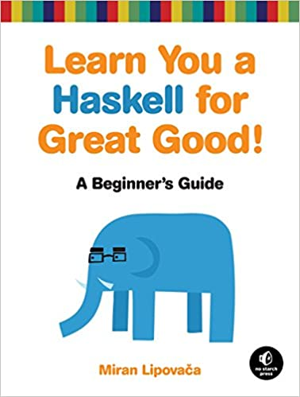

# Learn You a Haskell for Great Good! by Lipovača

Here's a good [book][] you can read for free. Like it says on the
back, "Maps, Monads, Monoids, and More!" It does a great job
explaining things in ways that are helpful. The humble list can be a
functor, an applicative functor, a monoid, and a monad.

[book]: http://learnyouahaskell.com/

There's a [joke][]: "A monad is just a monoid in the category of
endofunctors, what's the problem?" This is like saying "the median is
just a medoid on the field of reals."

[joke]: http://james-iry.blogspot.com/2009/05/brief-incomplete-and-mostly-wrong.html

In both cases, if you don't know what the first term is, you likely
don't know what the others are. It's not a good way to explain.

In both cases, the explanatory terms are needlessly obscure: "endo" is
likely gratuitous; "field of reals" is probably not better than
"numbers".

Also in both cases, the explanation isn't complete; it describes
without defining. For the median, the L1 norm has to be specified. For
monads, the monoid function has to be `join`. See also
[Crockett's explanation][] and my [pictures][] showing how `map` and
`join` give you `bind`.

[Crockett's explanation]: https://stackoverflow.com/questions/3870088/a-monad-is-just-a-monoid-in-the-category-of-endofunctors-whats-the-problem
[pictures]: /20150125-monads_by_diagram/

I'm not giving a complete explanation here either. Read the book! It
has [zippers][] too!

[zippers]: https://en.wikipedia.org/wiki/Zipper_(data_structure)


---




---

Forcing non-pure stuff into `do` blocks, as seems common in Haskell,
is very reminiscent of the [functional core, imperative shell][]
pattern.

[functional core, imperative shell]: https://www.destroyallsoftware.com/screencasts/catalog/functional-core-imperative-shell


---

Haskell's pattern-matching (often instead of conditionals) is pretty
neat. Python is getting [something analogous][] in 3.10.

[something analogous]: https://mathspp.com/blog/pydonts/pattern-matching-tutorial-for-pythonic-code


---

Haskell's type inference gives behavior sort of like coercion in other
languages, but without the craziness. So `3 + 4.5` will work like
you'd expect, but there's no chance `'3' + 4.5` will turn out to be
`'34.5'` (which is what happens in JavaScript).


---

Haskell has a funny quirk in some of its ranges:

```
ghci> [0.1, 0.3 .. 1]
[0.1,0.3,0.5,0.7,0.8999999999999999,1.0999999999999999]
```

It's surprising that 1.1 is in there, when 1 was the upper bound. This
is because of a rule that if the value is within half the step size
(for floats and things like them) then it gets included in the result.
Wacky!


---

> "_Sets and maps from `Data.Set` and `Data.map` are implemented using
> trees, but instead of normal binary search trees, they use_ balanced
> _binary search trees._" (page 135)

Interesting! Usually these would be hash maps... Hmm! The closest
Haskell gets to a "normal" hash map (I think [this][]?) is implemented
with [hash array mapped tries][]. Also good for persistence (meaning
re-using things in memory rather than creating everything from
scratch, because we don’t mutate). Fun!

[this]: https://hackage.haskell.org/package/unordered-containers-0.2.13.0/docs/Data-HashMap-Strict.html
[hash array mapped tries]: https://en.wikipedia.org/wiki/Hash_array_mapped_trie


---

> "We can read the type of `putStrLn` like this: `putStrLn` takes a
> string and returns an _I/O action_ that has a result type of `()`
> (that is, the empty tuple, also known as _unit_)." (page 155)

The wiki for [unit type][] is helpful for understanding why it's
called that.

[unit type]: https://en.wikipedia.org/wiki/Unit_type


---

On page 275, he defines a pipe operator with `x -: f = f x`. Pretty
neat!


---

> "While similar to a normal list, a _difference list_ is actually a
> function that takes a list and prepends another list to it. For
> example, the difference list equivalent of a list like `[1,2,3]` is
> the function `\xs -> [1,2,3] ++ xs`. A normal empty list is `[]`,
> whereas an empty difference list is the function `\xs -> [] ++ xs`."
> (page 307)

And so we get efficient appending to linked lists!


---

> "the function monad is also called the _reader monad_." (page 312)


---

> "For instance, if we have `Just (Just 9)`, can we make that into
> `Just 9`? It turns out that any nested monadic value can be
> flattened and that this is actually a property unique to monads."
> (page 326)

This makes it sound fancier than it is, I think because the author
talks about `bind` more than `join` and doesn't talk about the
[relationship between them][].

[relationship between them]: /20150125-monads_by_diagram/


---

> "We don't usually set out to make a monad with the sole purpose of
> making a monad. Rather, we make a type whose purpose is to model an
> aspect of some problem, and then later on, if we see that the type
> represents a value with a context and can act like a monad, we give
> it a `Monad` instance." (page 336)
