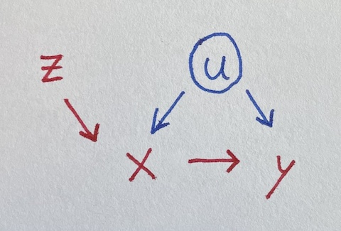

# A simple Instrumental Variable

Instrumental variables can let you estimate effects despite
confounding, which is pretty neat. The idea is sort of that the
instrument helps identify a non-confounded version of a variable, as
illustrated in the over-simplified version of
[two-stage least squares][] below.

[two-stage least squares]: https://en.wikipedia.org/wiki/Instrumental_variables_estimation#Interpretation_as_two-stage_least_squares


We seek to estimate the impact of _x_ on _y_, where they’re both
influenced by _u_.





Unfortunately, _u_ is <em>u</em>nobserved, so we can’t control for it.
But lo, there is _z_ influencing _x_. Let’s simulate data where all
the true coefficients are one.

<!-- set.seed(42) -->

```r
u = rnorm(100)
z = rnorm(100)
x = u + z + rnorm(100)
y = u + x + rnorm(100)
```

Regressing naively, we get an incorrect estimate for the effect of _x_
on _y_.

```r
summary(lm(y ~ x))
##              Estimate Std. Error t value Pr(>|t|)
##  x            1.35260    0.07697  17.573   <2e-16 ***
```

Luckily, _z_ is an “instrument,” satisfying three requirements
(following [McElreath][]):

[McElreath]: https://xcelab.net/rm/statistical-rethinking/


 * _z_ is independent of _u_
 * _z_ is not independent of _x_
 * _z_ doesn’t influence _y_ except through _x_

But how do we use the instrument? Throwing it in the regression makes
things _worse_:

```r
summary(lm(y ~ x + z))
##              Estimate Std. Error t value Pr(>|t|)
##  x            1.52949    0.09207  16.612  < 2e-16 ***
##  z           -0.54659    0.17099  -3.197  0.00188 **
```

A fancier model-fitting approach is needed. McElreath points out that
two-stage least squares is not the only way to do this, and also that
there should be some adjustments to make the standard errors make
sense. I’m going to ignore adjustments and just try to get some
intuition from how two-stage least squares works.

Stage one: Do a regression using _z_ to predict _x_. Then get the
predictions for _x_ from that model, which I’ll call _x_from_z_. This
uses the independence of _z_ from _u_ to make a “version of” (maybe a
component of) _x_ that is independent of _u_: the variation of _x_ due
to _z_.

Stage two: Do a regression using _x_from_z_ to predict _y_.

```r
x_from_z = predict(lm(x ~ z))
summary(lm(y ~ x_from_z))
##              Estimate Std. Error t value Pr(>|t|)
##  x_from_z     1.03978    0.23886   4.353  3.3e-05 ***
```

We’ve recovered a fair estimate of the true parameter for _x_, despite
not using the unobserved confound _u_!

Here’s the same thing as above but with the `ivreg` [package][],
correcting the standard error:

[package]: https://john-d-fox.github.io/ivreg/

```r
summary(ivreg(y ~ x | z))
##              Estimate Std. Error t value Pr(>|t|)
##  x            1.03978    0.13844   7.511 2.77e-11 ***
```

You could also use [HMC][] as in [McElreath][] §14.3.

[HMC]: https://en.wikipedia.org/wiki/Hamiltonian_Monte_Carlo


---

### Simpler cases

This example of an instrumental variable situation extends the earlier
collection of four simpler regression situations,
[What should be in your regression?][]

[What should be in your regression?]: /20200912-what_should_be_in_your_regression/


---

### More complicated cases

The [dagitty][] tools seems to be a great way to analyze a given
situation (expressed as a [DAG][]) and figure out what you should
control for and/or whether there are instruments you can use to
estimate a given effect.

[dagitty]: http://www.dagitty.net/
[DAG]: https://en.wikipedia.org/wiki/Directed_acyclic_graph

There’s also the front-door criterion, which I’m not yet sure how to
fit a model for. Maybe I’ll try to write something up eventually.

Maybe regression discontinuity is another kind of case?
