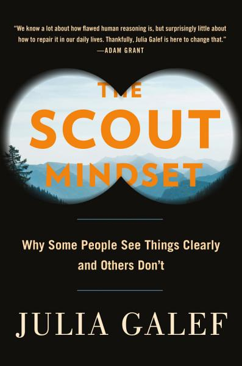

# The Scout Mindset, by Galef

The metaphor is soldier vs. scout. The advice is broadly good. With no
real discussion of epistemology but an implicit (roughly positivist?)
assumed worldview, I felt interesting foundational discussion was
elided. There was also little directly on “hard” (not yet known or
unknowable) questions. My critique is principally that I wanted more.

 * [Quotes and notes](#more)
 * [Slightly expanded table of contents](#outline)

---

### <a name="more" href="#more">Quotes and notes</a>

---

> "our judgment isn’t limited by knowledge nearly as much as it’s
> limited by attitude." (page x)

---

> "In “Persuasion,” we saw that law students who are randomly assigned
> to one side of a moot court case become confident, after reading the
> case materials, that their side is morally and legally in the right.
> But that confidence doesn’t help them persuade the judge. On the
> contrary, law students who are more confident in the merits of their
> own side are significantly _less_ likely to win the case—perhaps
> because they fail to consider and prepare for the rebuttals to their
> arguments." (page 27)

This cites [Eigen and Listokin][], and I don’t have access or
inclination to read the paper just now, but it seems like there’s a
claim here like “confidence causes bad performance” and I wonder
whether possible confounds have been considered. To me, “lower quality
lawyer causes both confidence and bad performance” seems plausible.

[Eigen and Listokin]: https://www.journals.uchicago.edu/doi/abs/10.1086/667711?journalCode=jls

---

> "Having an accurate map doesn’t help you very much when you’re
> allowed to travel only one path." (page 40)

---

Page 45 starts an exploration of Kahan’s famous paper on
[scientific polarization increasing with education][]. Perhaps in an
effort to avoid alienating any readers, the tools of the scout are not
applied to settle the question of whether global warming is real. The
opportunity to engage one way or another with the idea of
[naive realism][] is not taken.

[scientific polarization increasing with education]: https://www.nature.com/articles/nclimate1547 "The polarizing impact of science literacy and numeracy on perceived climate change risks"
[naive realism]: https://en.wikipedia.org/wiki/Na%C3%AFve_realism_(psychology) "Naïve realism"

In Harford’s [treatment][] of Kahan, I really appreciated the emphasis
on _curiosity_ being essential for “scout-like” thinking.

[treatment]: https://planspace.org/20210330-how_to_make_the_world_add_up_by_harford/#golden

---

I think I hadn’t seen the idea of Blind Data Analysis mentioned on
page 55, citing [Nuzzo][]. Nice! Will keep this in mind.

[Nuzzo]: https://www.nature.com/news/how-scientists-fool-themselves-and-how-they-can-stop-1.18517

---

> "It [being critical of a study with undesirable results] prompted me
> to go back through the studies I had been planning to cite in my
> favor, and scrutinize their methodology for flaws, just as I had
> done with the pro-soldier mindset study. (Sadly, this ended up
> disqualifying most of them.)" (page 68)

I’m not sure to what extent this is a joke; I thought it was funny as
I read it. But seriously, I wish people generally would [say more][]
about determinations such as this.

[say more]: https://www.paperswithoutcode.com/

---

I might be a soldier on this, but I don’t love quantifying uncertainty
in the manner of the calibration game introduced starting on page 75.
I thought a little bit about why.

 * For simple matters of fact, uncertainty is ignorance. It just isn’t
   that interesting, or useful. You can go check and get 100% (or
   close) confidence.
 * For predictions about the future, there are interesting questions
   about what confidence means (is the universe deterministic? what is
   knowable?) and I think there’s no way to know whether your
   prediction _at a given time_ is calibrated. The advice is to update
   your estimate over time, after all. If I say event _x_ (to be
   evaluated in a week) is 20% likely today but 10% likely tomorrow,
   was I "right" at those respective times? Did the probability
   change, or just my estimate? Is there such a thing as "correct
   probability given what you know," likely different from true
   probability?
 * For difficult propositions, there is no oracle; you can’t
   calibrate. Worse, consensus can change over time. When it was
   consensus, what confidence in [aether][] would have been
   appropriate? How confident should you be in a research result
   before it comes out that an error in analysis invalidates it? How
   confident should you be in a value judgment?
 * If we’re serious about quantifying confidence, shouldn’t we also
   estimate confidence in our confidence? Like: I’m 60% confident,
   plus or minus 10pp. This seems necessary, to allow for things like
   mistaken beliefs about current evidence. It also seems silly.

[aether]: https://en.wikipedia.org/wiki/Aether_(classical_element)

I’m not sure I have any really coherent argument here. I agree with
the general idea of being aware of how sure you are. Somehow I don’t
like the exercise of writing down numbers for it.

There is an interesting topic of decision-making in the face of low
confidence. What do you do when you know you’re not sure? (Ramble,
seems to be my answer.) Maybe out of scope for the book.

---

> "The reality is that there’s no clear divide between the
> “decision-making” and “execution” stages of pursuing a goal. Over
> time, your situation will change, or you’ll learn new information,
> and you’ll need to revise your estimate of the odds." (page 110)

I really agree with this. Planning can be valuable, but following the
plan to the letter is often not.

---

Galef discusses low (10%, 30%) early estimates of “success” from Musk
and Bezos (starting page 111). Exploring why they would take such
chances, she mentions both expected value (10% of huge is still big)
and the idea that even “failure” would be fairly positive. I think
expected value is almost always the wrong way to think about
significant choices (especially one-shot choices with unclear odds)
and I don’t really believe it’s how people tend to think (or should).
I think the question of whether something is
[worth doing, even if it fails][] is the right question. So I think
the balance of emphasis is off here. Expected value is a simple tool,
a hammer that people reach for [too often][], simplifying problems too
far. I wouldn’t even mention it in this setting.

[worth doing, even if it fails]: /20181204-worth_doing_even_if_it_fails/
[too often]: /2012/06/04/expected-value-is-not-useful-for-making/

---

> "You might think these principles sound obvious and that you know
> them already. But “knowing” a principle, in the sense that you read
> it and say, “Yes, I know that,” is different from having
> internalized it in a way that actually changes how you think." (page
> 144)

---

> "In his book _Sources of Power_, decision researcher Gary Klein
> cites this [explaining away signs of a problem] as one of the top
> three causes of bad decisions. He calls it a “de minimus error,” an
> attempt to minimize the inconsistency between observations and
> theory. Each new piece of evidence that doesn’t fit a doctor’s
> medical diagnosis can be explained away or dismissed as a fluke, so
> the doctor never realizes her initial diagnosis was wrong." (page
> 165)

---

[Exposure to opposing views on social media can increase political polarization](https://www.pnas.org/content/115/37/9216) cited in chapter 12.

---

[Keep your identity small](http://www.paulgraham.com/identity.html) cited in chapter 14.

---

> "They [a group of citizen scientists] also dove into the politics of
> government research, familiarizing themselves with how funding was
> structured and how the drug trials were conducted. The
> disorganization they discovered alarmed them. “It sort of felt like
> reaching the Wizard of Oz,” said one activist named Mark Harrington.
> “You’ve gotten to the center of the whole system and there’s just
> this schmuck behind a curtain.”" (page 212)

Cites [How to Survive a Plague](https://www.penguinrandomhouse.com/books/209900/how-to-survive-a-plague-by-david-france/).

---

### <a name="outline" href="#outline">Slightly expanded table of contents</a>

 * Introduction
     * Realize that truth isn't in conflict with your other goals
     * Learn tools that make it easier to see clearly
     * Appreciate the emotional rewards of scout mindset
 * Part 1: The case for scout mindset
     * Chapter 1: Two types of thinking
         * “Can I believe it?” vs. “Must I believe it?”
     * Chapter 2: What the soldier is protecting
     * Chapter 3: Why truth is more valuable than we realize
 * Part 2: Developing self-awareness
     * Chapter 4: Signs of a scout
         * Do you tell other people when you realize they were right?
         * How do you react to personal criticism?
         * Do you ever prove yourself wrong?
         * Do you take precautions to avoid fooling yourself?
         * Do you have any good critics?
         * Can you point to occasions in which you were in soldier
           mindset?
     * Chapter 5: Noticing bias
         * The double standard test
         * The outsider test
         * The conformity test
         * The selective skeptic test
         * The status quo bias test
         * Core skill: "a sense that your judgments are
           _contingent_—that what seems true or reasonable or fair or
           desirable can change when you mentally vary some feature of
           the question that should have been irrelevant." (page 87)
     * Chapter 6: How sure are you?
         * Core skill: "being able to tell the difference between the
           feeling of _making a claim_ and the feeling of _actually
           trying to guess what's true_." (page 87)
 * Part 3: Thriving without illusion
     * Chapter 7: Coping with reality
     * Chapter 8: Motivation without self-deception
     * Chapter 9: Influence without overconfidence
 * Part 4: Changing your mind
     * Chapter 10: How to be wrong
     * Chapter 11: Lean in to confusion
     * Chapter 12: Escape your echo chamber
 * Part 5: Rethinking identity
     * Chapter 13: How beliefs become identities
     * Chapter 14: Hold your identity lightly
     * Chapter 15: A scout identity

<!-- https://twitter.com/planarrowspace/status/1388919415660548102 -->
