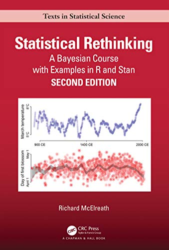

# Statistical Rethinking, by McElreath

I was fortunate to read this [excellent book][]. It's opinionated,
often quotable, and a fair summary is that "you can imagine your own
generative process, simulate data from it, write the model, and verify
that it recovers the true parameter values. You don't have to wait for
a mathematician to legalize the model you need." (page 376)
Recommended.

[excellent book]: https://xcelab.net/rm/statistical-rethinking/


> "Thinking generatively—how the data could arise—solves many
> problems. Many statistical problems cannot be solved with
> statistics. All variables are measured with error. Conditioning on
> variables creates as many problems as it solves. There is no
> inference without assumption, but do not choose your assumptions for
> the sake of inference. Build complex models one piece at a time. Be
> critical. Be kind." (page 553)

Notes by chapter:

1.  [The Golem of Prague](#ch1) (statistics, models, science)
2.  [Small Worlds and Large Worlds](#ch2) (Bayes' theorem)
3.  [Sampling the Imaginary](#ch3) (priors and posteriors)
4.  [Geocentric Models](#ch4) (linear regression)
5.  [The Many Variables & The Spurious Waffles](#ch5)
6.  [The Haunted DAG & The Causal Terror](#ch6)
7.  [Ulysses' Compass](#ch7) (overfitting)
8.  [Conditional Manatees](#ch8) (interactions)
9.  [Markov Chain Monte Carlo](#ch9)
10. [Big Entropy and the Generalized Linear Model](#ch10)
11. [God Spiked the Integers](#ch11) (GLMs for counts)
12. [Monsters and Mixtures](#ch12) (over-dispersion, ordered categories)
13. [Models with Memory](#ch13) (varying effects)
14. [Adventures in Covariance](#ch14)
15. [Missing Data and Other Opportunities](#ch15)
16. [Generalized Linear Madness](#ch16) (beyond GLMs)
17. [Horoscopes](#ch17) (conclusion)





---

### <a name="ch1" href="#ch1">Chapter 1: The Golem of Prague</a>

statistics, models, science


---

> "What researchers need is some unified theory of golem engineering,
> a set of principles for designing, building, and refining
> special-purpose statistical procedures. Every major branch of
> statistical philosophy possesses such a unified theory. But the
> theory is never taught in introductory—and often not even in
> advanced—courses. So there are benefits in rethinking statistical
> inference as a set of strategies, instead of a set of pre-made
> tools." (page 4)


---

I think there's a little bit of linguistic confusion between
scientific hypotheses ("I think the world works like...") and
statistical hypotheses (also called "Statistical models" in Figure
1.2).


---

> "... deductive falsification never works." (page 4)

I think this is too strong.


---

> "_modus tollens_, which is Latin shorthand for “the method of
> destruction.”" (page 7)


---

also: importance of _measurement_


---

He has some neat examples of evidence that's not trivial to infer
from - whether the ivory-billed woodpecker was extinct, and
faster-than-light neutrinos... To these, also add the Piltdown Man
fraud.


---

### <a name="ch2" href="#ch2">Chapter 2: Small Worlds and Large Worlds</a>

Bayes' theorem


---

Neat counting example in 2.1! I tried to write up
[a similar example][] (inspired by [Gelman][]) some years ago...

[a similar example]: /2013/11/11/whats-the-difference-between-bayesian-and-non-bayesian-statistics/
[Gelman]: http://www.stat.columbia.edu/~gelman/book/


---

In note 41, from page 24, McElreath advocates [Cox][]-style
probability.

[Cox]: https://en.wikipedia.org/wiki/Cox%27s_theorem


---

I also wrote up (still years ago) a [cute example][] trying to explain
Bayes' rule, but I think it's pretty crummy relative to his
development through sections 2.1.2 and 2.1.3.

[cute example]: /2014/02/23/bayes-rule-for-ducks/


---

I kind of miss seeing "evidence" in Bayes' rule... Maybe I like this,
with "explanation" for the other term?

```
P(explanation|evidence) = P(evidence|explanation) * P(explanation)
                          ----------------------------------------
                                        P(evidence)
```

(The P's everywhere would kind of obfuscate the nice counting
development he was using, but still...)

Then, note that `P(evidence|explanation)` is the "likelihood" of the
evidence, and that we're going to talk about that a lot.


---

Ah, here on page 37 is his version:

```
Posterior = Probability of the data * Prior
            -------------------------------
            Average probability of the data
```

Also nice! He reminds me that I'm using "evidence" (above) in a
different way from using it to mean the denominator there...

There's also the way of doing it that's more like this:

```
Posterior =     Probability of the data     * Prior
            -------------------------------
            Average probability of the data
```

And then we can talk about the first term as the likelihood ratio,
which is kind of nice, but makes it less clear that the denominator is
a normalizer that can often be mostly ignored...

Likelihood ratio is a nice thing to think about, especially in
connection with Polya's "plausible reasoning"... Evidence that is
_only_ consistent with the explanation (and no other) increases
confidence a lot.

There's also a nice connection to the error mode of getting the
denominator wrong and jumping to conclusions when you don't know of
another possible explanation. "I didn't think you were planning a
surprise party!" etc.

I don't really like "average probability of the data" as a term, I
think...


---

On page 39, he doesn't include Hamiltonian Monte Carlo as one of the
"engines"... Is it a type of MCMC? Ah, [yes][].

[yes]: https://en.wikipedia.org/wiki/Hamiltonian_Monte_Carlo


---

Oh no! Very ugly page break from 42 to 43, with the header of a table
separated from its contents...


---

Interesting; really not explaining what's going on with `dbeta`,
conjugate priors, etc... Probably fine?


---

Wow! I do not understand how this Metropolis algorithm on page 45
works! I guess I can wait until Chapter 9.


---

Ooh fun, some people have problem solutions online... Here's one:

 * https://github.com/cavaunpeu/statistical-rethinking


---

### <a name="ch3" href="#ch3">Chapter 3: Sampling the Imaginary</a>

priors and posteriors


---

I'm reading Ellenberg's [How Not to Be Wrong][], and he says on page
49: "In mathematics, you very seldom get the clearest account of an
idea from the person who invented it."

[How Not to Be Wrong]: /20200925-how_not_to_be_wrong_by_ellenberg/

I have that feeling in connection with Gelman and Pearl (not sure they
completely invented things they're associated with, but still): I feel
like McElreath is doing a better job of explaining things, and it's
super nice.

Also Ellenberg:

> "If a tiny state like South Dakota experiences a rash of brain
> cancer, you might presume that the spike is in large measure due to
> luck, and you might estimate that the rate of brain cancer in the
> future is likely to be closer to the overall national number. You
> could accomplish this by taking some kind of weighted average of the
> South Dakota rate with the national rate. But how to weight the two
> numbers? That's a bit of an art, involving a fair amount of
> technical labor I'll spare you here." (pages 70-71)

I think he's referring to [multi-level modeling][], in the Gelman
style.

[multi-level modeling]: https://en.wikipedia.org/wiki/Multilevel_model


---

This common medical testing scenario appeared in a recent
LearnedLeague one-day on statistics:

> "Suppose that 1% of a population has a particular genetic mutation,
> and a test for the mutation is 99% accurate for both positive and
> negative cases. In other words, if someone with the mutation takes
> the test, there is a 99% chance that the test comes back positive;
> if someone without the mutation takes the test, there is a 99%
> chance that the test comes back negative. If a randomly-selected
> person takes the test and gets a positive result, what is the
> probability that the person actually has the mutation? (Express your
> answer as a fraction in lowest terms.)"

I solved it by seeing that 0.01 * 0.99 == 0.99 * 0.01, which is sort
of like what McElreath says is called "frequency format" or "natural
frequencies." I definitely thought of it in terms of "quantity," but
as percentages rather than counts. I was surprised when Erica referred
to the problem as "the Bayesian" problem, because I hadn't thought of
it that way. So I agree with McElreath that it isn't uniquely Bayesian.


---

> "Changing the representation of a problem often makes it easier to
> address or inspires new ideas that were not available in an old
> representation. In physics, switching between Newtonian and
> Lagrangian mechanics can make problems much easier. In evolutionary
> biology, switching between inclusive fitness and multilevel
> selection sheds new light on old models. And in statistics,
> switching between Bayesian and non-Bayesian representations often
> teaches us new things about both approaches." (page 50)


---

> "I avoid discussing the analytical approach
> [of conjugate priors, etc.] in this book, because very few problems
> are so simple that they have exact analytical solutions like this
> [the beta-binomial conjugate prior]." (page 560, note for page 51)


---

The "Why statistics can't save bad science" box on page 51 is neat.


---

Just to establish equivalence between R and Python...

```r
dbinom(6, size=9, prob=0.5)
## [1] 0.1640625
```

```python
import scipy.stats
scipy.stats.binom(n=9, p=0.5).pmf(6)
## 0.16406250000000006
```


---

Interesting: using "compatibility interval" rather than "credible
interval" (or "confidence interval") in the sense of "compatible with
the model and data." (page 54)


---

> "Overall, if the choice of interval type
> [percent interval or highest posterior density interval] makes a big
> difference, then you shouldn't be using intervals to summarize the
> posterior." (page 58)


---

> "There is no way to really be sure that software works correctly."
> (page 64)


---

Hmm; his HPDI (Highest Posterior Density Interval) [implementation][]
itself relies on the implementation in [coda][]...

[implementation]: https://github.com/rmcelreath/rethinking/blob/3b48ec8dfda4840b9dce096d0cb9406589ef7923/R/utilities.r#L106
[coda]: https://cran.r-project.org/package=coda

How hard is this really to implement? If you have a histogram or just
sorted counts, every left point determines one interval, so you could
do it in one pass with a little farting around to find the right point
each time, and a running smallest interval... Really not so
computation-intensive.


---

```r
birth1 <- c(1,0,0,0,1,1,0,1,0,1,0,0,1,1,0,1,1,0,0,0,1,0,0,0,1,0,
0,0,0,1,1,1,0,1,0,1,1,1,0,1,0,1,1,0,1,0,0,1,1,0,1,0,0,0,0,0,0,0,
1,1,0,1,0,0,1,0,0,0,1,0,0,1,1,1,1,0,1,0,1,1,1,1,1,0,0,1,0,1,1,0,
1,0,1,1,1,0,1,1,1,1)
birth2 <- c(0,1,0,1,0,1,1,1,0,0,1,1,1,1,1,0,0,1,1,1,0,0,1,1,1,0,
1,1,1,0,1,1,1,0,1,0,0,1,1,1,1,0,0,1,0,1,1,1,1,1,1,1,1,1,1,1,1,1,
1,1,1,0,1,1,0,1,1,0,1,1,1,0,0,0,0,0,0,1,0,0,0,1,1,0,0,1,0,0,1,1,
0,0,0,1,1,1,0,0,0,0)
table(birth1, birth2)
##        birth2
##  birth1  0  1
##       0 10 39
##       1 30 21
```

So really, what _is_ up with this data?


---

### <a name="ch4" href="#ch4">Chapter 4: </a>

linear regression


---

> "Linear regression is the geocentric model of applied statistics."
> (page 71)


---

Frank's [The common patterns of nature][] seems pretty neat, getting
into how common distributions come from processes and information
considerations...

[The common patterns of nature]: https://onlinelibrary.wiley.com/doi/pdf/10.1111/j.1420-9101.2009.01775.x


---

> "Multiplying small numbers is approximately the same as addition."
> (page 74)


---

On page 76 he shows "precision" as τ, meaning 1/σ^2, and it shows up
in the equation for the Gaussian with π, which is an example of
notation that doesn't work particularly well with
[the tau manifesto][].

[the tau manifesto]: https://tauday.com/


---

"procrustean" (on page 77): "(especially of a framework or system)
enforcing uniformity or conformity without regard to natural variation
or individuality."


---

I like the [spark][] histograms!

[spark]: https://en.wikipedia.org/wiki/Sparkline

Oh, neat, they're even [called][] "histosparks"...

[called]: https://github.com/rmcelreath/rethinking/blob/f9c16bb7faec8a9883d976a769824b1764d12540/R/precis.r#L72

And I might have guessed... they're [from][] Hadley.

[from]: https://rdrr.io/github/hadley/precis/src/R/histospark.R

So there are unicode characters that do blocks of various sizes, by
eighths... It looks like Hadley only uses some of them:

```r
sparks <- c("\u2581", "\u2582", "\u2583", "\u2585", "\u2587")
#             1/8       2/8       3/8       5/8       7/8
```

Can look these up for example here: https://www.fileformat.info/info/unicode/char/2581/index.htm

" ▁▂▃▄▅▆▇█" has all the heights, with a normal blank at the beginning.

So why does Hadley only use some of the available heights? Not sure.

Oh look at that! In my terminal those all look fine, but in a browser (maybe it depends on font?) the half and full blocks go lower than the others! Still doesn't explain why 6/8 is missing from Hadley's list... Maybe it looks bad in other fonts?

Let's try it fixed-width:

```
 ▁▂▃▄▅▆▇█
```

Yup, looks much nicer in fixed width.

Here's another nice place to see these: https://en.wikipedia.org/wiki/Block_Elements


---

> "E. T. Jaynes (1922-1988) called this the _mind projection fallacy_,
> the mistake of confusing epistemological claims with ontological
> claims." (page 81)

And a fun reference to [Monkeys, Kangaroos, and N](https://bayes.wustl.edu/etj/articles/cmonkeys.pdf):

> "... I think you will find that 90% of the past confusions and
> controversies in statistics have been caused, not by mathematical
> errors or even ideological differences; but by the technical
> difficulty that the two parties had different problems in mind, and
> failed to realize this. Thinking along different lines, each failed
> to perceive at all what the other considered too obvious to
> mention." (Jaynes)


---

> "There's also a tradition called _dimensionless analysis_ that
> advocates constructing variables so that they are unit-less ratios."
> (page 94)

I haven't heard about this as such, I think. Dimension_al_ analysis is
more well known, but not quite the same thing...


---

Interesting to recall that in the first edition, what's now called
`quap` (quadratic approximation posterior / a posteriori?) was called
`map` (maximum a posteriori?)


---

> "My experience is that many natural and social scientists have
> naturally forgotten whatever they once knew about logarithms." (page
> 98)


---

> "... most social and natural scientists have never had much training
> in probability theory and tend to get very nervous around ∫'s."
> (page 106)


---

He repeats it in different ways here and there, but I noted it again
on page 107: I like his effort at clarity between "small world" and
"large world" claims, where small world is "assuming the model" or "in
the world of the model."


---

When doing the quadratic example, he z-scores but does not
decorrelate... The default behavior in R (using [poly][]) is to
"compute orthogonal polynomials"... I'm not sure how common that is
elsewhere.

[poly]: https://www.rdocumentation.org/packages/stats/versions/3.6.2/topics/poly

Okay I'll look at sklearn... Here's somebody with a nice Python
implementation:
http://davmre.github.io/blog/python/2013/12/15/orthogonal_poly But as
far as I can tell there isn't anything "built in" for Python...


---

page 111: `weight.s` is used in one listing, while `weight_s` is used
in another, which is a very mild kind of inconsistency. ([PR][])

[PR]: https://github.com/rmcelreath/rethinking/pull/279


---

> "We should feel embarrassed to use [linear models], just so we don't
> become satisfied with the phenomenological explanations they
> provide." (page 113)


---

I really liked section 4.5.2 on splines; I don't think I ever saw a
good explanation of splines before.


---

> "Matrix algebra is a stressful topic for many scientists." (page 119)


---

In both R listings 4.76 and 4.79, it's a little unintuitive to me in
that it doesn't seem obvious that `w` is a vector. In `w ~ dnorm(0,
10)`, that `dnorm` returns just one number. Somewhere `quap` is
figuring out how many elements it needs, I guess?


---

For question 4H8 on page 122, it asks what else would have to change
if the intercept was removed from the model. I think the answer is
just the priors on the other coefficient(s), since they'd have to get
the mean all the way to where it needs to be by themselves then.
And/or maybe the data couldn't be centered, because making the mean
zero would really hurt the ability to have the result be right? It
would still be okay if both x and y were centered, at least for simple
designs.


---

### <a name="ch5" href="#ch5">Chapter 5: The Many Variables & The Spurious Waffles</a>


---

> "... introduce graphical causal models as a way to design and
> interpret regression models." (page 124)


---

> "About one thing, however, there is general agreement: Causal
> inference always depends upon unverifiable assumptions." (page 124)


---

> "Think before you regress" (page 128)

In the first paragraph of 5.1.1, I don't really see how Figure 5.2
tells us that only one of the predictor variables has a causal
influence...


---

I really like [dagitty][]. Learning about it is one of the best things
in the book, in that I was wishing to find such software while reading
[The Book of Why][] but didn't.

[dagitty]: http://www.dagitty.net/
[The Book of Why]: https://planspace.org/20200917-book_of_why/

It is a little weird that the web interface uses ⊥ (falsum)... Hmm;
[looking it up][], it seems it's the same symbol as `\perp`, which is
used for independence. Ah! The "double tack up" (⫫) is for conditional
independence! The web interface still uses ⊥ for both kinds of
independence.

[looking it up]: https://en.wikipedia.org/wiki/Up_tack


---

> "This is very weird notation and any feelings of annoyance on your
> part are justified." (page 130)


---

The `coeftab` visualization (see page 133) is pretty nice.


---

It took me a little bit to understand what he was getting at with the
"predictor residual plots" (page 135) but I'm glad I did, since it
connects to one of his main points about how multiple regression is
about how much a variable adds given all the other variables.


---

> "Usually answers to large world questions about truth and causation
> depend upon information not included in the model." (page 139)


---

The section 5.2 "Masked relationship" is neat.


---

> "Taking the log of a measure translates the measure into
> magnitudes." (page 148)

What use of "magnitude" is this? Hmm... Looks like star brightness is
done via a log that is called magnitude... Just weird, because in
other domains "magnitude" refers to the _un_-logged value...

Seems like this is less surprising to others, and it makes sense as "_order of_ magnitude."


---

> "A set of DAGs with the same conditional independencies is known as
> a Markov equivalence set." (page 151)


---

I was unfamiliar with [Melanesia][].

[Melanesia]: https://en.wikipedia.org/wiki/Melanesia


---

One page 155, he makes index variables seem fundamentally different
from indicator variables. Their notation in `quap` is different (and
nicer) but fundamentally the only difference is with index variables
you drop the intercept term (or equivalently, you have separate
intercept terms for each thing). Just reading through, I initially
thought his index variables were a real novelty, but they're not. (I'm
still curious about where he says on page 156 "It is also important to
get used to index variables, because multilevel models (Chapter 13)
depend upon them.")


---

> "The mistake of accepting the null hypothesis." (page 158)


---

Question 5E3 on page 159 jokes (I think?) about the effects of amount
of funding and size of laboratory on time to PhD, but I'm not sure I
know what he thinks is funny...


---

### <a name="ch6" href="#ch6">Chapter 6: The Haunted DAG & The Causal Terror</a>


---

On page 161 he starts with Berkson's Paradox, suggesting
"selection-distortion effect" as a better name. Dave suggested a nice
example: shorter basketball players in the NBA are better 3 point
shooters.


---

> "Let's bein with the least of your worries: multicollinearity."
> (page 163)

This can "smear out" your estimates, because it isn't clear which
variables to put beta weight on.


---

Section 6.2 (page 170) uses "post-treatment bias" to refer to what I
might call a mediator, and what he later calls a "pipe" situation
(page 185).


---

> "The "d" [in d-separation] stands for _directional_." (page 174)

> "You'll often see the "d" in d-separation defined as "dependency."
> That would certainly make more sense. But the term d-separation
> comes from a more general theory of graphs. Directed graphs involve
> d-separation and undirected graphs involve instead u-separation."
> (page 563)


---

> "No statistical procedure can substitute for scientific knowledge
> and attention to it." (page 175)


---

> "If a procedure cannot figure out the truth in a simulated example,
> we shouldn't trust it in a real one." (page 177)


---

> "So I'm sorry to say that we also have to consider the possibility
> that our DAG may be haunted." (page 180)

The thing haunting it (as in the title of the chapter) is unmeasured
causes that induce collider bias, which means conditioning on things
we have can induce bias about effects we're trying to measure.


---

I like "the four elemental confounds" on page 185. They're pretty
similar to the cases I included in
[What should be in your regression?][].

[What should be in your regression?]: https://planspace.org/20200912-what_should_be_in_your_regression/


---

The explanation of shutting the back-door on pages 184-185 is better
than others I've seen, I think. And then on page 186 he shows how
everybody's favorite [dagitty][] can do it automatically.

Front-door isn't mentioned until page 460.


---

On page 186, he says "Conditioning on C is the better idea, from the
perspective of efficiency, since it could also help with the precision
of the estimate of X➔Y." This seems reasonable since C is closer to Y,
but I feel like a little more explanation wouldn't have been a bad
thing here.


---

> "In fact, domain specific structural causal models can make causal
> inference possible even when a DAG with the same structure cannot
> decide how to proceed." (page 188)

Say more? Like, a footnote? An endnote? Some kind of reference to more
information? Seems so mysterious!


---

> "Sometimes, in order to avoid multicollinearity, people inspect
> pairwise correlations among predictors before including them in a
> model. This is a bad procedure, because what matters it the
> conditional association, not the association before the variables
> are included in the model." (page 189)


---

### <a name="ch7" href="#ch7">Chapter 7: Ulysses' Compass</a>

overfitting


---

 * 7.1. The problem with parameters
 * 7.2. Entropy and accuracy
 * 7.3. Golem taming: regularization
 * 7.4. Predicting predictive accuracy
 * 7.5. Model comparison


---

McElreath has slides and video of his lectures [online][].

[online]: https://github.com/rmcelreath/statrethinking_winter2019


---

> "This chapter describes some of the most commonly used tools for
> coping with this trade-off." (page 191, referring to the trade-off
> between simplicity and accuracy)

There's some parallel between statistical models and scientific models
generally; see [Characteristics of good theories][].

[Characteristics of good theories]: https://planspace.org/20170825-characteristics_of_good_theories/


---

> "... when we design any particular statistical model, we must decide
> whether we want to understand causes or rather just predict." (page
> 192)


---

"Stargazing" is a cute way to criticize fixation on stars that
represent statistical significance. (page 193)


---

On page 194 he uses "hominin" which I wasn't familiar with. Hominins
refers to humans and chimps. Add gorillas and you get hominines. Add
orangutans to that and you get hominids.


---

> "In fact, Carl Friedrich Gauss originally derived the OLS procedure
> in a Bayesian framework." (page 196)

He loves pointing out this kind of thing.


---

> "The point of this example is not to praise R<sup>2</sup> but to
> bury it." (page 197)

This alludes to Shakespeare's famous Marc Antony speech in Julius
Caesar: "I come to bury Caesar, not to praise him."


---

> "This means the _actual_ empirical variance, not the variance that R
> returns with the `var` function, which is a frequentist estimator
> and therefore has the wrong denominator." (page 197)

Saucy!


---

> "... model fitting can be considered a form of data compression. ...
> This view of model selection is often known as minimum description
> length (MDL)." (page 201)

Wikipedia [says][] "In its most basic form, MDL is a model selection
principle: the shortest description of the data as the best model."

[says]: https://en.wikipedia.org/wiki/Minimum_description_length

McElreath points to [Grünwald's][] The Minimum Description Length
Principle.

[Grünwald's]: https://homepages.cwi.nl/~pdg/publicationpage.html


---

He's trying to develop "out-of-sample deviance" in 7.2 "Entropy and
accuracy" starting page 202.


---

"Likelihood" as in the likelihood of the data, given the model, on
page 204. And he _really_ likes it:

> "If you see an analysis using something else, either it is a special
> case of the log scoring rule or it is possibly much worse."


---

Interesting "Rethinking" box on page 204:

> "Calibration is overrated. ... The problem is that calibrated
> predictions do not have to be good."

It has an endnote on page 563 that includes:

> "Strictly speaking, there are no "true" probabilities of events,
> because probability is epistemological and nature is deterministic."


---

On page 207 he points out that when probability is zero, L'Hopital's
rule gives us 0*log(0) = 0.


---

Endnote 110 on page 564 begins:

> "I really wish I could say there is an accessible introduction to
> maximum entropy, at the level of most natural and social scientists'
> math training. If there is, I haven't found it yet."

On page 207 he just says:

> "So Bayesian updating is entropy maximization."


---

He just says "divergence" to mean Kullback-Leibler divergence, and
adds in endnote 111 on page 564:

> "For what it's worth, Kullback and Leibler make it clear in their
> 1951 paper that Harold Jeffreys had used this measure already in the
> development of Bayesian statistics."

There he goes again!


---

> "In plainer language, the divergence is _the average difference in
> log probability between the target (p) and model (q)_. This
> divergence is just the difference between two entropies: The entropy
> of the target distribution _p_ and the _cross entropy_ arising from
> using _q_ to predict _p_."


---

> "At this point in the chapter, dear reader, you may be wondering
> where the chapter is headed." (page 209)


---

> "It's as if we can't tell how far any particular archer is from
> hitting the target, but we can tell which archer gets closer and by
> how much." (page 209)


---

> "To compute this [log-probability] score for a Bayesian model, we
> have to use the entire posterior distribution. Otherwise, vengeful
> angels will descend upon you." (page 210)

His package has `lppd` for "log-pointwise-predictive-density."

> "It is also quite common to see something called the deviance, which
> is like a lppd score, but multiplied by -2 so that smaller values
> are better. The 2 is there for historical reasons."

There's more explanation in endnote 112 on page 564:

> "In non-Bayesian statistics, under somewhat general conditions, a
> difference between two deviances has a chi-squared distribution. The
> factor of 2 is there to scale it the proper way."

(Recall we're interested in the difference between these things; they
don't have a meaningful scale on their own.)


---

I was briefly befuddled by the positive log-likelihoods on page 210,
but of course it's the point density, not probability, and the density
can be greater than one.


---

On page 211 he talks about `log_sum_exp` which "takes all the
log-probabilities for a given observation, exponentiates each, sums
them, then takes the log. But it does this in a way that is
numerically stable."

I had cause to do this recently! It comes down to this:

```python
import math

def sum_log_prob(a, b):
    return max(a, b) + math.log1p(math.exp(0 - abs(a - b)))
```

I based that on a [post from Kevin Karplus][].

[post from Kevin Karplus]: https://gasstationwithoutpumps.wordpress.com/2014/05/06/sum-of-probabilities-in-log-prob-space/

McElreath's is:

```r
log_sum_exp <- function( x ) {
    xmax <- max(x)
    xsum <- sum( exp( x - xmax ) )
    xmax + log(xsum)
}
```

([Found][] on rdrr.)

[Found]: https://rdrr.io/github/rmcelreath/rethinking/src/R/distributions.r


---

> "That [two-parameter] model does worse in prediction than the model
> with only 1 parameter, even though the true model does include the
> additional predictor. This is because with only N=20 cases, the
> imprecision of the estimate for the first predictor produces more
> error than just ignoring it." (page 213)


---

> "When you encounter multilevel models in Chapter 13, you'll see that
> their central device is to learn the strength of the prior from the
> data itself. So you can think of multilevel models as adaptive
> regularization, where the model itself tries to learn how skeptical
> it should be." (page 216)


---

> "Statisticians often make fun of machine learning for reinventing
> statistics under new names. But regularization is one area where
> machine learning is more mature. Introductory machine learning
> courses usually describe regularization. Most introductory
> statistics courses do not." (page 216)


---

Section 7.4 (page 217) is "predicting predictive accuracy."


---

> "It is a benign aspect of the universe that this importance
> [of individual examples] can be estimated without refitting the
> model." (page 217)


---

"PSIS" is "Pareto-smoothed importance sampling cross-validation."
(page 217)


---

> "For ordinary linear regression with flat priors, the expected
> overfitting penalty is about twice the number of parameters." (page
> 219)


---

> "AIC is of mainly historical interest now." (page 219)


---

It seems like WAIC can only be used when you have a posterior
distribution, since it relies on variance of those predictions...


---

> "... in the natural and social sciences the models under
> consideration are almost never the data-generating models. It makes
> little sense to attempt to identify a "true" model." (page 221)


---

> "Watanabe recommends computing both WAIC and PSIS and contrasting
> them. If there are large differences, this implies one or both
> criteria are unreliable.
>
> "Estimation aside, PSIS has a distinct advantage in warning the user
> about when it is unreliable." (page 223)


---

> "A very common use of cross-validation and information criteria is
> to perform model selection, which means choosing the model with the
> lowest criterion value and then discarding the others. But you
> should never do this." (page 225)


---

Endnote 133 references
[The Decline of Violent Conflicts: What Do The Data Really Say?](https://www.fooledbyrandomness.com/violencenobelsymposium.pdf) which is interesting.


---

> "This chapter has been a marathon." (page 235)

And then the chapter summary doesn't even mention cross-validation!


---


Acronyms:

 * AIC: Akaike Information Criterion
 * BIC: Bayesian Information Criterion (aka Schwarz criterion)
 * CV: Cross-Validation
 * DIC: Deviance Information Criterion
 * D_{KL}(p, q): Kullback-Leibler divergence
 * E: Expectation
 * H(p): Entropy
 * H(p, q): Cross-entropy
 * lppd: Log Pointwise Predictive Density
 * MAP: Maximum A posteriori Probability (mode of posterior)
 * MDL: Minimum Description Length
 * N: sample size
 * PSIS: Pareto-smoothed importance sampling cross-validation
 * S(q): Sum of log probabilities
 * R^2: "variance explained" or "coefficient of determination"
 * WAIC: [Widely Applicable | Watanabe-Akaike] Information Criterion


---

Practice problem 7E1: State the three motivating criteria that define
information entropy.

 * It should change smoothly with changes in the inputs.
 * When more things could happen, it should go up.
 * It should add, when you combine things.


---

Practice problem 7E2: Suppose a coin is weighted such that, when it is
tossed and lands on a table, it comes up heads 70% of the time. What
is the entropy of this coin?

Well, entropy is the negative sum of p*log(p), so:

```python
import math

# Truth (as in Problem 7E1)
p = [0.7, 0.3]

# Entropy, H(p)
H = lambda p: -sum(p_i * math.log(p_i) for p_i in p)
H(p)  # 0.6108643020548935

# Candidate "models"
q = [0.5, 0.5]
r = [0.9, 0.1]

# Cross-Entropy, H(p, q), xH here because Python
xH = lambda p, q: -sum(p_i * math.log(q_i) for p_i, q_i in zip(p, q))
xH(p, q)  # 0.6931471805599453
xH(p, r)  # 0.764527888858692

# KL Divergence, D(p, q)
D = lambda p, q: sum(p_i * math.log(p_i/q_i) for p_i, q_i in zip(p, q))
D(p, q)  # 0.08228287850505178
D(p, r)  # 0.15366358680379852

# D(p, q) = H(p, q) - H(p)
D(p, q) == xH(p, q) - H(p)  # True

# We wish we could do this (use D) but we can't, because we don't have p.

# Data
d = [0, 0, 1]

# Log probability (likelihood) score
S = lambda d, p: sum(math.log(p[d_i]) for d_i in d)
S(d, q)  # -2.0794415416798357
S(d, r)  # -2.513306124309698

# True vs. predictive
S(d, p)  # -1.917322692203401
S(d, [2/3, 1/3])
         # -1.9095425048844388

# Deviance
deviance = lambda d, p: -2 * S(d, q)

# Positive log likelihoods! Gasp!

# Note the log probabilities here are really probabilities, because
# I'm just using point estimates, not real distributions. Really,
# you'll have densities, which can be greater than one.
```


---

> "Information criteria construct a theoretical estimate of the
> relative out-of-sample KL divergence." (page 219)

And he really likes them, largely forgetting about cross-validation.


---

### <a name="ch8" href="#ch8">Chapter 8: Conditional Manatees</a>

interactions


---

Propeller marks on manatees are unpleasant, but DID YOU KNOW you see
those marks so much because they don't kill the manatees, so they're
still around to be seen? Manatees are mostly killed by blunt force
thwacking by the hulls of boats, not their propellers.


---

> "Using GDP to measure the health of an economy is like using heat to
> measure the quality of a chemical reaction." (endnote 138, page 565)


---

Why not split data to condition on some categorical variable? (page
241)

 * For parameters that exist in both parts, "you are essentially
   making two less-accurate estimates instead of pooling all of the
   evidence".
 * "you can't easily quanitfy that uncertainty" (about "the predictive
   value of distinguishing" your parts)
 * It makes it hard to use information criteria (the comparison works
   best when the same data is in all the models under comparison)
 * Multilevel models don't split the data, and derive benefits in
   "borrowing information across categories".


---

On page 245, he explains (again?) that using indicator variables is
bad in the sense that it implies more uncertainty in the indicated
class (uncertainty of baseline, plus uncertainty of indicator's
coefficient).


---

On using fancy Greek letters in your model specification:

> "If your reader cannot say the symbol's name, it could make
> understanding the model harder." (page 249)


---

Section 8.2 (page 250) on "Symmetry of interactions" is pretty neat.

> "There is just no way to specify a simple, linear interaction in
> which you can say the effect of some variable _x_ depends upon _z_
> but the effect of _z_ does not depend upon _x_." (page 256)


---

In endnote 142, McElreath recommends Grafen and Hails'
[Modern Statistics for the Life Sciences][], saying "It has a rather
unique geometric presentation of some of the standard linear models."
The book has the somewhat surprising subtitle of "Learn to analyse
your own data".

[Modern Statistics for the Life Sciences]: https://smile.amazon.com/Statistics-STATISTICS-May-09-2002-MAY-09-2002-Hardcover/dp/B009CPMY4Y/


---

[Main effects][] vs. interaction effects.

[Main effects]: https://en.wikipedia.org/wiki/Main_effect


---

On weakly informative priors:

> "If you displayed these priors to your colleagues, a reasonable
> summary might be, "These priors contain no bias towards positive or
> negative effects, and at the same time they very weakly bound the
> effects to realistic ranges."" (page 260)


---

> "While you can't see them in a DAG, interactions can be important
> for making accurate inferences." (page 260)


---

### <a name="ch9" href="#ch9">Chapter 9: Markov Chain Monte Carlo</a>


---

> "Researchers rely upon random numbers for the proper design of
> experiments." (page 263)


---

In an endnote, McElreath recommends Kruschke's
[Doing Bayesian Data Analysis][], and it seems like it might be good.

[Doing Bayesian Data Analysis]: https://sites.google.com/site/doingbayesiandataanalysis/


---

> "the combination of parameter values that maximizes posterior
> probability, the mode, is not actually in a region of parameter
> values that are highly plausible." (page 269)


---

> "we need MCMC algorithms that focus on the entire posterior at once,
> instead of one or a few dimensions at a time like Metropolis and
> Gibbs. Otherwise we get stuck in a narrow, highly curving region of
> parameter space." (page 270)


---

> "It appears to be a quite general principle that, whenever there is
> a randomized way of doing something, then there is a nonrandomized
> way that delivers better performance but requires more thought."
> (page 270, quoting E. T. Jaynes)


---

> "[The U-turn problem] just shows that the efficiency of HMC comes
> with the expense of having to tune the leapfrog steps and step size
> in each application." (page 274)


---

> "Fancy HMC samplers ... choose the leapfrog steps and step size for
> you ... by conducting a warmup phase in which they try to figure out
> which step size explores teh posterior efficiently. If you are
> familiar with older algorithms like Gibbs sampling, which use a
> burn-in phase, warmup is not like burn-in." (page 274)


---

### <a name="ch10" href="#ch10">Chapter 10: Big Entropy and the Generalized Linear Model</a>


---

> "Indeed, it may be that no one fully understands
> [the principle of maximum entropy]." (page 303)


---

> "[The exponential] distribution is the core of survival and event
> history analysis, which is not covered in this book." (page 315)


---

> "... no regression coefficient ... from a GLM every produces a
> constant change on the outcome scale. ... every predictor
> essentially interacts with itself, because the impact of a change in
> a predictor depends upon the value of the predictor before the
> change. More generally, every predictor variable effectively
> interacts with every other predictor variable, whether you
> explicitly model them as interactions or not." (page 318)


---

> "Link functions are assumptions." (page 319)

He suggests sensitivity assumptions, presumably including trying
different link functions, which I think is the closest he comes to
talking about probit regression.


---

> "... even a variable that isn't technically a confounder can bias
> inference, once we have a link function." (page 320)


---

> "Parameter estimates do not by themselves tell you the importancce
> of a predictor on the outcome." (page 320)


---

> "... a big beta-coefficient may not correspond to a big effect on
> the outcome." (page 320)


---

He also points out on page 320 that with a different likelihood (and
so link) function, you can't compare log likelihoods (etc.) any more
because there's an (unknown) normalization constant that's different
between them.


---

### <a name="ch11" href="#ch11">Chapter 11: God Spiked the Integers</a>

GLMs for counts


---

 * 11. God spiked the integers
     * 11.1. Binomial regression
         * 11.1.1. Logistic regression: Prosocial chimpanzees
         * 11.1.2. Relative shark and absolute deer
         * 11.1.3. Aggregated binomial: Chimpanzees again, condensed
         * 11.1.4. Aggregated binomial: Graduate school admissions
     * 11.2. Poisson regression
         * 11.2.1. Example: Oceanic tool complexity
         * 11.2.2. Negative binomial (gamma-Poisson) models
     * 11.3. Multinomial and categorical models
         * 11.3.1. Predictors matched to outcomes
         * 11.3.2. Predictors matched to observations
         * 11.3.3. Multinomial in disguise as Poisson


---

> "As described in Chapter 10, the Poisson model is a special case of
> binomial." (page 323)

This is a little loose, maybe; Poisson is the limit of binomial, which
isn't quite "a special case" I think...

Logistic regression as a special case of binomial regression, okay.


---

> "There are many ways to construct new variables like this, including
> mutant helper functions." (page 327)

Mutant helper functions? Is this a common term?


---

> "Let's look at these on the outcome scale:" (page 330)

He shows a table that includes logistic regression coefficients, but
there's really no attempt to interpret them directly, which is
different from some presentations of logistic regression. He goes
directly to showing things on the probability scale. He does then show
some plots on the coefficient scale, and describes them as being "on
the logit scale," but still not a lot of effort spent on connecting
them to changes in odds etc.


---

> "counting the rows in the data table is no longer a sensible way to
> assess sample size." (page 340)

(When using data that is counts of outcomes.)


---

> "This isn't to say that over-parameterizing a model is always a good
> idea. But it isn't a violation of any statistical principle." (page
> 345)


---

> "Keep in mind that the number of rows is not clearly the same as the
> "sample size" in a count model. The relationship between parameters
> and "degrees of freedom" is not simple, outside of simple linear
> regressions." (page 347)


---

> "Any rules you've been taught about minimum sample sizes for
> inference are just non-Bayesian superstitions." (page 347)


---

He really seems to want to make gamma-Poisson happen (replacing
negative binomial).


---

Probit doesn't appear anywhere! (At least, I haven't seen it and it
isn't in the index.)


---

> "In general, more than two things can happen." (page 359)


---

> "The conventional and natural link in this context is the
> multinomial logit, also known as the softmax function." (page 359)


---

> "Another way to fit a multinomial/categorical model is to refactor
> it into a series of Poisson likelihoods. That should sound a bit
> crazy." (page 363)


---

> "It is important to never convert counts to proportions before
> analysis, because doing so destroys information about sample size."
> (page 365)


---

### <a name="ch12" href="#ch12">Chapter 12: Monsters and Mixtures</a>

over-dispersion, ordered categories


---

> "Just be sure to validate it [your model] by simulating dummy data
> and then recovering the data-generating process through fitting the
> model to the dummy data." (page 369)


---

> "continuous mixture models in which a linear model is attached not
> to the observations themselves but rather to a distribution of
> observations." (page 370)


---

> "... Poisson distributions are very narrow. The variance must equal
> the mean, recall." (page 373)


---

> "You should not use WAIC and PSIS with these
> [beta-binomial and gamma-Poisson/negative binomial] models, however,
> unless you are very sure of what you are doing. The reason is that
> while ordinary binomial and Poisson models can be aggregated and
> disaggregated across rows in the data, without changing any causal
> assumptions, the same is not true of beta-binomial and gamma-Poisson
> models. The reason is that a beta-binomial or gamma-Poisson
> likelihood applies an unobserved parameter to each row in the data.
> When we then go to calculate log-likelihoods, how the data are
> structured will determine how the beta-distributed or
> gamma-distributed variation enters the model." (page 375)


---

> "In the sciences, there is sometimes a culture of anxiety
> surrounding statistical inference. It used to be that researchers
> couldn't easily construct and study their own custom models, because
> they had to rely upon statisticians to properly study the models
> first. This led to concerns about unconventional models, concerns
> about breaking the laws of statistics. But statistical computing is
> much more capable now. Now you can imagine your own generative
> process, simulate data from it, write the model, and verify that it
> recovers the true parameter values. You don't have to wait for a
> mathematician to legalize the model you need." (page 376)

This could almost be a summary of the book, maybe.


---

> "Just treating ordered categories as continuous measures is not a
> good idea."

He offers the cumulative link function.


---

> "This kind of vector, in which all the values sum to one (or any
> other constant), has a special name, a simplex." (page 394)


---

### <a name="ch13" href="#ch13">Chapter 13: Models with Memory</a>

It's the varying effects ("random effects") chapter! Multilevel models!


---

> "Anterograde amnesia is bad for learning about the world." (page 399)


---

> "this prior is actually learned from the data." (pages 399-400)


---

> "When some individuals, locations, or times are sampled more than
> others, multilevel models automatically cope with differing
> uncertainty across these clusters. This prevents over-sampled
> clusters from unfairly dominating inference." (page 400)

This is a pretty cool property to have. The problem of data imbalance
is a challenge for many machine learning algorithms. Considering
multilevel models as a kind of solution is interesting. Not obvious
that it can be easily applied e.g. to vision models, but still, it's
interesting.


---

> "When it comes to regression, multilevel regression deserves to be
> the default approach. There are certainly contexts in which it would
> be better to use an old-fashioned single-level model. But the
> contexts in which multilevel models are superior are much more
> numerous. It is better to begin to build a multilevel analysis, and
> then realize it's unnecessary, than to overlook it." (page 400)

Is this really the case? It would be neat to see an example where a
multilevel model isn't obviously needed but is better.


---

Costs of multilevel models (page 400, paraphrase):

 * new assumptions (priors on priors)
 * estimation challenges (requires MCMC)
 * hard to understand


---

Synonyms (page 401):

 * multilevel model
 * hierarchical model
 * mixed effects model

With parameters of multilevel models "most commonly known as random
effects". An endnote cites section 6 of Gelman's [Anova paper][] but I
didn't find it as "entertaining" as promised. It does include the
origin of "varying effects" as a proposed better name than "random
effects":

[Anova paper]: http://www.stat.columbia.edu/~gelman/research/published/banova7.pdf

> "We define effects (or coefficients) in a multilevel model as
> _constant_ if they are identical for all groups in a population and
> _varying_ if they are allowed to differ from group to group." (page
> 20 in Gelman)

(A "group" could be an individual, depending on the nature of the
data.)


---

I don't love that "hyperparameter" is used for parameters that are
learned from the data, even if they're a level up, because it
conflicts with the usual ML usage of "hyperparameter". It seems fair
that their priors are called hyperpriors, though.


---

Reasons for using a Gaussian prior (page 403):

1. convention (everybody does it)
2. pragmatism (easy to use/fit)
3. entropy (maxent if specifying only mean and variance)


---

> "Rethinking: Varying intercepts as over-dispersion. ... Compared to
> a beta-binomial or gamma-Poisson model, a binomial or Poisson model
> with a varying intercept on every observed outcome will often be
> easier to estimate and easier to extend." (page 407)

Oh my! A coefficient for every observation! Take that, frequentist
statisticians!

It would be interesting to see a direct comparison, using e.g.
beta-binomial on the one hand and multilevel on the other...


---

Page 408 itemizes three perspectives:

 * Complete pooling (one estimate shared by all groups)
 * No pooling (each group independently)
 * Partial pooling (multilevel model; shrinkage of group estimates)

This in particular reminds me of
[How Not To Sort By Average Rating][], which inspired in part my
[How To Sort By Average Rating][] advocating Laplace smoothing instead
of Wilson bounds.

[How Not To Sort By Average Rating]: https://www.evanmiller.org/how-not-to-sort-by-average-rating.html
[How To Sort By Average Rating]: https://planspace.org/2014/08/17/how-to-sort-by-average-rating/

If you use the grand average to determine the Laplace binomial values,
this is just like partial pooling via multilevel model, only much less
rigorous, less obviously extensible to multivariate settings, and far
easier.

I did a version of Laplace smoothing back when I was helping use
survey data to determine how well various medical facilities were
satisfying their patients. A ranking was desired, but ranking by raw
scores ("no pooling") made the most extreme scores nearly always
associated with the locations that had the fewest survey responses.


---

> "Note that the priors are part of the model when we estimate, but
> not when we simulate. Why? Because priors are epistemology, not
> ontology. They represent the initial state of information of our
> robot, not a statement about how nature chooses parameter values."
> (page 409)


---

I enjoy that my preferred way of writing the logistic function is used
on page 411.


---

> "Partial pooling isn't always better. It's just better on average in
> the long run." (page 413)


---

> "As soon as you start trusting the machine, the machine will betray
> your trust." (page 416)


---

> "If the individual units are exhcnagable—the index values could be
> reassigned without changing the meaning of the model—then partial
> pooling could help." (page 419)


---

> "Recall that HMC simulates the frictionless flow of a particle on a
> surface." (page 420)


---

> "Algebra makes many things possible." (page 425)


---

Ah! Here's where he mentions Mister P: Multilevel Regression and
Post-stratification. (page 430)


---

> "Selection on the outcome variable is one of the worst things that
> can happen in statistics." (page 431)


---

### <a name="ch14" href="#ch14">Chapter 14: Adventures in Covariance</a>


---

> "... the general varying effects strategy: Any batch of parameters
> with _exchangeable_ index values can and probably should be pooled.
> Exchangeable just means the index values have no true ordering,
> because they are arbitrary labels." (page 435)


---

> "a way to pool information _across_ parameter types—intercepts and
> slopes" (page 436)


---

> "Finally, we'll circle back to causal inference and use our new
> powers over covariance to go beyond the tools of Chapter 6
> [The Haunted DAG & the Causal Terror], introducing Instrumental
> Variables." (pages 436-437)

That doesn't reflect the actual order, which has IV in the middle of
the chapter...

 * 14.1 Varying slopes by construction
 * 14.2 Advanced varying slopes
 * 14.3 Instruments and causal designs
 * 14.4 Social relations as correlated varying effects
 * 14.5 Continuous categories and the Gaussian Process


---

> "In conventional multilevel models, the device that makes this
> [modeling the joint population of intercepts and slopes by modeling
> their covariance] possible is a joint multivariate Gaussian
> distribution for all of the varying effects, both intercepts and
> slopes." (page 437)


---

> "... we are always forced to analyze data with a model that is
> misspecified: The true data-generating process is different than the
> model." (page 441)


---

> "how you fit the model is part of the model." (page 447)


---

> "This [fewer effective than actual parameters] is a good example of
> how varying effects adapt to the data. The overfitting risk is much
> milder here than it would be with ordinary fixed effects." (page
> 451)

Estimates are pooled/shrunk, so parameters don't fit "tightly" to the
data...


---

> "Our interpretation of this experiment has not changed. These
> chimpanzees simply did not behave in any consistently different way
> in the partner treatments." (page 452)

This chimpanzee example continues to be fairly dull, for the level of
complexity... I guess it's an example of sensitivity analysis, in a
sense, looking at it in multiple different ways? But it would be more
interesting if there were sometimes different (or any) results.


---

> "There is an obvious cost to these non-centered forms: They look a
> lot more confusing. Hard-to-read models and model code limit our
> ability to share implementations with our colleagues, and sharing is
> the principal goal of scientific computation." (page 454)


---

> "This last line ["Q cannot influence W except through E"] is
> sometimes called the exclusion restriction. It cannot be strictly
> tested, and it is often implausible."


---

The introduction to instrumental variables is based on the classic
[Does Compulsory School Attendance Affect Schooling and Earnings?][]

[Does Compulsory School Attendance Affect Schooling and Earnings?]: https://www.jstor.org/stable/2937954


---

> "Remember: With real data, you never know what the right answer is."
> (page 456)


---

> "Instrumental variables are hard to understand. But there are some
> excellent tools to help you. For example, the `dagitty` package
> contains a function `instrumentalVariables` that will find
> instruments, if they are present in a DAG." (page 459)


---

> "The instrumental variable model is often discussed with an
> estimation procedure known as two-stage least squares (2SLS). This
> procedure involves two linear regressions. The predicted values of
> the first regression are fed into the second as dta, with
> adjustments so that the standard errors make sense. Amazingly, when
> the weather is nice, this procedure works. ... Some people mistake
> 2SLS for the model of instrumental variables. They are not the same
> thing. Any model can be estimated through a number of different
> procedures, each with its own benefits and costs." (page 460)


---

> "Instrumental variables are natural experiments that impersonate
> randomized experiments." (page 460)


---

Discussing the front-door criterion, he points to a [blog post][] and
[paper][].

[blog post]: http://www.alexchinco.com/example-front-door-criterion/
[paper]: https://www.aeaweb.org/articles?id=10.1257/pol.6.3.63


---

 * Instrumental Variables
 * Front-Door Criterion
 * Regression Discontinuity


---

> "First, the correlation changes if we switch the A/B labels." (page
> 462)

This is a little puzzling. Swapping axes shouldn't change correlation.

Ahhh... It doesn't swap the axes (unless there are only two
participants, or an even number that all pair off sufficiently
nicely, or the relabeling is otherwise sufficiently "nice"...

Why does this happen...

Some labeling is essentially arbitrary, so that "giver" and "receiver"
switch.

Consider a three-point graph. Our "point of view" node is attached to
two others. Label them however you want, the give/receive with us
remains the same. But when you switch those two, give/receive change
direction between them, and if they're not equal, that will send a
point over the diagonal and change the correlation.

Cool.


---

> "Social Relations Model, or SRM" (page 462)


---

> "The general approach is known as Gaussian Process regression. This
> name is unfortunately wholly uninformative about what it is for and
> how it works." (page 468)

I like the phrase the author uses to describe GP regression:
"continuous categories".


---

> "phylogenic, or [patristic][], distance." (page 481)

[patristic]: https://en.wikipedia.org/wiki/Patrocladogram


---

> "[Pagel's lambda]" (page 482)

[Pagel's lambda]: https://www.carlboettiger.info/2013/10/11/is-it-time-to-retire-pagels-lambda.html


---

> "Biologists tend to use phylogenies under a cloud of superstition
> and fearful button pushing." (page 482)


---

> "Gaussian processes represent a practical method of extending the
> varying effects strategy to continuous dimensions of similarity,
> such as spatial, network, phylogenic, or any other abstract distance
> between entities in the data." (page 485)


---

The [Stan documenation][] has more on fitting GP regressions.

[Stan documenation]: https://mc-stan.org/docs/2_26/stan-users-guide/gaussian-process-regression.html

I think the thing that keeps this kind of GP from fitting the data
perfectly, as is [often the case][] with GPs, is the eta term...

[often the case]: https://planspace.org/20181226-gaussian_processes_are_not_so_fancy/

But really, why doesn't it fit the data perfectly? In the primates
example, there's a correlation matrix that clearly includes ones...

Oh! It's because the kernel matrix doesn't enter into the mean! ...
Well, that's the case for the primates example, anyway...

So the effect of just changing the covariance matrix is like this:

```r
install.packages('mvtnorm')
library(mvtnorm)

data <- c(1, 1, -1, -1)

# the mean here defaults to c(0, 0, 0, 0)

# "standard" 4d normal (identity for covariance matrix)
dmvnorm(data)
# 0.003428083

# covariance matrix that expects clustering
sigma <- matrix(c(1, 0.5, 0, 0,
                  0.5, 1, 0, 0,
                  0, 0, 1, 0.5,
                  0, 0, 0.5, 1), nrow=4)
dmvnorm(data, sigma=sigma)
# 0.008902658 (more likely than when assuming independence)
```

So when expecting clustering, you don't have to explain via the mean
as much...

For the primates example, he gets a significant coefficient on group
size, then he makes it go away via covariance, and then he uses a
different covariance and gets it back...

> "This [the second] model annihilates group size—the posterior mean
> is almost zero and there is a lot of mass on both sides of zero. The
> big change from the previous model suggests that there is a lot of
> clustering of brain size in the tree and that this produces a
> spurious relationship with group size, which also clusters in the
> tree." (page 482)

This is a little weird, isn't it? Just because the relationship
clusters in the tree, that doesn't mean there isn't a relationship,
right? There are at least two interpretations: (a) bigger groups and
bigger brains co-evolved, in this part of the tree, and (b) this part
of tree just happens to have both bigger groups and bigger brains. I
guess it's a potential confound?

In the final example he gets less covariance and the coefficient on
brain size comes back. Which model is more right? Doesn't seem very
obvious to me.

Ah: For the earlier example, it's a Poisson regression anyway, so it's
not obvious it could fit perfectly anyway, because of the link
function.

And the multi-variate normal bit has mean zero! It can only pull out
of the mean zero distribution with given covariance (which is
constrained by prior so variance isn't very big). So there's really no
chance of fitting perfectly.


---

### <a name="ch15" href="#ch15">Chapter 15: Missing Data and Other Opportunities</a>

 * 15.1. "Measurement error" (Oh! Like Nate Silver with polls!)
 * 15.2. "Missing data"
 * 15.3. "Categorical errors and discrete absences" (sum over options)


---

> "A big advantage of Bayesian inference is that it obviates the need
> to be clever. ... There's no need to be clever when you can be
> ruthless." (page 489)

(The ruthlessness is ruthlessness in applying rules of conditional
probability.)


---

> "And that's the real trick of the Bayesian approach: to apply
> conditional probability in all places, for data and parameters."
> (page 490)


---

> "Bayes is an honest partner. It is not afraid to hurt your
> feelings." (page 491)


---

> "The big take home point for this section is that when you have a
> distribution of values, don't reduce it down to a single value to
> use in a regression." (page 497)


---

> "This [considering covariance between errors] is computationally
> similar to how we did instrumental variable regression in the
> previous chapter." (page 498)

It sounds like instrumental variables are often (originally?) about
measurement error, but I don't completely understand how...


---

> "Use your background knowledge to write down a generative model or
> models, simulate data from these models in order to understand the
> inferential risks, and design a statistical approach that can work
> at least in theory." (page 499)


---

> "So there will be a posterior distribution for each missing value."
> (page 505)

In the model, when we _have_ data, the distribution we enter is
interpreted as a _likelihood_, but when we _don't have_ data (it's
missing), the distribution is interpreted as a prior... Neat!


---

> "Implementing an imputation model can be done several ways. All of
> the ways are a little awkward, because the locations of missing
> values have to be respected, and that means plenty of index
> management." (page 506)


---

> "Doing better is good." (page 511)


---

> "If you aren't comfortable dropping incomplete cases, then you
> shouldn't be comfortable using multiple imputation either." (page
> 511)

This is maybe a little strong; he's explaining here that multiple
imputation is an approximation of the technique he's advocating, after
all.


---

He refs this paper, which has some missing data:
[Complex societies precede moralizing gods throughout world history][].

[Complex societies precede moralizing gods throughout world history]: https://www.nature.com/articles/s41586-019-1043-4


---

> "HMC just doesn't do discrete variables." (page 516)


---

> "This all sounds too good to be true. It is all true. But
> implementing it is not at all obvious." (page 517)


---

> "This chapter highlights the general principles of the book, that
> effective statistical modeling requires both careful thought about
> how the data were generated and delicate attention to numerical
> algorithms. Neither can lift inference alone." (page 521)


### <a name="ch16" href="#ch16">Chapter 16: Generalized Linear Madness</a>

beyond GLMs


---

 * 16.1. "Geometric people"
 * 16.2. "Hidden minds and observed hehavior"
 * 16.3. "Ordinary differential nut cracking"
 * 16.4. "Population dynamics"


---

> "GLMs (or GLMMs)" (page  526)

"GLMM" is "[Generalized linear mixed model][]" where "mixed" means
adding "random effects" in addition to "fixed effects" which means
doing something hierarchical, essentially. Varying effects, per
individual, group, etc.

[Generalized linear mixed model]: https://en.wikipedia.org/wiki/Generalized_linear_mixed_model


---

> "Useful mathematical modeling typically involves ridiculous
> assumptions." (page 527)

The 1985 "Consider a Spherical Cow: A Course in Environmental Problem
Solving" doesn't seem to be the origin of the [spherical cow][], but
it's still fun.

[spherical cow]: https://en.wikipedia.org/wiki/Spherical_cow

Three cites here:

 * [The Strategy of Model Building in Population Biology](https://uberty.org/wp-content/uploads/2015/07/Levins-1966-Model_Building.pdf)
 * [Using False Models to Elaborate Constraints on Processes: Blending Inheritance in Organic and Cultural Evolution](https://www.journals.uchicago.edu/doi/abs/10.1086/341764), which includes in its abstract: "Scientific models may be more useful for false assumptions they make than true ones when one is interested not in the fit of the model, but in the form of the residuals."
 * [Models Are Stupid, and We Need More of Them](https://www.taylorfrancis.com/chapters/edit/10.4324/9781315173726-14/models-stupid-need-paul-smaldino)


---

> "One of the major advantages of having a scientifically inspired
> model is that the parameters have meanings." (page 528)


---

> "The key, as always is to think generatively." (page 531)


---

[Learning curves and teaching when acquiring nut-cracking in humans and chimpanzees](https://www.nature.com/articles/s41598-018-38392-8)


---

> "no lag beyond one period makes any causal sense." (page 543)

I think this is too strong, and he walks it back a little...


---

 * [State Space Model (SSM)](http://www.scholarpedia.org/article/State_space_model)
 * [Hidden Markov Model (HMM)](https://en.wikipedia.org/wiki/Hidden_Markov_model)


---

> "Sometimes all this nonsense is okay, if all you care about is
> forecasting. But often these models don't even make good forecasts,
> because getting the future right often depends upon having a decent
> causal model." (page 543)


---

This particular model is a famous one, the [Lotka-Volterra Model][].
It models simple predator-prey interactions and demonstrates several
important things about ecological dynamics. Lots can be proved about
it without using any data at all. For example, the population tends to
be unstable, cycling up and down like in Figure 16.6. This is
interesting because it suggests that, while nature is more
complicated, all that is necessary to see cyclical population dynamics
is captured in a stupidly simple model. (page 544)

[Lotka-Volterra Model]: https://en.wikipedia.org/wiki/Lotka%E2%80%93Volterra_equations


---

> "The hidden states are the causes. The measurements don't cause
> anything." (page 549)


---

### <a name="ch17" href="#ch17">Chapter 17: Horoscopes</a>

conclusion


---

> "Thinking generatively—how the data could arise—solves many
> problems. Many statistical problems cannot be solved with
> statistics. All variables are measured with error. Conditioning on
> variables creates as many problems as it solves. There is no
> inference without assumption, but do not choose your assumptions for
> the sake of inference. Build complex models one piece at a time. Be
> critical. Be kind." (page 553)


---

> "Philosophers of science actually have a term, _the pessimistic
> induction_, for the observation that because most science has been
> wrong, most science is wrong." (page 554)


---

[A Vast Graveyard of Undead Theories: Publication Bias and Psychological Science’s Aversion to the Null](https://journals.sagepub.com/doi/full/10.1177/1745691612459059)


---

> "Even retracted papers continue to be cited." (page 555)

This makes me wonder whether there could be some proactive system to
inform authors of such issues... "I see you cited this paper; did you
know?"


---

> "The data and its analysis are the scientific product. The paper is
> just an advertisement." (page 555)
