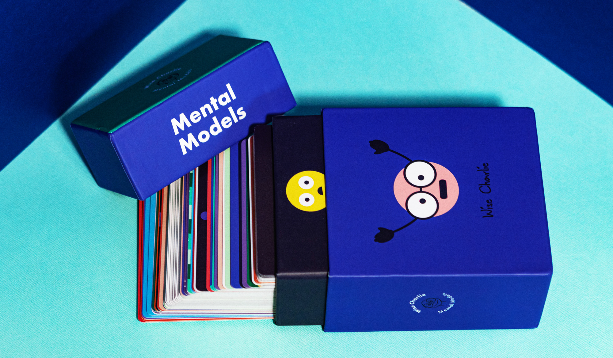

# Wise Charlie Mental Models (cards)

These [100 cards][] are kind of cute. They summarize mental models in
the style of [Charlie Munger][]; some are distinct Munger-isms. The
descriptions aren't terribly good and there are errors. I like the
[general idea][], and I like cards; these are mediocre but not bad.

[100 cards]: https://www.wisecharlie.com/shop
[Charlie Munger]: https://en.wikipedia.org/wiki/Charlie_Munger#%22Elementary,_worldly_wisdom%22
[general idea]: https://fs.blog/mental-models/

