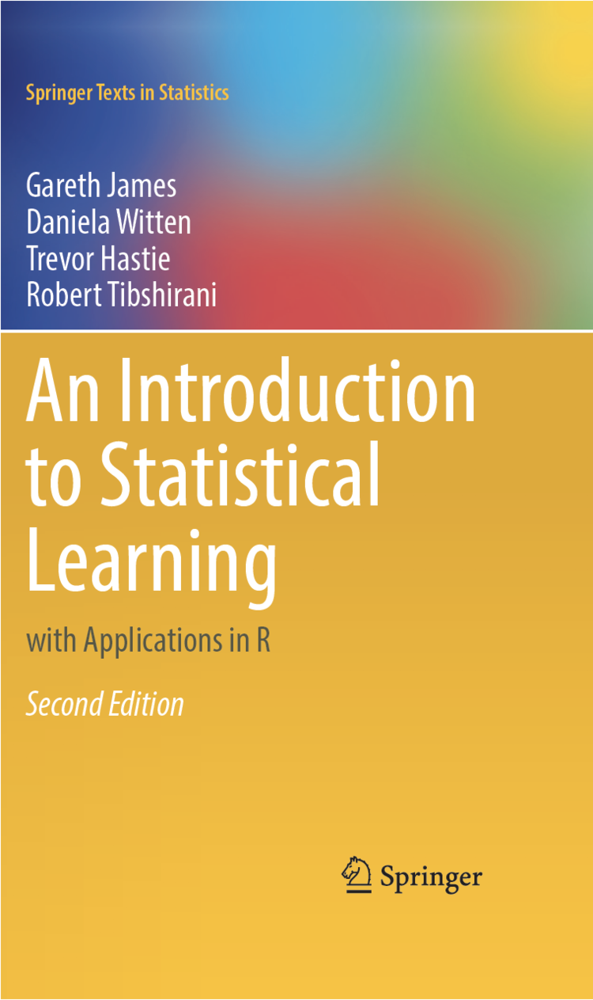
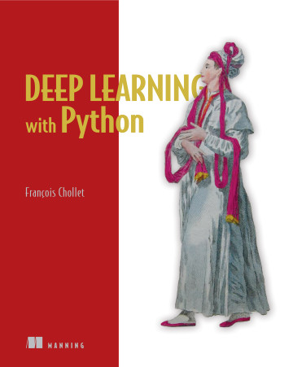
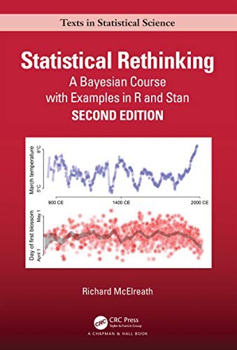
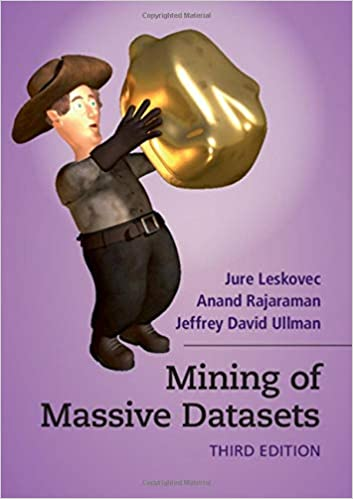

# Books for Machine Learning

> "for someone that doesn't have a lot of experience with machine
> learning, what books would you recommend starting with? machine
> learning for dummies?"

---

---

[Intro to Statistical Learning][]: The friendly version of
[Elements][] has [MOOC videos][] and a 2nd edition coming soon, all
free online. Is there a better intro? Maybe using Python?

[Intro to Statistical Learning]: https://www.statlearning.com/
[Elements]: https://web.stanford.edu/~hastie/ElemStatLearn/
[MOOC videos]: https://www.r-bloggers.com/2014/09/in-depth-introduction-to-machine-learning-in-15-hours-of-expert-videos/

[Deep Learning with Python][]: The creator of [Keras][] provides
pretty good explanations and code, as I recall. Is there a better
intro? Maybe something using [PyTorch][]?

[Keras]: https://keras.io/
[Deep Learning with Python]: https://www.manning.com/books/deep-learning-with-python
[PyTorch]: https://pytorch.org/

[Statistical Rethinking][] has great explanations, examples, and
philosophical commentary for understanding Bayesian approaches.

[Statistical Rethinking]: /20210508-statistical_rethinking_by_mcelreath/

[Mining of Massive Datasets][] is much better than its cover, with
good coverage of both more and less commonly discussed techniques (and
a [MOOC][]).

[Mining of Massive Datasets]: http://www.mmds.org/
[MOOC]: https://online.stanford.edu/courses/soe-ycs0007-mining-massive-data-sets

---

### See also:

 * William Chen's [22 Free Data Science Books][] includes three of my
   four selections.
 * My [Books for Professionals][] selects four titles on professional
   life.
 * My [Books for Programmers][] recommends for Python, JavaScript,
   Clojure, R, and git.

[22 Free Data Science Books]: http://www.wzchen.com/data-science-books
[Books for Professionals]: /20160320-books_for_professionals/
[Books for Programmers]: /20160322-books_for_programmers/

---

Thanks to a couple of colleagues who inspired this collection of
recommended books!

What else would you add/change in this list?
